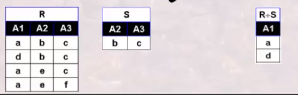

# 04 关系代数

- 基本操作：并、差、积、选择、投影（更名）
- 扩展操作：交、连接、除

关系代数操作以一个或多个关系为输入，结果是一个新的关系

用对关系的运算来表达查询，需要指明所用操作, 具有一定的过程性

## 关系代数基本操作

某些操作，如并、差、交等，需要满足“并相容性”

- 两个关系的属性数目相同
- 两个关系对应位置的属性的域相同

##### 基本操作

###### 并 

+ 表示出现在关系R中或出现在关系S中的元组，

- 数学描述：$R\cup S=\{ t|t\in R \cup t \in S\} $
- 并运算是将两个元组合并成一个关系，在合并时去掉重复的元组
- $R\cup S$与$S\cup R$运算结果是同一个关系

###### 差

+ 表示出现在关系R中但不出现在关系S中的元素构成
+ 数学描述：$R-S=\{ t|t\in R \and t\not \in S\}$
+ R-S和S-R不同

###### 广义笛卡尔积

+ 表示关系R中的元组与关系S的元组进行所有可能的拼接（或串接）构成
+ 数学描述： $R\times S=\{ <a_1,a_2,...,a_n,b_1,b_2...,b_m>|<a_1,a_2,...,a_n>\in R\and <b_1,b_2...,b_m>\in S\}$

###### 投影

+ 从关系R中选择出属性包含在A中的列构成
+ 数学描述：$\prod_{A_{i1},A_{i2},...,A_{ik}}(R)=\{<t[A_{i1}],t[A_{i2}],...,t[A_{ik}]>|t\in R\}$
  + 设$R(A_1,A_2,...A_n)$
  + $\{A_1,A_2,...,A_{ik}\}\subseteq\{A_1,A_2,...,A_n\}$
  + $t[A_i]$表示元组t中相应于属性$A_i$的分量
  + 投影运算可以对原关系的列在投影后重新排列

+ 投影操作是从给定关系中选出某些列组成新的关系，而选择操作是从给定关系中选出某些行组成新的关系

## 关系代数之扩展操作

###### 交

- 假设关系R和关系S是并相容的，则关系R与关系S的交运算结果也是一个关系，记作$R \and S$，由同时出现在关系R和关系S中的元组构成
- 数学描述：$R \cap S = \{t|t\in R\cap t\in S\}$,其中t是元组
- $R\cap S$和$S\cap R $是同一个关系
- 交运算可以通过差运算实现：
- $R\cap S =R-(R-S) = S-(S-R)$

###### $\theta$连接操作

+ 给定关系R和关系S，R与S的$\theta$连接运算结果也是一个关系，记做$R{\triangleright \triangleleft}_{A \theta B} S$,它由关系R和关系S的笛卡尔积中，选取R中属性A与S中属性B之间满足$\theta$的元组构成
+ 数学描述：$R{\triangleright \triangleleft}_{A \theta B} S = \sigma_{ t[A]\theta s[B]}(R\times S)$
  + 设$R(A_1,A_2,...A_n)，A\in \{A_1,A_2,...A_n\}$
  + $S(B_1,B_2,...,B_m),B\in \{B_1,B-2,...,B_m\}$
  + t是关系R中的元组，s是关系中的元组
  + 属性A和属性B具有可比性
  + $\theta$是比较运算符，$\theta \in \{ >,\geq,<,\leq,=,\not =\}$

+ 在实际应用中，$\theta-$连接经常与投影，选择操作一起使用

###### 等值连接操作

+ 特殊的$\theta$连接操作（关系是等号）

###### 自然连接

+ 定义：由关系S和关系R的笛卡儿积中选择相同属性组B上值相等的元素组成

+ 数学描述：$R{\triangleright \triangleleft}_{A \theta B} S = \sigma_{ t[B]= s[B]}(R\times S)$

  + 自然连接是一种特殊的等值连接

  + 要求关系R和关系S必须由相同的属性组B（B可以为单一属性可以为多属性）

  + R，S属性相同，值必须相等才能连接，即

    $R.B_1=S.B_1 and R.B_2=S.B_2.... and R.B_n=S.B_n$

  + 要在结果中去除重复的属性列，（因为$R.B_i$恒等于$S.B_i$，所以只保留一列即可）

## 关系代数之复杂扩展操作

###### 除操作

+ 用于求解“查询...全部的/所有的...”问题
+ 前提条件：给定关系$R(A_1,A_2,...,A_n)$为n度关系，关系$S(B_1,B_2,...,B_n)$为m度关系，如果可以进行关系R与关系S的除运算，当且仅当：属性集$\{B_1,B_2,...,B_m\}$是属性集$\{A_1,A_2,...,A_n\}$的真子集，即$m<n$
+ 定义，关系R和关系S的除运算结果也是一个关系，记作$R\div S$分两部分定义
  + $R\div S$的属性：在R中去掉S中的属性，剩余属性的个数是$R\div S$的属性个数
  + $R\div S$的元组：$R\div S$这个元组与S的元组组合后的每个元组必须存在于R中

###### 外连接

+ 两个关系R与S进行连接时，如果关系R（或S）中的元组在S（或R）中找不到匹配的元组，则为了避免该元组信息丢失，从而将该元组与S（或R）中假定存在的全为空值的元组形成连接，放置在关系中，这种连接称为外连接
+ 外连接=自然连接(或$\theta$连接)+失配的元组(与空元组形成的连接)
+ 外连接的形式:左外连接,右外链接,全外连接
  + 左外连接=自然连接(或$\theta$连接)+左侧表中失配的元组
  + 右外连接=自然连接(或$\theta$连接)+右侧表中失配的元组
  + 全外连接=自然连接(或$\theta$连接)+两侧表中失配的元组

