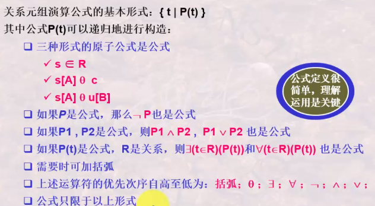
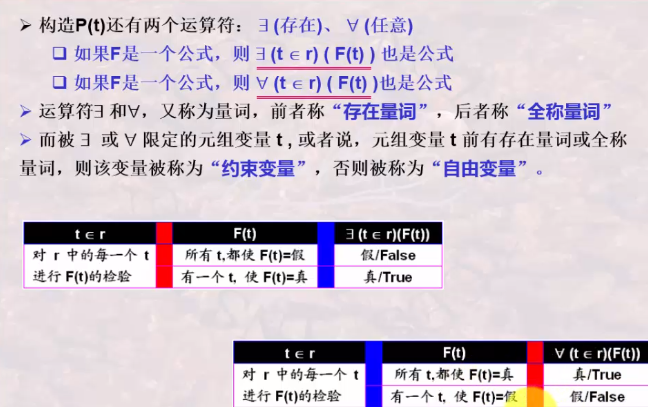
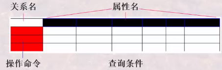
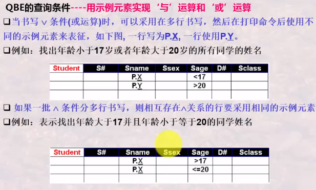

# 关系模型之关系演算

## 1.关系演算之元组演算

+ 关系演算以数理逻辑中的谓词演算为基础
+ 是描述关系运算的另一种思维方式

<!-- more -->

+ 关系演算根据谓词变量不同，分为关系元组演算和关系域演算
+ 基本形式：$\{t|P(t)\}$表示使用谓词P为真的元组t的集合
  + t是元组变量
  + $t\in r$表示元组在关系r中
  + t[A]表示元组t的分量，即t在属性A上的值
  + P是与谓词逻辑相似的公式，P(t)表示以元组t为变量的公式
  + 可以递归定义

## 2.关系演算之关系域演算

关系域演算公式：

关系域演算的基本形式：$\{<x_1,x_2,...,x_n>|p(x_1,x_2,...,x_n)\}$

其中，$x_1$代表域变量或常量，P为以$x_1$为变量的公式公式P可以递归构造

+ 三种形式的原子公式

  + $<x_1,x_2,...,x_n>\in R$。其中$x_i$代表域变量或常量，表示由域变量构成的$<x_1,x_2,...,x_n>$是属于关系R的

  + $x\theta y$。其中，域变量x与常量c之间满足比较关系$\theta$，$\theta$是比较运算符$<,\leq,=,<>,>,\geq$
  + $x\theta y$。其中，域变量x与常量y之间满足比较关系$\theta$，

+ 如果p是公式，那么$\lnot p$也是公式
+ 如果P1,P2 是公式。那么$P1\and P2,P1\or P2$也是公式
+ 如果P是公式，x是域变量，则$\exists (x)(P(x))$和$\forall (x)(P(x))$也是公式、
+ 需要时可加括弧
+ 上述运算符的优先次序自高至底为：括弧；$\theta；\exists; \forall;\lnot;\and;\or$
+ 公式只限于以上形式

## 域演算与元组演算的区别

元组演算的基本形式：$\{t|p(t)\}$

域演算的基本形式：$\{<x_1,x_2,...,x_n>|P(x_1,x_2,...,x_n)\}$

元组演算是以元组为变量，以元组为基本处理单位，先找到元组，然后找到元组分组，然后再找到元组分量，进行谓词判断。

域演算是以域变量为基本处理单位，先有域变量，然后再判断由这些域变量组成的元组是否满足谓词判断。

公式的运算符是相同的，之有其中的变量不同。

## 域演算语言QBE

QBE操作框架由四个部分组成

+ 关系名区：用于书写欲待查询的关系名
+ 属性名区：用于显示对应关系名区关系的所有属性名
+ 操作命令区：用于书写查询操作的命令
+ 查询条件区：用于书写查询条件

QBE操作命令

+ Print或P．——显示输出命令
+ Delete或D．——删除操作
+ Insert或I．——插入操作
+ Update或Ｕ．——更新操作

QBE的查询条件 --不同属性上的与条件

+ QBE不同属性上的与条件可以写在同一行中

QBE的查询条件--示例元素与投影

+ 条件$\theta$参量中的参量也可以是域参量,用任何一个值(不必是结果中的值)带有下划线表示,被称为示例元素.示例元素下划线上卖弄的值不起作用,被当做变量名用来对待,只用于占位或是链接条件.不带下划线的则是构成实际条件一部分的值

+ 当不是显示出所有内容时,可在条件区对应要显示的列下面书写显示输出命令(投影运算).

QBE的查询条件--用示例元素实现与运算和或运算

## 关系运算的安全性

**不产生无限关系和无穷验证的运算被称为是安全的**

+ 关系代数是一种集合运算，是安全的
  + 集合本身是有限的，有限元素集合的有限次运算仍旧是有限的

+ 关系演算不一定是安全的
  + 例如$\{t|\lnot (R(t)),\},\{t|R(t)\or t[2]>3\}$可能表示无限关系
  + R(t)是有限的，但不在R(t)中的元素就可能是无限的
  + 再例如：$(\exists u)(\omega (u))$，$(\forall u)(\omega (u))$
  + 前者称为“假验证”，即验证所有元素是否都使得$\omega (u)$为false，后者被称为“真验证”，即验证所有元素是否都使得$\omega (u)$为true。检验所有元素就可能造成正无穷

+ 对关系演算需要施加约束条件，即任何一个公式都要在一个集合范围内操作，而不是无限范围内操作，才能保证其安全性

### 安全约束有限集合DOM

+ DOM$(\psi)$是一个有限集合，其中的每个符号要么是$\psi$中明显出现的符号，要么是出现在$\psi$ 中的某个关系R的某元组分量
+ DOM主要用于约束$\psi$中的一些谓词的计算范围，它不必是最小集合

### 元组安全演算表达式

满足下面三个条件的元组演算表达式$\{t|\psi(t)\}$称为安全表达式

+ 只要t满足$\psi$，他的每个分量就是DOM$(\psi)$的一个成员
+ $\{t|\psi(t)\}$中t的取值只能是DOM中的值，是有限的
+ 对于$\psi$中形如$(\exists u)(\omega (u))$的子表达式，若u 满足w，则u的每个分量都是DOM(w)的成员
+ $\{t|\psi(t)\}$中的每个$(\exists u)(\omega (u))$的子表达式，只需验证DOM中的元素是否有使$\omega (u)$为真的元素，已经明确其都不满足$\omega (u)$，无需验证