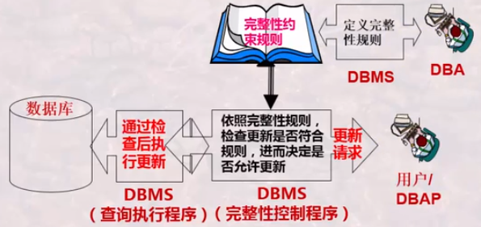
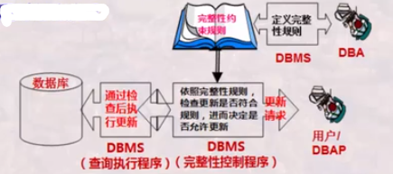
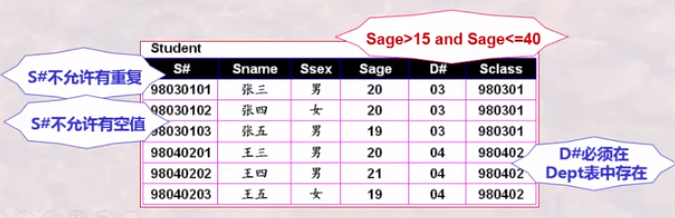
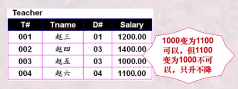
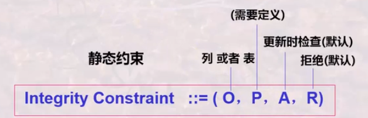
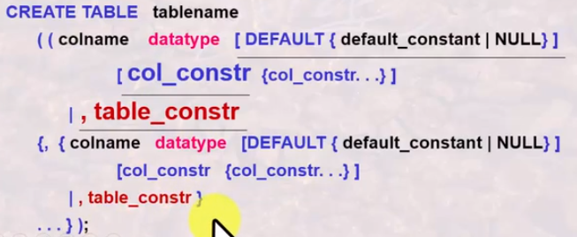

# 数据库完整性概念及其分类

## 数据库完整性

数据库完整性是指DBMS应保证DB的一种特性——在仍任何情况下的正确性，有效性和一致性

<!--more-->

+ 广义完整性：语义的完整性，并发控制。安全控制，DB故障恢复等
+ 狭义完整性：专指语义的完整性，DBMS通常由专门的完整性管理机制与程序来处理语义完整i性问题

### 关系模型中的完整性要求：

+ 实体完整性
+ 参照完整性
+ 用户自定义完整性

引发数据库完整性问题的原因主要是因为不正当的数据库操作（比如输入错误，操作错误，程序处理失误等）

### 数据库完整性的作用：

+ 防止和避免数据库中不合理数据的出现

+ DBMS应尽可能地自动防止DB中语义不合理现象
  + DBMS允许用户定义一些完整性约束规则（用SQL-DDL定义）
  + 当有DB更新操作时，DBMS自动按照完整性约束条件进行检查，以确保更新操作符合语义完整性



### 完整性约束条件的一般形式

**Integrity Constraint ::=(O,P,A,R)**

+ O 数据集合：约束的对象
+ P 谓词条件：什么样的约束
+ A 触发条件： 什么时候检查
+ R 相应动作：不满足怎么办



## 数据库完整性分类

### 域完整性约束条件

+ 施加于某一列上，对给定列上所要更新的某一后选址是否可以接受进行约束条件判断，这是孤立进行的

### 关系完整性约束条件

+ 施加于关系/table上，对给定table上所要更新的某一候选元组是否可以接受进行约束条件判断，或是对一个关系中的若干元组和另一关系中的若干元组和另一个关系中的若干元组之间联系是否可以接受进行约束条件判断

### 按约束来源分类

结构约束

+ 来自于模型的约束，例如函数依赖约束、主键约束（实体完整性）、外键约束（参照完整性）、只关心数值是否相等，是否允许空值等

内容约束

+ 来自于用户的约束，如用户自定义完整性，关系元组或属性的取值范围。



### 按约束状态分类

静态约束

+ 要求DB在任一时候均应该满足的约束

动态约束

+ 要求DB从一状态变为另一状态时必须完成的约束



## SQL实现完整性

### SQL支持以下几种约束

+ 静态约束
  + 列完整性-域完整性约束
  + 表完整性-关系完整性约束

+ 动态约束
  + 触发器



### SQL实现约束方法-Creat Table

Creat Table 有三种功能:定义关系模式,定义完整性约束和定义物理存储特性

定义完整性约束条件

+ 列完整性
+ 表完整性



#### Col_constr列约束

列约束是一种域约束类型,可以对单一列进行约束

```sql
{NOT NULL|                         //列值非空
    [CONSTRAINT constraintname]    //为约束命名.便于以后撤销
         {UNIQUE                   //列值是唯一
          |PRIMARY KEY             //列为主键
          |CHECK(search_cond)      //列值满足条件,条件只能使用当前列值
          |REFERENCES tablename [(colname)]
                [ON DELETE{CASCADE|SET NULL}]}}
//引用另一表tablename的列colname的值，如有ON DELETE CASCADE或ON DELETE SET NULL语句，则删除被引用表的某列值v时，要将本表该列值为v的记录删除或列值更新为null;缺省为无操作。
```

Col_constr 列约束:只能应用在单一列 上，其后面的约束如UNIQUE,PRIMARY KEY及search_cond 只能是单一列唯一、单一列为主键、和单一列相关

#### table_constr表约束

表约束是一种关系型约束.对多列或多元组的值进行约束,列约束是其特例

```sql
    [CONSTRAINT constraintname]              //为约束命名.便于以后撤销
         {UNIQUE  (colname {.colname...})    //几列值合一起是唯一
          |PRIMARY KEY (colname {.colname...}) //几列联合为主键
          |CHECK(search_condition)      //元组多列值共同满足条件,
      								//条件中只能使用同一元组不同列当前值
          |FOREIGN KEY (colname {.colname...})
               REFERENCES tablename [(colname {.colname...})]
                [ON DELETE CASCADE]}}
           					//引用另一表tablename的若干列键值作为外键
```

## 断言ASSERTION

一个断言就是一个谓词表达式,它表达了希望数据库总能满足的条件.表约束和列约束就是一种特殊的断言

SQL提供了复杂条件表达的断言.其语法形式为:

```sql
CREATE ASSERTION <assertion_name> CHECK <predicate>
```

当一个断言创建后,系统将检测其有效性,并在每一次更新中测试更新是否违背断言

**断言测试增加了数据库维护的负担,所以要小心的使用断言**

##  触发器Trigger

+ Create Table中的表约束和列约束基本上都是静态的约束，也基本上都是对单一列或单一元组的约束(尽管有参照完整性)，为实现动态约束以及多个元组之间的完整性约束，就需要触发器技术Trigger
+ Trigger是一种过程完整性约束(相比之下，Create Table中定义的都是非过程性约束)，是一段程序，该程序可以在特定的时刻被自动触发执行，比如在一次更新操作之前执行，或在更新操作之后执行。

基本语法:

```sql
CREATE TRIGGER trigger_name BEFORE|AFTER
    {INSERT|DELETE|UPDATE [OF folname{,colname...}]}
    ON tablename [REFERENCING corr_name_def {col_name_def}]
    [FOR EACH ROW|FOR EACH STATEMENT]   //更新操作的每一条结果(前者),或者整个更新操作完成(后者)
    [WHEN (search_condition)]           //检查条件,如满足执行下面程序
           {statement                   //单行程序直接书写,多行程序要用下行方式
           |BEGIN ATOMIC statement;(statement;..)END}
```

触发器Trigger意义:当某一时间发生时(Before|After),对事件产生的结果(或是每一元组,或者操作的所有元组),检查条件search_condition,如果满足条件,则执行后面程序段,条件或程序段中引用的变量可用corr_name_def来限定