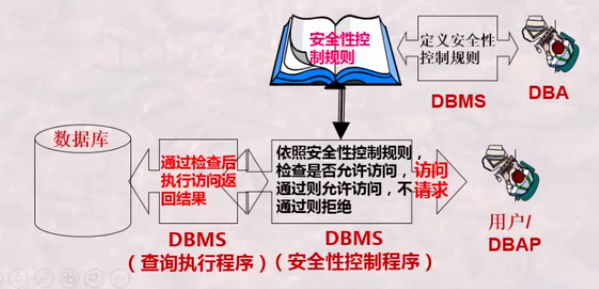
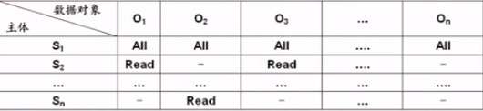
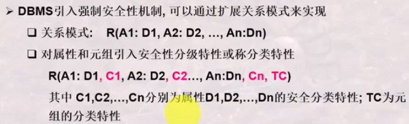

# 数据库安全性

数据库安全性是指DBMS应保证数据库的一种特性:免受非法,非授权用户的使用,泄露,更改和破坏

<!--more-->

## 数据库安全性概念及分类

### DBMS的安全机制

自主安全性机制:存取控制

+ 通过权限在用户之间的传递,使用户自主管理数据库安全性

强制安全性机制

+ 通过对数据和用户强制分类,使得不同类别用户能够访问不同类别的数据

推断控制机制:

+ 防止通过历史信息,推断出不该被其知道的信息
+ 防止通过统计信息(通常是聚集信息)推断出私密信息(个体信息)

数据加密机制:

+ 通过加密解密实现的机制

### DBA的责任与义务


## 数据库自主安全性机制

### 自主安全性

通常情况下，自主安全性是通过授权机制来实现的

用户在使用数据库之前必须在DBA处获得一个账户，并由DBA授予该用户一定权限，该账户的用户依据其所拥有的权限对数据库进行操作，同时，该账户用户也可将其所拥有的权力转授给其他用户，由此实现权限在用户之间的控制和传播

+ 授权者 ：决定用户权力的人
+ 授权：授予用户访问的权力

### DBMS自动实现自主安全性

DBMS允许用户定义一些安全性控制规则

当由DB访问操作时，DBMS自动按照安全性控制规则进行检查，检查通过则允许访问，不通过则不允许



DBMS将权力和用户结合在一起，形成一个访问规则表，一句该规则表对数据库进行安全性控制
$$
AccesRule::=(S,O,t,P)
$$

+ S: 请求主题（用户）
+ O: 访问对象
+ t:  访问权力
+ P： 谓词

{AccessRule} 通常放在数据字典或系统目录中，构成所有用户对DB的 访问权力

用户多时，可以按用户组建立访问规则

访问对象可大可小：属性/字段、记录/元组、关系、数据库

权力：包括创建、增、删、改、查等

谓词：拥有权力需满足的条件

##  自主安全性实现方式

### 1.存储矩阵



### 2.视图

视图时安全性控制的重要手段

通过视图可以吸纳之用户对关系中某些数据项的存取，例如：

+ 视图1： Create  EmpV1 as select * from Employee
+ 视图2： Create EmpV2 as select Pname ,D# from Employee

通过视图可将数据访问对象与谓词结合起来，先视用户对关系中某些元组的存取，例如：

+ 视图1： Create EmpV3 as select * from Emplayee where P# =:UeerId
+ 视图2： Create EmpV4 as select * from Employee where Head+:UserId

用户定义视图后，视图便成为新的数据对象，参与到存储矩阵与能力表述中进行描述（可以递归使用）

## SQL实现数据库自主安全性

### SQL语言的用户与权力

SQL包括DDL，DML，和DCL。数据库安全性控制时属于DCL的范畴

授权机制——自主安全性；视图的使用

关系级别：DBA－程序员用户－关系级别（普通用户）

+ 级别一 Select 读级别
+ 级别二 Modify ：更新
  + insert：插入
  + UPdate：更新
  + Delete ：删除

+ 级别三 Create：创建
  + Create  ：创建
  + ALter ：更新
  + Drop ：删除

**级别高的权力包含级别低的**

### 授权命令

```sql
GRANT {all PRIVILEGES|privilege {,privilege}}
   ON [TABLE] tablename|viewname
   TO {public|user-id{,user-id}}
   [WITH GRANT OPTION]
```

user-id：某一个用户账户，由DBA创建的合法账户

public：允许所有有效账户使用授予的权力

priviliege 是下面的权力

+ SELECT|INSERT|UPDATE|DELETE|ALL PRIVIEDGES

WITH GRANT OPTION 选项是允许被授权者传播这些权力

### 收回授权

```sql
REVOKE {all privilrges|priv{,priv...}} ON tablename|viewname
    FROM {public|user{,user...}};
```

## 安全性授权的其他简介

### 自主安全性的授权过程及其问题

#### 授权过程

+ 第一步：DBA创建DB为每个用户创建一个账户
+ 第二步：DBA授予某用户账户级别权力
+ 具有账户级别的用户可以创建基本表或者视图，他也自动成为该表或该视图的属主账户，拥有该表或该视图的所有访问权力
+ 拥有属主账户的用户可以将其中的一部分权力授予另外的用户，该用户也可将权力进一步授权给其他的用户

### 强制安全性

强制安全性通过对数据对象进行安全性分级

+ 绝密，机密，可信，无分类

同时对用户进行上述的安全性分级从而实现不同级别用户访问不同级别数据的一种机制

### 访问规则


### 强制安全性机制的实现

DBMS引入强制安全性机制，可以通过扩展关系模式被来实现

