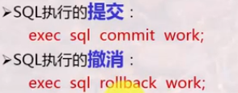
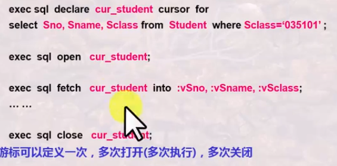
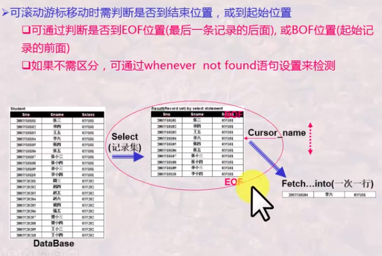
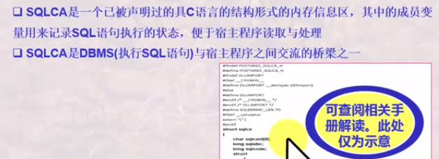
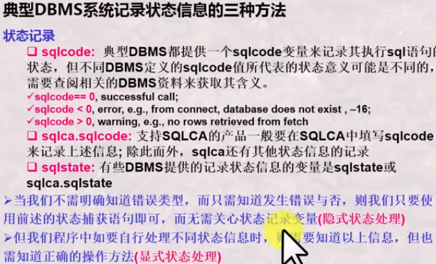

# 嵌入式SQL语言

## 交互式SQL的局限

普通用户无法很好的书写SQL

复杂检索结果难以用一条交互式SQL完成，需要结合高级语言中的循环判断来完成

解决方法：高级语言+SQL

+ 既继承了高级语言的过程控制性
+ 又结合SQL语言复杂结果的非过程性
+ 同时为数据库操作者提供安全可靠的操作方式：通过应用程序进行操作

嵌入式SQL：

+ 将SQL嵌入到高级语言中，这种高级语言又称为宿主语言
+ 嵌入在宿主语言的SQL与前面介绍的不太相同

## 要解决的问题


## 变量声明与数据链接

### 变量的声明与使用

在嵌入式SQL语句中可以出现宿主原因呢语句所使用的变量

```sql
exec sql select Sname,Sage into :vSname,:vSage from Student where Sname :specName
```

需要特殊声明的变量：


变量声明和赋值中，要注意：

+ 宿主程序的字符串变量长度应比字符型字段的长度多一个。因宿主程序的字符串尾部多一个终止符为“\0”，而程序中用双引号描述

+ 宿主程序变量类型与数据库字段之间有些是有差异的，有些DBMS可支持自动转换，有些不能。

+ 声明的变量，可以在宿主程序中赋值，然后传递给SQL的where等子句中，使SQL语句能够按照指定的要求（可变化的进行检索）


嵌入式比交互式SQL语句灵活了一些，只需要改变一下变量值，SQL语句便可以反复使用以检测出不同结果

### 程序与数据库的连接和断开

在嵌入式SQL执行前，首先要与数据库进行链接，不同的DBMS链接语句方式略有差异

同样在执行后需要断开链接

### SQL执行的提交与撤销

SQL执行过程中必须有提交和撤销语句才能确认其操作结果



## 事务的概念和特性

### 事务

一个存取或或改变数据库内容的一次执行，或者说一条或多条SQL语句的一次执行被看作一个任务

事务是数据库管理系统提供的控制数据操作的一种手段，通过这一手段，应用程序员将一系列的数据库操作组合在一起作为以一个整体进行操作和控制，以便数据库系统能够提供一致性状态转换保证

+ 事务一般是由应用程序员提出，因此有开始和结束，结束前需要提前提交或撤销。

```sql
Begin Transaction
     exec sql ...
     ...
     exec sql ...
     exec sql consit work|exec sql rollback work
End Transaction
```

在嵌入式SQL程序中，任何一条数据库操纵语句（如exec sql select等）都会引发一个新事物的开始，只要该程序当前没有正在处理的事务。而事务的结束时需要应用程序员通过commit或rollback确认的。因此Begin Transaction 和End Transaction两行语句是不需要的。

### 事务的特性：ACID

+ 原子性Atomicity：DBMS能够保证事务的一组更新操作是原子不可分的，即对于DB而言，要么不做，要么全做
+ 一致性Consistency：DBMS保证事务的操作状态时正确的，符合一致性的操作规则，它时由进一步隔离性来保证的
+ 隔离性Isolation：DBMS保证并发执行的多个事务之间互相不受影响，例如两个事务T1和T2，即使并发执行，也相当于先执行了T1，再执行T2，或者先执行了T2，再执行T1。
+ 持久性Durability：DBMS保证已提交的事务的影响是持久的，被撤销事务的影响是可恢复的

## 数据集与游标

### 单行结果与多行结果处理的差异

单行结果可以直接传送到宿主程序的变量中

多行结果则需要使用游标

+ 游标是指向某检索记录集的指针
+ 通过这个指针的移动，每次读一行，处理一行，直到结束

+ 读一行的操作通过Fetch...into语句实现的，每一次Fetch，都先向下移动指针，然后读取
+ 记录集有结束标识EOF，用来标记后面没有记录了

游标的使用需要先定义，再打开（执行），一条接着一条处理，最后关闭



### 可滚动游标

标准的游标自开始向结束方向移动，每fetch一次，向结束方向移动一次，一条记录之恶能访问一次

可滚动游标使指针在记录集之间灵活移动，使每条记录可以被反复访问的一种游标。



### 数据库记录的删除

一种是查找删除（Delete语句），**一种是定位删除（删除游标对应位置）**

EXEC SQL DELETE FROM tablename [corrname]

​            WHERE search_condition|**WHERE CURRENT cursor_name**

### 数据库记录的更新

一种是查找更新（UPdate语句），**一种是定位更新（更新游标对应位置）**

## 状态捕获及其处理

状态，是SQL语句的执行状态，尤其指一些出错状态，有时程序需要知道这些状态并进行处理

嵌入式SQL中，状态捕获及其处理由三部分构成

+ 设置SQL通信去：一般在嵌入式SQL程序的开始处便设置
  + exec sql include sqlca

+ 设置状态捕获语句 在嵌入式程序任何位置都可设置，可以多次设置，但是由作用域
  + exec sql whenever sqlerror goto report_error

+ 状态处理语句：某一段程序以应对SQL操作的某种状态
  + report_error:exec sql rollback

### SQL通信机制：SQLCA



#### 状态捕获语句

exec sql whenever condition action;

Whenever语句是设置一个”条件陷阱，条件语句会由Exec SQL 语句所引起的对数据库系统的调用自动检查是否满足条件（condition）“

+ SQLERROR：检测是否有SQL语句出错，并具体意义依赖于特定的DBMS
+ INOT　FOUND：执行某一SQL语句后，没有相应的结果记录出现
+ SQLWARNING：不是错误，但应该引起注意的条件

如果满足condition,则要采取一些动作(由action指出)

+ CONTINUE:忽略条件或错误，继续执行
+ GOTO标号:转移到标号所指示的语句，去进行相应的处理
+ STOP:终止程序运行、撤消当前的工作、断开数据库的连接
+ DO函数或CALL函数:调用宿主程序的函数进行处理，函数返回后从引发该condition的Exec SQL语句之后的语句继续进行

Whenever语句的范围是其后所有的Exec SQL语句，一直到程序中出现另外一条相同条件的Whenever为止，后面的覆盖前面的

