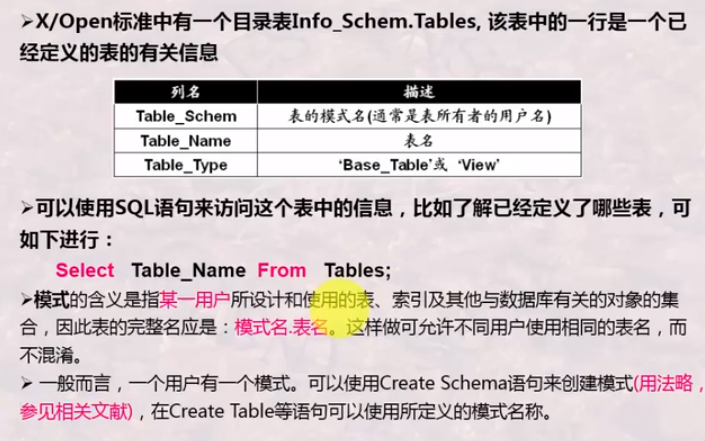
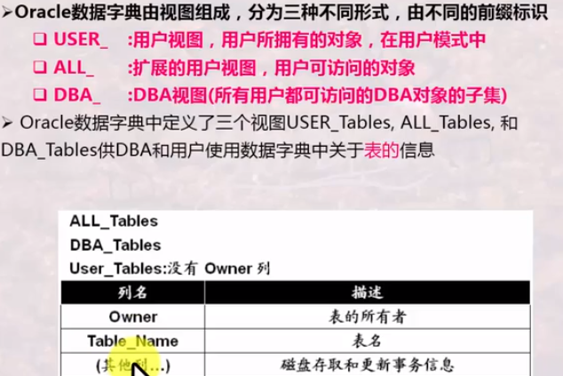
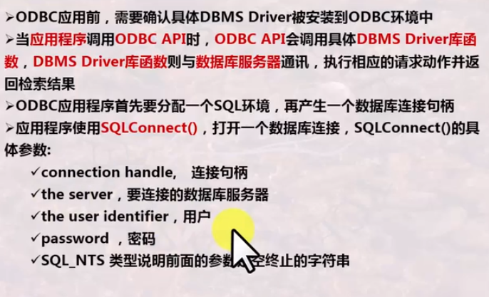
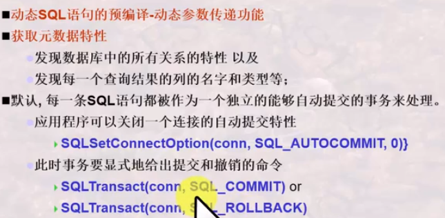
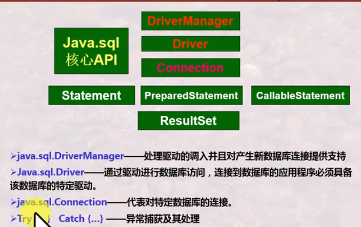

# 动态SQL的概念

动态SQL是相对与静态SQL而言的

静态SQL特点是SQL语句已经按要求写好，只需要将一些参数通过变量传送给嵌入式SQL语句即可

动态SQL则是在程序中动态构造，形成一个字符串，再交给DBMS执行，交给DBMS执行的时候仍旧可以传递变量

## 数据字典与SQLDA

数据字典又称为系统目录，是系统维护的一些表或视图的集合，者写表或驶入存储了数据中各类对象的定义信息，这些对象包括Create语句定义的表，列，索引，视图，权限，约束等，这些信息又称为数据库的元数据——关于数据的数据

不同DBMS术语不一样：数据字典、目录表、系统目录、系统视图

不同DBMS中系统目录存储方式可能是不同的，但会有一些信息对DBA公开。这些公开的信息，DBA可以使用一些特殊的SQL来检索

### 数据字典的内容构成

数据字典通常存储的是数据库和表的元数据，即模式本身信息

+ 与关系相关信息
  + 关系名字
  + 每个视图的属性名及其类型
  + 视图的名字及其定义
  + 完整性约束

+ 用户与账户信息，包括密码
+ 统计与描述性数据：如每个关系中元组的数目
+ 物理文件组织信息
  + 关系是如何存储的（顺序/无序/散列等）
  + 关系的物理位置

+ 索引相关信息

### 数据字典的结构

+ 也是存储在磁盘上的关系
+ 专门为内存高雄啊访问设计的特定的数据结构

可能的字典数据结构

#### X/Open标准系统目录

#### Oracle的用户字典

 

### SQLDA

SQLDA是一个内存数据结构，内可装载关系模式的定义信息，如列的数目，每一列的名字和类型等等

通过读取SQLDA信息可以进行更为复杂的动态SQL处理

不同的DBMS提供的SQLDA格式并不是一致的

### ODBC

ODBC是一种不同语言的应用程序与不同数据库服务器之间的通讯标准

是一组API，支持应用程序与数据库服务器的交互

应用程序通过调用ODBC　API，实现

+ 与数据服务器的链接
+ 向数据库服务器发送SQL命令
+ 一条一条的提取数据库检索结果中的元组传递给应用程序的变量

具体的DBMS提供一套驱动程序，即Driver库函数，供ODBC调用，以便数据库与应用程序的链接

ODBC可以配合很多高级语言使用

#### 应用程序如何通过ODBC链接一个数据库服务器

#### JDBC——JAVA版的ODBC

