# 数据建模与数据库设计

## 数据模型与概念模型

表达计算机世界的模型乘坐数据模型；表达信息世界的模型称为该奶奶数据模型，简称概念模型，信息世界是对现实世界的理解与抽象

<!--more-->

## 实体与实例

### 实体

实体：客观存在并可相互区分的事务

实体有类（实体，实体的型）和个体（实体的实例。实体的值）的概念

实体用**属性**来刻画  **属性**是实体具有的某一方面的特性

##### 属性分类

+ **单一属性和复合属性**，在关系模型中，复合属性一定要转化为单一属性（关系中的1范式）
+ **单值属性和多值属性**：每个实例的该属性值是一个还是多个
+ **可空值属性和非空值属性**
+ **导出属性**（由其他属性通过计算得到）

属性最重要的特点的**关键字/码**，表示实体中能够哟弄个其值唯一区分开每一实例的属性或属性组合

实体之间是有**联系**的，**联系**是指一个实体的实例和其他实体实例之间所可能发生的联系。

**角色**：实体在联系中的作用

实体之间的联系可以有很多种类

##### 二元联系

一对一，一对多，多对多

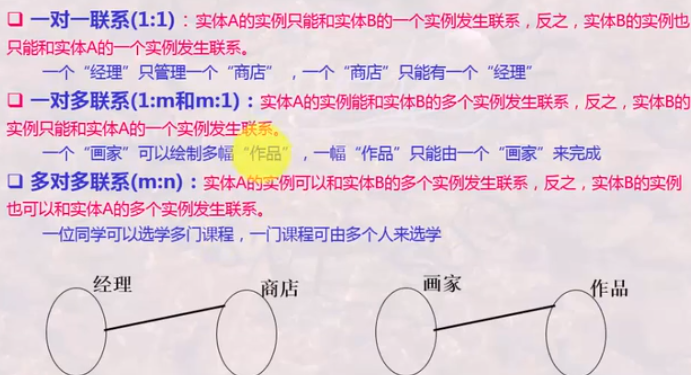

联系的**基数**：实体实例之间联系的数量，即一个实体的实例通过一个联系能与另一实体中相关联的实例的数目

进一步，联系的基数还要区分0个，1个，不定数目的多个还是固定数目的多个（即每个实体的实例而言是否必须存在）

通常以实体参与联系的最小基数和最大基数来标记（MInCard..MaxCard）

+ **书架**参与**存放图书**联系的基数为(0..m)，而图书参与此联系的基数为（1..1）
+ 一个书架可以存放0或多本图书，但一本图书只能存放在一个书架

完全参与联系，即该端实例至少有一个参与到联系中，最小基数为1（1..m）;

部分参与联系：即该端实例可以不参与联系，最小基数为0（0..m）

## E-R模型

### E-R模型表达方法之chen方法

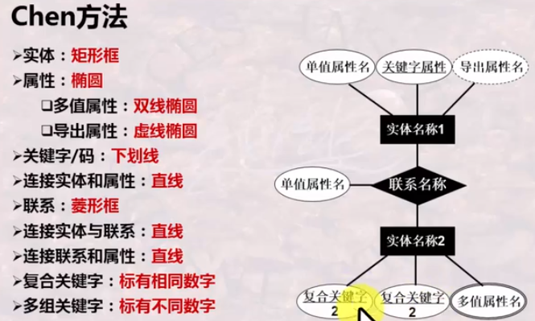

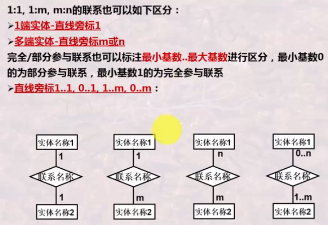 

### E-R模型表达方法之Crow's foot方法

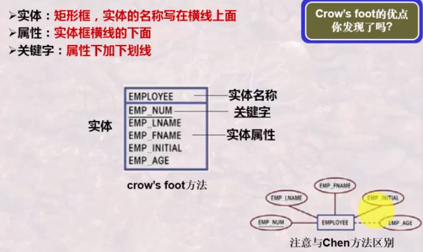

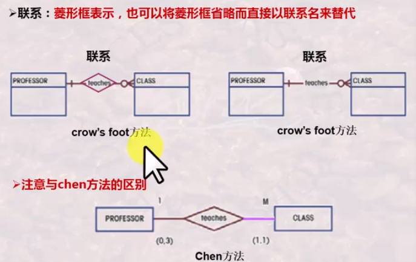

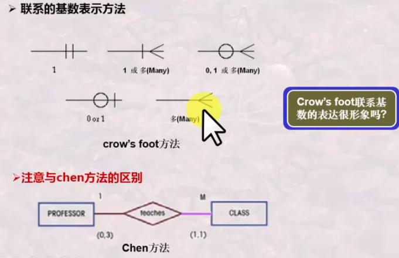

## 数据库设计的抽象

型与值

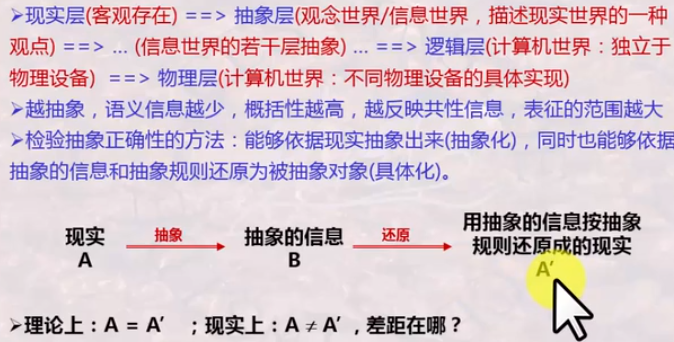

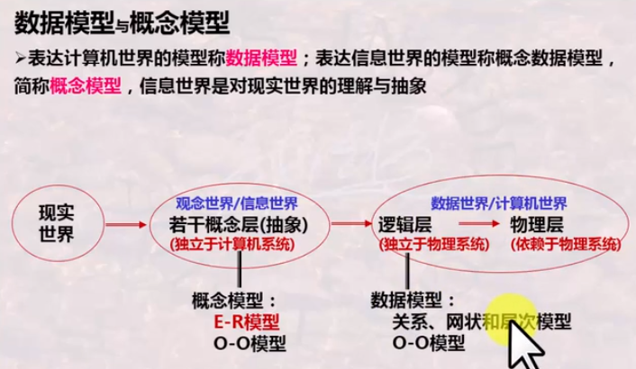

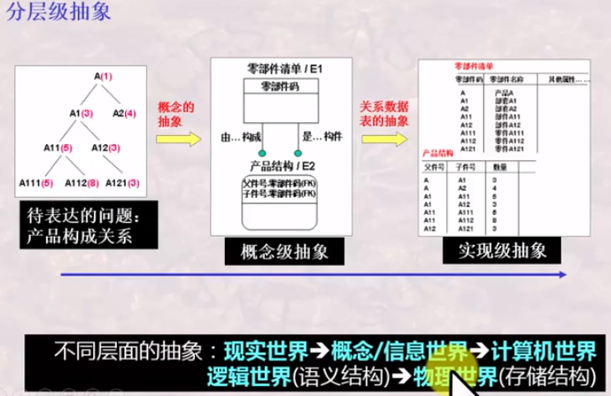

## 建模的不同层次：模型与元模型，模型（型）与实例（值）

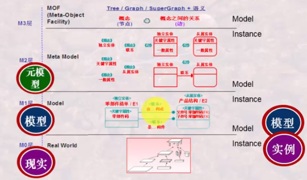

## IDEF1x

#### 实体

实体表示现实和抽象事物的集合，这些事物必须具有相同的属性和特征。这个集合的一个元素就是该实体的一个实例

+ 实体分为独立实体和从属实体
+ 在扩展E-R图中，**独立实体**又称为强实体，**从属实体**又称弱实体

独立实体：一个实体的实例都被唯一的标识而不决定与它与其他实体的联系

从属实体：一个实体的实例唯一标识需要依赖于该实体与其他实体之间的联系

从属实体需要从其他实体继承属性作为关键字的一部分

### 关于实体的规则

关于实体的规则：工程化要求

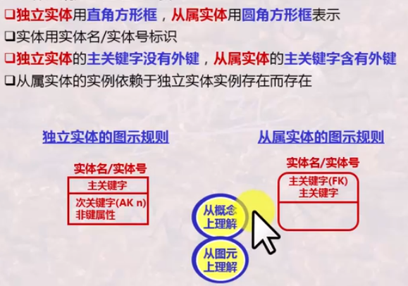

### 标定联系与非标定联系

子实体的实例能够被唯一标识而无需依赖与其实体的联系，父实体的主关键字不视子实体的主关键字

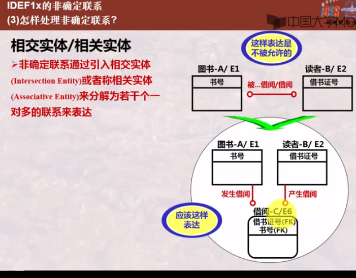

### 分类联系

分类联系：一个实体实例是由一个一般实体实例及多个分类实体实例构成的

+ 一个一般实体是若干具体实体（分类实体）的类
+ 分类实体与一般实体具有相同的主关键字
+ 不同分类实体除具有一啊不能是实体特征外，各自还可能具有不同的属性特征

### 具体化

实体的实例集中，某些实例子集具有区别于该实例集内其他实例的特性，可以根据这些差异特性对该实例进行分组，这一分组的过程称为具体化

自顶向下，逐步求精

### 泛化

若干个实体根据共有的性质，可以合成一个较高层的实体

**泛化和具体化在E-R图中用标记为ISa的三角形标识**