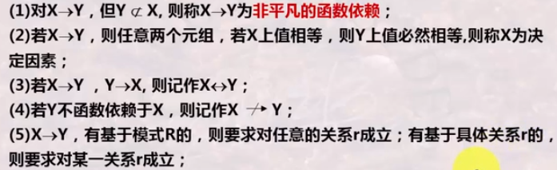
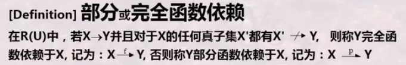
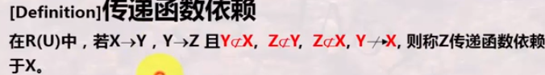

# 依赖关系

## 函数依赖

函数依赖的定义：设R(U)是属性集合
$$
U=\{A_1,A_2...A_n\}
$$
上的一个关系模式，X，Y是U上两个子集，若对R(U)的任意一个可能的关系r，r中不可能有两个元组满足在X中的属性值相等而在Y中的属性值不等，则称“X函数决定Y”或“Y函数依赖于X”记作X->Y 

<!--more-->

### 函数依赖的特性

### 完全函数依赖与传递函数依赖

### 函数相关的几个重要概念

候选键

外来键

闭包

被F逻辑蕴含的所有函数依赖的集合称为F的闭包，记作F'