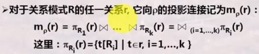
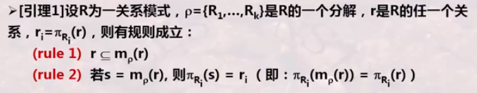
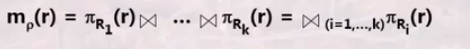

# 模式分解存在的问题

## 模式分解

模式分解是指用R的一组子集来替代这个关系

### 投影链接

模式分解需要关注：

R与p在数据内容方面是否等价：分解的无损连接性

R与p在数据依赖方面是否等价：分解的保持依赖性

## 无损链接分解

对于关系模式R(U,F),U是全局属性，F是函数依赖集合，$p=\{R_1,...,R_k\}$是R 的一个分解，如果对于R的任何满足函数依赖集F的关系r，有
$$
r=m_\rho(r)
$$
则称$\rho$是R相对于F的一个无损链接分解，其中

