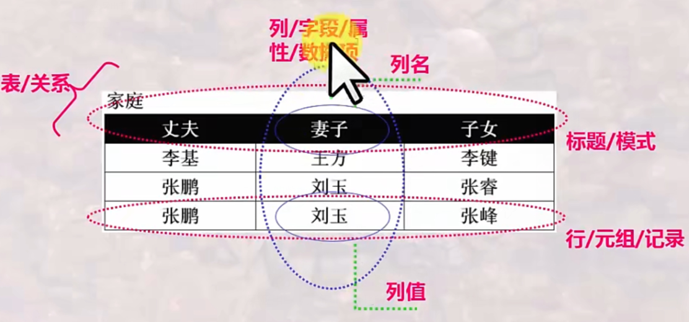

# [2] 关系数据库模型

## 2.1什么是关系

### 1.什么是表

<!-- more -->

### 域

域：列的取值范围，是一组值的集合，这组值具有相同的数据类型

+ 如：整数的集合，字符串的集合
+ 集合中的元素的个数叫做域的**基数**

### 笛卡儿积

+ 一组域D1，D2...Dn的笛卡尔积的笛卡尔积为：
  $$
  D_1\times D_2\times.....\times D_n=\{ (d_1,d_2,....,d_n)|d_i\in D_i,i=1,....n\}
  $$

+ 笛卡尔积的每个元素$(d_1,d_2,....d_n)$称作一个n-元组

+ 元组$(d_1,d_2,....d_n)$的每一个值$d_i$叫做一个分量
+ 元组$(d_1,d_2,....d_n)$是从每个域任取一个值形成的组合，笛卡尔积是所有这种可能组合的集合，即笛卡儿积是由n个域形成的所有可能的n-元组的集合
+ 若$D_i$的奇数为$m_i$则笛卡尔积的奇数即元组个数即为：$m_1 \times m_2 \times... \times m_n$

### 关系

关系：一组域D1，D2...Dn的笛卡尔积的子集，笛卡尔积中具有某一方面意义的元组被称为一个关系

- 理论上，关系的任两个元组不能完全相同，现实应用中，表(Table)可能并不完全遵守此特性
- 关系可用$R(A_1:D_1,A_2:D_2,....A_n:D_n,)$表示，可简记为$R(A_1,A_2,....A_n,)$,这种描述又称为**关系模式**或表标题
  - 其中R是关系的名字，$A_i$是属性，$D_i$是属性对应的域，n是关系的**度**或**目**，关系中的元组的数目称为关系的**基数**

##### 关系的特性：

+ 每一列中的分量来自同一域，是同一类型的数据
+ 不同的列可以来自同一个域，其中的每一个列为一个属性，不同的属性要基于不同的属性名
+ 行列的互换性（区分不是靠位置而是靠值）
+ 理论上关系的任意两个元组不能完全相同
+ 关系第一范式：属性不可再分

### 候选键（candidate key ）

- 一个**属性组**， 其值能唯一标识一个元组，若从该属性组中去掉任何一个属性，它就不具备这一性质了，这样的属性组称为**候选键**

- 有时关系中有很多组候选码

### 主键（primany key）

有多个候选码时，可以选一个作为主码/主键

DBMS以主码为主要线索管理关系中的各个元组

### 主属性与非主属性 

包含在任何一个候选码中的属性被称作主属性，而其他属性被称作非主属性

### 外键

- 关系R中的一个属性组，它不是R的候选码，但它与另一个关系S的候选 码相对应，则称这个属性组为R的外码或外键

- 两个关系是靠外码连接起来的

## 完整性

**实体完整性**

- 关系中主码的属性值不能为空（空值：不知道或无意义的值）
- 其他情况下存在空值需要特殊处理，需要特别注意

**参照完整性**

- 如果关系R1的外码Fk与关系R2的主码Pk相对应，则R1中的每一个元组的 Fk值或者等于R2 中某个元组的Pk 值， 或者为空值

**用户自定义完整性**

- 如S#要求是10位整数
- 性别只能是男/女