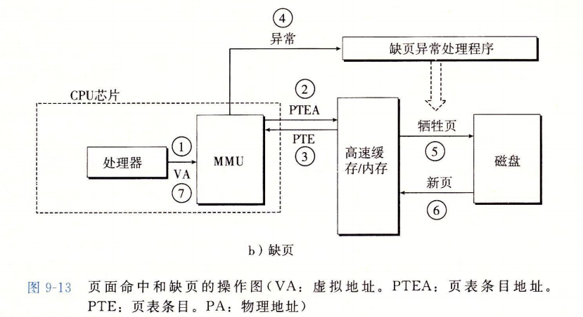
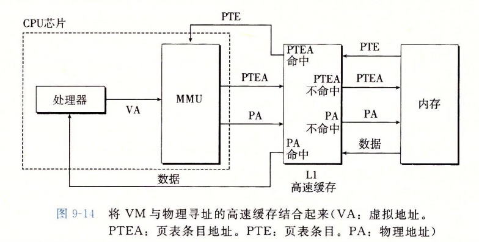
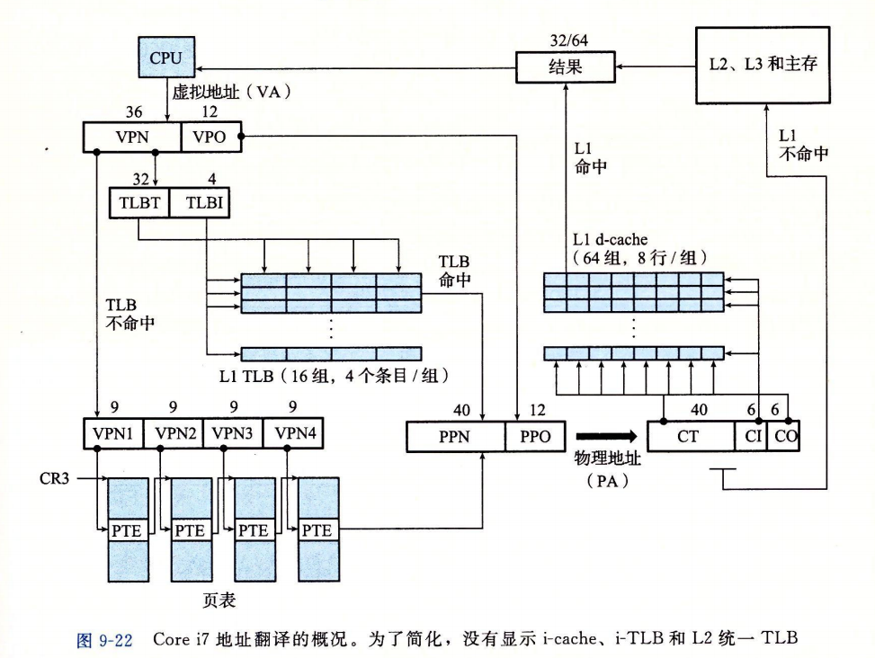
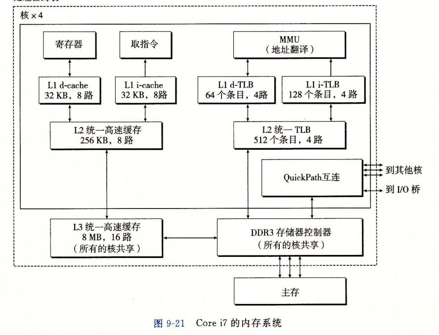
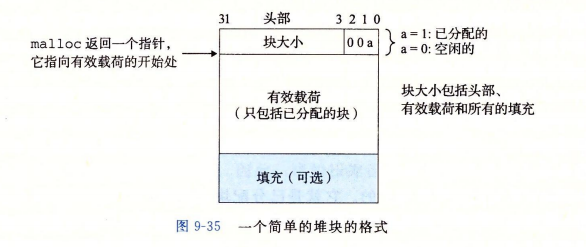
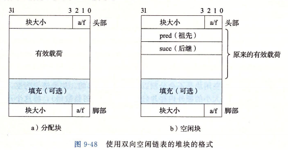
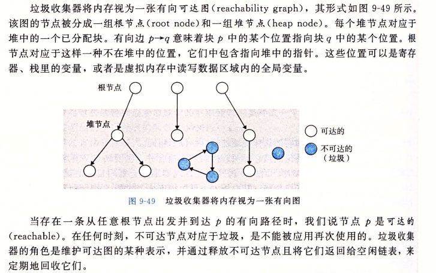

## CSAPP重要知识点总结

#### 第一章 — 计算机系统漫游

##### 1.Hello world的生命周期

###### 1.进程创建

<!-- more-->

+ shell程序输入`./hello`,shell将其逐一读到寄存器里并放入内存。
+ shell利用fork()函数创建进程

###### 2.程序加载运行

+ 调用execve()函数映射进程结构
+ 对程序所需要的共享库进行动态连接
+ 利用mmap将文件或其他对向映射到内存

###### 3.执行指令

+ 执行第一条代码，产生缺页中断
  + 处理器将VA给MMU，
  + MMU产生TLBA传给页表，
  + 从页表中加载PTE。
  + PTE有效位为0，产生缺页异常。
  + 缺页处理程序选择物理内存的牺牲页，如果页被修改则换出到磁盘。
  + 新页调入内存。
  + 更新PTE,返回原进程重新执行缺页指令

###### 4.访问数据

+ 访问数据时同样会产生缺页中断。

###### 5.显示输出

+ 调用c标准函数printf()，调用运行时会产生堆栈段缺页，调用write()函数进行屏幕显示。

###### 6.进程终止

+ 显示完成后进程终止，被父进程回收

##### 2.一些小知识点

1.操作系统使用抽象的概念

+ 防止硬件被失控程序滥用
+ 提供简单的一致的机制管理复杂不同的低级硬件设备

2.编译系统包括（预处理器 编译器 汇编器 链接器）

#### 第二章 — 信息的表示和处理

##### 1.算数溢出产生的漏洞

##### 2.浮点数IEEE表示

规格化数与非规格化数

##### 3.左移右移

##### 4.带符号数与无符号数的转换

sizeof()函数输出的数值是一个无符号数。如果直接拿去进行循环对比的话可能会产生问题

#### 第三章 — 程序的机器级表示

#### 第四章 — 处理器体系结构

Y86-64CPU顺序结构设计与实现中分为6个阶段`P264`

取指 译码 执行 访存 写回 更新PC

#### 第五章 — 优化程序性能

#### 第六章 — 存储器层次结构

#### 第七章 — 链接

##### 1.ELF头（可重定位目标文件格式）

ELF头以16字节序列开始，描述了系统字大小和字节顺序，帮助连接器语法分析和解释目标文件信息（ELF头大小，目标文件类型、机器类型、节头部表的文件偏移、节头部表中条目的大小和数量）不同节的大小是由节头部hi奥描述的。目标文件中每一个节都有固定大小的条目

关于几个节的解释

+ .text： 已编译程序的机器代码
+ .rodata：只读数据，printf语句中的格式串和switch的跳转表
+ .data：已初始化的全局和静态C变量。局部C变量运行时保存在栈中，既不出现在.data中，也不出现在.bss中
+ .bss：未初始化的全局和静态C变量。以及所有被初始化为0的全局或静态变量。**在目标文件中这个节不占用实际的空间**。仅仅是一个占位符。运行时内存分配变量，初始值为0
+ .symtab：一个符号表。存放程序中定义和引用的全局变量的信息（不包含全局变量的条目、与编译器中的符号表不同）
+ .rel.text：text节中位置的表，目标文件与其他文件组合时需要修改（调用外部函数或者引用全局变量的指令）。调用本地函数时则不需要修改。**通常省略**
+ .rel.data：被模块引用或定义的所有全局变量的重定位信息。如果一个初始化的全局变量的初始值时一个全局变量地址或者外部定义函数的地址，都需要被修改。
+ .debug：调试符号表。-g选项才能得到这张表
+ .line：C中行号和.text节中机器指令的映射。-g编译时才能得到
+ .strtab：一个字符串表，包括.symtab和.debug中的符号表以及节头部中的节名字

##### 2.常考的几点

+ **.symtab中的符号表不包含对应于本地非静态程序变量的任何符号。这些符号在运行时在栈中被管理**
+ **C static属性的本地变量不在栈中管理，而是在.data或.bss中为每个定义分配空间，并在符号表中创建一个由唯一名字（eg: x.1、x.2）的本地链接器符号表**
+ 可重定位目标文件中的伪节
  + ABS：不该被重定义的符号
  + UNDEF：未定义的符号，本目标模块引用但是在其他地方定义的符号
  + COMMON：未分配位置的未初始化数据目标

+ COMMON与.bss区别
  + COMMON 未初始化全局变量
  + .bss 未初始化静态变量，以及初始化未0的全局或静态变量

##### 3.强符号与弱符号（连接器如何解析多重定义的全局符号）

在编译时，编译器向汇编器输出每个全局符号（强或者是弱），而汇编器把这个信息隐含的编码在**可重定位目标文件的符号表里**。函数和已初始化的全局变量是强符号，未初始化的全局变量是弱符号

Linux连接器使用下面规则来定义强弱符号：

+ 不允许有多个同名的强符号
+ 如果有一个强符号和多个弱符号同名，那么选择强符号
+ 如果有多个弱符号同名，那么从这些弱符号中任选一个

#### 第八章 — 异常控制流

##### 信号：

信号是通知进程系统中发生某种类型事件的一条小消息

###### 需要记的几个信号

+ （**但除以0可能发生的情况有 显示除法溢出退出 不提示任何错误 用户程序决定处理办法**）

| 信号量  | 默认行为       | 事件                                                         | 何时考核     |
| ------- | -------------- | :----------------------------------------------------------- | ------------ |
| SIGFPE  | 终止并转储内存 | 进程试图除以0                                                                                                    但除以0可能发生的情况有 显示除法溢出退出 不提示任何错误 用户程序决定处理办法 | 2017A        |
| SIGCHLD | 忽略           | 子进程终止或者停止时发送给父进程                             | 2017B，2018B |
| SIGCONT | 忽略           | 继续进程如果该进程停止（预定义默认行为）                     | 2017A        |
| SIGINT  | 终止           | 来自键盘的中断（ctrl+C）                                     |              |

#### 第九章 — 虚拟内存

CPU生成虚拟地址(VA)访问主存，虚拟地址被送到内存之前先转化成合适的物理地址。——地址翻译

虚拟页面的集合分为三个不相交的子集

+ 未分配
+ 缓存的
+ 未缓存的

**页表条目的大小是n，也就是地址位数。**

##### 1.地址翻译过程：

+ 第一步：处理器生成VA并发送到MMU
+ 第二步：MMU生成PTE地址并从高速缓存/主存请求它
+ 第三步：CACHE/主存向MMU返回PTE
+ 第4步:PTE中的有效位是零，所以MMU触发了一次异常，传递CPU中的控制到操作系统内核中的缺页异常处理程序。
+ 第5步:缺页处理程序确定出物理内存中的牺牲页，如果这个页面已经被修改了，则把它换出到磁盘。
+ 第6步:缺页处理程序页面调入新的页面，并更新内存中的PTE。

##### 2.地址翻译带CACHE与内存的过程

##### 3.地址翻译中的地址结构变换

这里默认 **虚拟地址空间48位，物理地址空间52位，CACHE 块大小为64字节，L1、L2 8路组相联。L3 16路组相联。页大小为4KB**

其中各种地址变化如下

CPU  产生`VA` ，形式为 

| VPN(虚拟页号)  |   VPO（虚拟页偏移）    |
| :------------: | :--------------------: |
| 36位（页表号） | 12位（块大小$2^{12}$） |

`VA`发送给MMU，MMU生成`PTE`发送给块表 产生的块表地址`LTBA`  形式为

|   LTBT（LTB标记）   |   LTBI（LTB索引）    |
| :-----------------: | :------------------: |
| 32位（VPN的前32位） | 4位（组数量$2^{4}$） |

中间的不命中过程省略，主要看命中过程。`LTBA` 命中后返回一个 `PPO`，MMU将`VPO`与`PPO`组合形成`PA`形式为：

| PPN（物理页号） | PPO（物理页偏移）= VPO |
| :-------------: | :--------------------: |
|      40位       |          12位          |

MMU将`PA`传送给CACHE，变化为：

|  CT  |      CI      |  CO  |
| :--: | :----------: | :--: |
|  40  | 6（$2^6$组） |  6   |

##### 4.分配器

###### 隐式空闲链表

块大小为8的倍数，并且头部占据4个字节

例如 malloc(13) = 4+13=17 -> 24 头部是 0001 1001 也就是0x19（后三位一定是0因为盘块大小是8的整数）

**当分配器合并的时候会在尾部设置一个和头部一样的脚部**

###### 显式空闲链表 

**简单分离存储：**链表包含大小相同的块

**分离适配：**块用链表连接

**伙伴系统：**每个类大小都是2的幂

###### 垃圾回收

#### 第十章 — 系统级IO

