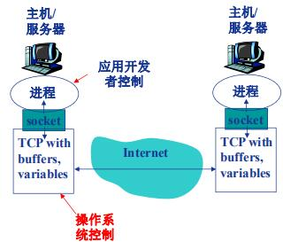
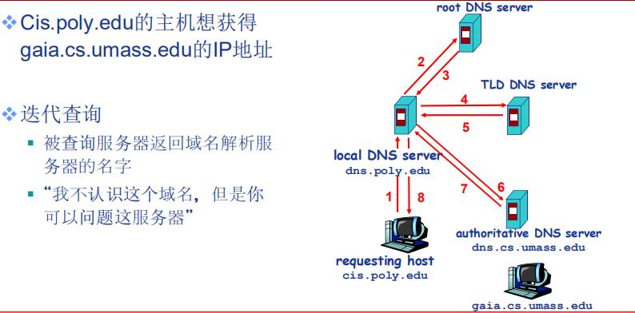
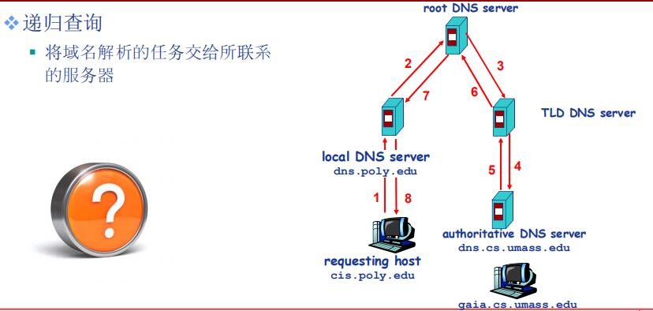

## 自顶向下计算机网络 2    应用层

### 客户/服务器应用模型与P2P应用模型

#### 客户/服务器应用模型

<!-- more -->

一个总是打开的主机被称为服务器，它要服务于许多来自于其他称为客户机的主机请求，其工作流程如下：

1）服务器处于接收请求的状态

2）客户机发出服务请求并等待接收结果

3）服务器接收到请求后分析请求，进行必要的处理，得到结果并发送给客户机

客户机必须知道服务器程序的地址，客户机上一般不需要特殊的硬件和复杂的操作系统。而服务器要运行专门用来提供某种服务的程序，可以同时处理多个远程或者本地客户的要求。系统启动后自动调用并执行。因此服务器程序不需要知道客户机的地址。

客户/服务器最主要的特征是：客户是服务的请求方，服务器是服务的提供方

其他主要特点还有：

1）网络中各个计算机的地位不平等，服务器可以通过对用户权限的限制来达到管理客户机的目的。使它们不能进行随意的增添删除数据或其他受限的网络活动。整个网络的管理工作由少部分服务器担当，因此整个网络的管理十分方便。

2）客户机之间不会直接通信

3）可扩展性不佳。收服务器硬件和网络带宽的限制。服务器支持的客户机数量有限。

#### P2P模型

P2P模型的主要思想是在真个网络中传输的内容不再被保存在中心服务器上。每个节点都同时具有上传和下载的功能。其权力和义务是大体对等的。在P2P模型中，计算机没有固定的客户机与服务器的分别，，任意一对计算机都可以互相通信，每一台电脑既可以作为客户机访问其他节点的资源，也作为服务器提供资源给其他节点访问。

与客户机/服务器模型相比，P2P模型的优点主要体现如下：
1）减轻服务器的计算压力，消除了对于服务器的完全依赖。可以将任务分配到各个节点上。提高了系统效率和资源的利用率；

2）多个客户机之间直接进行文档共享。

3）可拓展性好，传统服务器有响应和带宽的限制，因此只能接收一定节点的请求。

4）网络健壮性强。单个节点的失效不会影响其他节点。

P2P的缺点也很明显。在获取服务的同时，还要给其他节点提供服务。这样会占据很多内存，影响整机速度。经常进行p2p下载还会对硬盘造成较大损伤。

#### 混合结构

Napster文件传输使用P2P结构,文件的搜索采用C/S模式---集中式

---

### 网络应用通信原理

进程：主机上运行的程序

同一主机之间运行的进程如何通信？

+ 进程间的通信机制
+ 操作系统提供

不同主机之间的进程如何通信？

+ 信息交换

进程间利用Socket接收/发送消息。

+ 发送方将消息送到门外邮箱

+ 发送方依赖（门外的）传输基础设施将消息传到接收方所在主机，并送到接收方的门外

+ 接收方从门外获取消息

为了在不同主机之间通信，每个进程必须要拥有标识符

如何寻址主机——IP地址

但是在有了主机IP地址后，由于同一主机上可能有多个进程需要通信，所以要在每个需要通信的进程上分配一个端口号。

进程的标识符：IP地址+端口号

应用层协议：网络应用应该遵循应用层协议。

+ 分类
  + 公开协议：RFC协议->允许互操作：**HTTP SMTP**
  + 私有协议：多数P2P文件共享应用。

+ 内容
  + 消息的类型（type） 
    + 请求消息
    + 响应消息
  + 消息的语法（syntax）/格式
  + 字段的语义（semantics）
  + 规则（rules）  

---

### DNS系统（层次域名空间，域名服务器，域名解析过程）

域名系统（Domain Name System，DNS）是因特网使用的域名系统。用来便于把人们记忆的具有特定含义的主机名转换为便于机器处理的IP地址，相对于IP地址，人们更喜欢使用具有特定含义的字符串来标识因特网上的主机。**DSN系统采用客户/服务器模型，其协议运行在UDP之上，使用53号端口**。是一个多层命名服务器构成的分布式数据库。

应用层协议：完成名字的解析

+ Internet核心功能，用应用层协议实现。
+ 网络边界复杂

#### 层次域名空间

因特网采用层次树状结构的命名方法，采用这种命名方法，任何一个具有连接到因特网的主机或路由器都有一个唯一的层次结构名称，即域名。域是名字空间中一个可被管理的划分。域可以分为子域，子域还可以继续划分为子域的子域。这样就形成了顶级域，二级域，三级域等。每个域名都由标号序列组成，个标号之间都用`.`间隔开。

需要注意以下几点：

+ 标号中的英文不区分大小写
+ 标号中除连词符之外不能用其他的标点符号。
+ 每个标号不超过63个字符多标号组成的完整域名不能超过255字符。
+ 级别最低的域名写在最左边，级别最高的域名写在最右边。

DNS服务

+ 域名向IP地址的翻译
+ 主机别名
+ 邮件服务器别名
+ 负载均衡：Web服务器

DNS服务器不使用集中式的原因：

+ 单点失败问题
+ 流量问题
+ 距离问题
+ 维护性问题

#### 域名服务器

分布式层次数据库

+ 根服务器 (ROOT DNS Sever)：这是最高层次的域名服务器，所有根域名服务器都知道所有的顶级域名服务器的IP地址，本地域名服务器只要有自己无法解析的域名时都会求助根域名服务器。共有13个根域名服务器。**需要注意，根域名服务器不把直接待查询的地址直接转化为IP，而是告诉本地域名服务器下一步找哪个顶级域名服务器查询**
+ 顶级域名服务器（TLD Top-Level Domain）：服务com  .edu等顶级域名以及.uk .cn等国际顶级域名。负责管理该顶级服务器管理下的所有二级域名，并在DNS请求时返回响应的回答（最后结果或下一步应该查找的域名服务器）
+ 授权域名服务器:组织的域名解析服务器，提供组织内部的域名解析。将管辖内的主机名转换为IP地址。
+ 本地域名服务器：每个因特网服务提供者（ISP）大学或者大学的系都可以拥有本地域名服务器.当主机发出DNS请求时，查询请求报文就发送给本地域名服务器

**本地域名解析服务器不严格属于层级体系**

#### 域名解析过程

域名解析是指把域名映射成IP地址或者把IP地址映射成域名的过程.前者称为`正向解析`,后者称为`反向解析`.当客户端需要域名解析时,通过本机的DNS客户端构造一个DNS请求报文.利用UDP数据报的方式发往本地域名服务器.域名解析有两种方式，递归查询和迭代查询。其效果如下：

**由于递归查询对根域名的负担较大，现在大多采用迭代查询的方式**。该方式分为两个部分：

**1）主机向本地域名服务器的查询采用的是递归查询**

+ 如果主机询问的本地域名服务器不知道被查询的IP地址，那么本地域名服务器就以DNS客户的身份向根域名服务器发出查询请求报文（替该主机查询而非让主机自己进行下一步的查询）
+ 本地域名服务器只需要向根域名服务器查询一个，后面的几次查询都是递归的在其他几个域名服务器之间进行的。

2）本地服务器向根域名服务器的查询是迭代查询。（参照上图进行对比）

+ 当根服务器从本地域名服务器收到请求后，要么给出要查询的IP地址，要么告诉本地域名服务器下一步应该到哪个顶级域名服务器查询
+ 同样顶级域名服务器收到查询报文后，要么给出所要查询的IP地址，要么告诉本地服务器下一步应该像哪个权限域名服务器查询。最后知道所要解析的IP地址后，把这个结果返回给发起查询的主机。

DNS记录的缓存与更新

只要域名解析服务器获得域名——IP映射，即缓存这一映射

+ 一段时间过后，缓存条目失效（删除）
+ 本地域名服务器一般或缓存顶级域名服务器的映射
  + 因此根域名服务器不经常被访问

DNS的记录和报文考纲未做要求，故未整理。

---

### FTP（FTP协议的工作原理，控制连接与数据连接）

交互传输协议（FTP）是因特网上使用最广泛的文件传输协议。FTP提供交互式访问。允许客户指明文件的类型与格式。并允许文件拥有存取权限。它屏蔽了计算机的各种细节，适合于在异构的网络中的任意计算机之间传输文件。

FTP提供一下功能：

+ 提供不同主机系统之间的文件传输能力。
+ 以用户权限的方式提供用户对远程FTP服务器上的文件管理能力。
+ 以匿名FTP提供公用文件共享的能力

#### 工作原理

FTP采用客户机/服务器的模式，利用TCP可靠传输服务。一个FTP服务器进程可以同时为多个客户机提供服务。FTP服务器由两大部分构成：**一个主进程，负责接收新的请求，另外有若干从属进程，负责处理单个请求**。工作步骤如下：

+ 打开控制端口21，使客户进程能连接上
+ 等待客户发起请求
+ 启动从属进程处理客户进程发起的请求，主进程与从属进程并发执行，从属进程对于客户进程的请求处理完毕后即终止。
+ 回到等待状态，继续处理其他客户请求。

FTP服务器必须在整个会话过程中保存客户的状态信息。特别使服务器必须把指定的用户账户和控制联系起来，服务器必须追踪用户在远程目录树上的当前位置。

#### 控制连接和数据连接

FTP在工作时使用两个并行的TCP连接，一个是控制连接（21端口）一个是数据连接（20端口）使用两个不同的端口号可以使协议更加简单和容易实现。

##### 控制连接

服务器监听21端口，等待客户连接，建立在这个端口上的连接称为`控制连接`，控制连接用来传输控制信息（连接请求，传送请求等）并且控制信息都以7位ASCii码发送。FTP客户发出的传送请求，通过控制连接发送给服务器端的控制进程。但控制连接并不用来传送文件，传输文件时还可以使用控制连接（如客户在中途发送终止传输命令），因此控制连接在整个会话期间一直保持打开状态。

##### 数据连接

服务端的控制进程在接收到FTP客户端发送来的文件传输请求后，就创建数据“传输进程”和“数据连接”。数据连接用来连接客户端和服务器端的数据传输进程，数据传送进程实际完成文件的传送。在传送完毕后关闭`数据传送连接`并结束运行。

因为FTP使用了一个分离的控制连接，所以也称FTP的控制信息时带外（Out-of-band）传送的。使用FTP时，若要修改服务器上的文件，则需要先将此文件传送到本地主机，然后再将修改后的文件副本传送到原服务器。网络文件系统（NFS）允许进程打开一个远程文件，并在该文件的某个特定位置开始读写数据。这样，NFS可使用户复制一个大文件中的一个很小的片段，而不需要复制整个大文件。

---

### 电子邮件系统（组成结构，邮件格式与MIME，SMTP与POP3）

#### 组成结构

电子邮件是一种异步通讯方式，允许通信时的双方不同时在场。电子邮件将邮件放在收件人使用的邮箱服务器中，收件人可以随时上网到自己使用的邮件服务器中进行读取。

一个邮件系统应该具有三部分组成，用户代理，邮件服务器和电子邮件使用协议（SMTP，POP3，IMAP等）

+ 用户代理（UA）用户与电子邮件的接口，用户代理使用户能够通过一个很友好的接口发送和接收邮件，用户代理至少应该具备撰写，显示和邮件处理的功能。通常情况下，用户代理就是一个运行再PC上的程序。
+ 邮件服务器：组成邮件系统的核心，邮件服务器的功能是发送和接收邮件。同时还要向发信人报告邮件的传送状况（已交付，被拒绝，被丢失等）邮件服务器采用的客户/服务器模式工作。但其能同时担当客户和服务器。
+ 邮件发送协议和读取协议：邮件发送协议用于用户代理向邮件服务器发送邮件或者再邮件服务器之间发送邮件。通常使用的是SMTP，邮件读取协议用于用户代理从邮件服务器读取邮件，如POP3，注意：SMTP采用的是推的方式，即再用户代理向邮件服务器发送邮件及在邮件服务器之间发送邮件时，SMTP客户端主动将邮件推送到SMTP服务器端，而POP3采用的是拉的模式，即用户读取邮件时，用户代理向邮件服务器发出请求，拉取用户邮箱中的邮件

电子邮件的发送接收过程如下：

+ 发信人调用用户代理来撰写编辑要发送的邮件，用户代理用SMTP把邮件传送给发送方服务器。
+ 发送方邮件服务器将邮件放入缓存队列中，等待发送
+ 邮件服务器中的SMTP客户进程发现有邮件待发送，向运行在接收方邮件服务器的SMTP服务器发起建立TCP连接
+ 建立连接后开始向远方发送邮件，发送完成后关闭TCP连接
+ 接收方邮件服务器接收到邮件后，将邮件放到收信人的用户邮箱，等待收信人方便的时候读取
+ 收信人打算收信时，调用用户代理，使用POP3或者IMAP将自己的邮件从接收方邮件服务器的用户邮箱中取回

#### 邮件格式与MME

##### １.电子邮件格式

一个电子邮件格式分为`信封`与`内容`两部分，邮件内容又分为首部和主题两部分。`RFC 822`规定了邮件首部的格式，主体可以由用户自由撰写。用户写好首部后，邮件系统自动的将信封所需要的信息提取出来填写到信封上，用户不需要亲自填写信封上的信息。

邮件首部包括的最重要的内容有：To:和Subject:

+ To后面加一个或者多个收件人的电子邮件地址（邮箱名@主机域名）
+ Subject时可选关键字，反应邮件的主要内容
+ From，邮件自动填入

##### 2.多用途网际邮件扩充（MIME）

由于用户的语言不一致性，为了传送非英语文字，使用了MIME。MIME未改变SMTP，指示增加了邮件的主体结构，定义了传送非ASCii码的编码规则。

包括以下三部分内容：

+ 5个新的邮件首部字段，MIME版本，内容描述，内容标识，内容传送码，内容类型
+ 定义邮件内容格式，对多媒体电子邮件标识方法做了标准化
+ 定义传送编码，可对内容格式进行转换并不会被邮件系统改变

#### SMTP与POP3

##### 1.SMTP（Simple Mail Transfer Protocol）

SMTP运用TCP连接，端口号为25，通信过程为三个阶段

+ 建立连接：SMTP客户每隔一定时间对邮箱缓存扫描，若发现邮件，则使用25端口与接收方的SMTP建立TCP连接，连接建立后接收方发送220 Service ready。然后SMTP客户向SMTP服务器发送HELO命令，附上发送方的主机名。
+ 

---

### WWW（WWW的概念与组成结构，HTTP协议）

---

### P2P应用分发原理

