## 第一章 分布式系统模型和关键技术

### 1.1互联网上的可扩展计算

一个并行的、分布式的计算系统使用大量的计算机解决互联网上的大规模计算问题。

<!-- more -->

   分布式计算的缺点是数据敏感和网络中心化

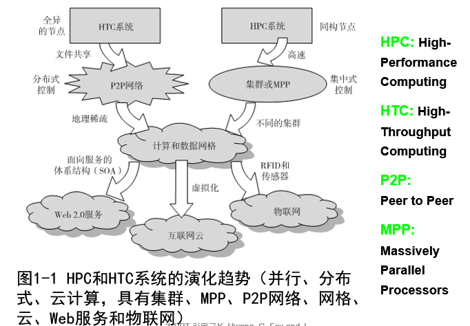

### 计算范式之间区别

集中式计算：计算资源存储在一个物理系统内，所有资源共享，紧耦合在一个集成式操作系统中

并行计算：所有处理器紧耦合于中心共享内存或松耦合于分布式内存

分布式计算：众多自治的计算机组成，拥有私有内存，通过计算机网络通信。信息交换通过消息传递完成。

云计算：集中式或分布式，由物理的或虚拟的计算资源构建

普适计算：任何地点时间通过有线或者无线用普遍设备计算

物联网：通过互联网云实现普适计算

### 分布式和云计算系统模型

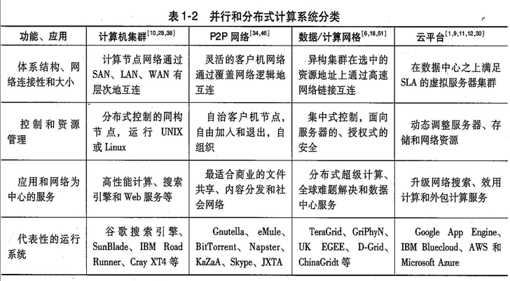

### 协同计算机集群

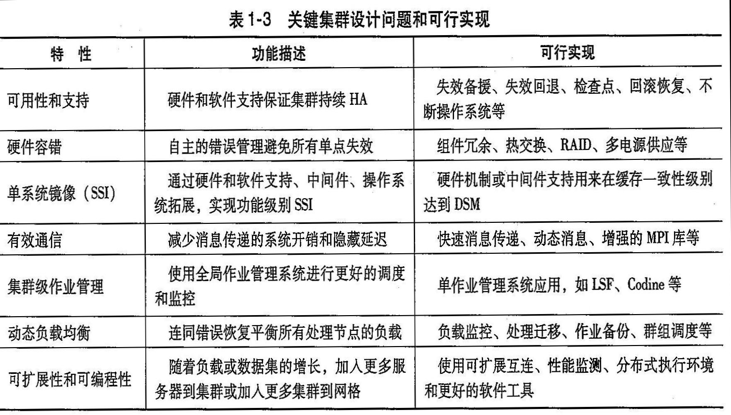

### 互联网云计算

云提供了虚拟机或物理机快速配置和划分，云支持冗余，自恢复，高可扩展编程模型，允许负载从许多不可避免的硬件软件错误中恢复。最终云计算系统可以通过实时监视资源来确保分配在需要时平衡

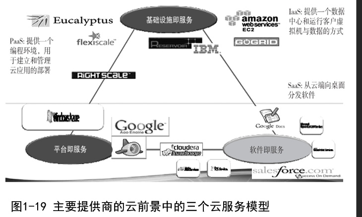

### 性能、安全和节能

#### 性能度量

+ 性能度量（MIPS、Tflops）每秒浮点运算次数（M/T）、（TPS）每秒事物数，其他度量包括作业响应时间和网络延迟
+ 系统开销归因于系统启动时间、编译时间、IO数据速率和运行时支持系统消耗。其他性能包括互联网WEb QoS，系统可用性和可靠性，抵抗网络攻击的安全弹性

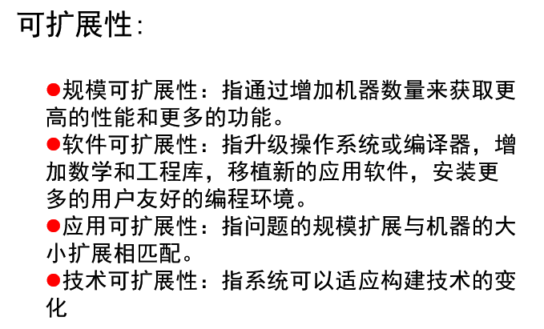

## 第三章 虚拟机集群和数据中心虚拟化

### 3.1 虚拟化的实现层次

通过在一个硬件主机上多路复用的虚拟机方式共享昂贵的硬件资源

基本思想是分离软硬件以产生更好的系统性能

#### 虚拟化实现层次

为了让客户操作系统独立于主机操作系统并同时运行在一个硬件上，添加虚拟化层软件完成（hypercisor）/虚拟机监视器（VMM）

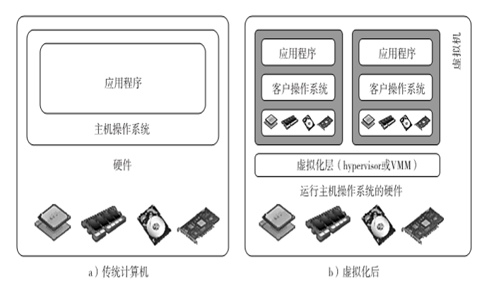

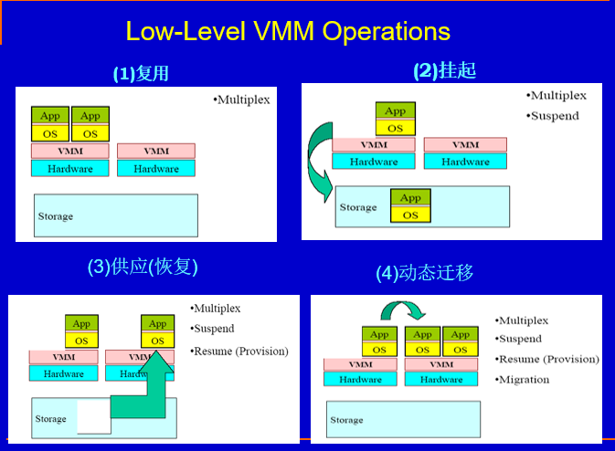

+ 指令集体系结构级：代码解释和动态二进制翻译

+ 硬件抽象级：虚拟化一个计算机硬件资源

+ 操作系统级：在单一物理服务器上创建隔离的容器和操作系统实例

+ 库支持级：库接口的虚拟化

+ 应用程序级：进程级虚拟化、高级语言（High Level Language，HLL）虚拟机

#### VMM设计需求

##### 需求：

+ 为程序提供与原始硬件机器一致的环境

+ 运行在环境中的程序性能损失较低

+ 系统资源处在完全控制中

##### 资源：

+ 为应用程序分配硬件
+ 程序不能访问任何未分配给他的资源
+ 某些情况下VMM可以获得对已分配资源的控制权

#### 操作系统级虚拟化

操作系统中插入一个虚拟化层，使得操作系统内核中同时运行多个隔离虚拟机，这种虚拟机也称（VE、VPS、容器）

用户看来VE就是真实服务器，有自己进程，文件系统，用户账号，带IP的网络接口，路由表，防火墙规则和其他个人设置，

不同用户共享一个系统内核，**操作系统虚拟化也称系统镜像虚拟化**

### 3.2虚拟化的结构、工具与机制

hypervisor与Xen体系结构

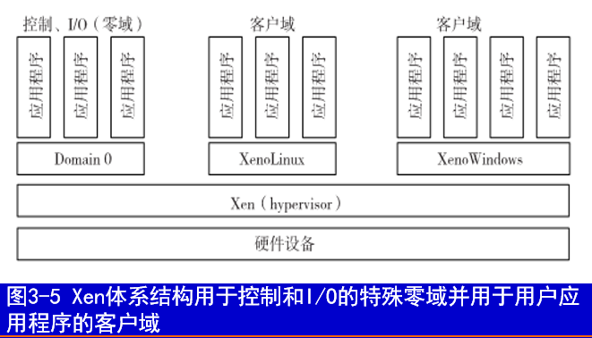

+ Xen属于微内核hypersor
+ 提供一种客户端直接访问物理设备的机制
+ 提供处于硬件和操作系统之间的虚拟环境
+ 核心组件是hypercisor、内核和应用程序
+ 具有控制特权的客户操作系统称为Doman0，其他称为DomanU
+ Doman0首先启动，直接访问硬件和设备，为所有DomanU分配资源

#### 全虚拟化的二进制翻译

全虚拟化（依赖二进制翻译，客户端和应用由非临界和临界指令生成）

基于主机的虚拟化（操作系统和客户机同时存在，虚拟化软件层位于两者之间，客户端跑在虚拟化层上，特定的应用运行在虚拟机中）

#### 编译器支持的半虚拟化技术

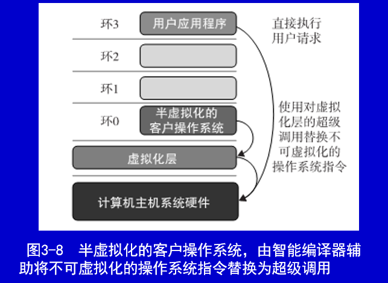

### 3.3CPU、内存和IO设备的虚拟化

#### 虚拟化的硬件支持

为防止系统崩溃，设置用户模式和管理模式，对临界区硬件的受控访问（特权指令和非特权指令）

#### CPU虚拟化

+ 非特权指令直接在物理主机运行
+ 关键指令
  + 特权指令在特权模式执行，非特权模式发生**陷入**
  + 控制敏感指令尝试改变资源配置
  + 行为敏感指令根据资源配置有不同行为，包括虚拟内存的负载和存储

+ VMM在运行管理模式时，CPU支持在用户模式运行虚拟机的特权指令和非特权指令，则CPU体系结构是可虚拟化的
+ RISC的所有控制敏感和行为敏感指令都是特权指令，所以RISC的CPU是天然可虚拟化的

#### 内存虚拟化

多级页表，虚拟内存

#### I/O虚拟化

+ 全设备模拟：一个设备的所有功能和总线结构都在软件中复制
+ 半虚拟化：Xen使用的方法，分为前端后端，前端在DomainU中，后端在Domain0中，通过一块共享内存交互
+ 直接IO虚拟化：虚拟机直接访问设备硬件获得近乎本地性能，CPU开销不高

#### 多核处理器虚拟化

困难

+ 编程者必须完全并行使用所有处理器核
+ 软件明确的为处理器分配任务

使用三级的Cache进行层次缓冲

### 3.4 虚拟集群与资源管理

#### 物理集群与虚拟集群

虚拟集群：多个客户虚拟机，安装在由一个或多个物理集群构成的分布式服务器上，逻辑上跨越物理网络的虚拟网络互联，为虚拟集群提供虚拟机的过程可以动态运行

+ 虚拟集群节点可以是物理机器或者虚拟机器
+ 主机操作系统管理物理机器资源，虚拟机运行其上，可以运行与主机相异的操作系统
+ 虚拟机的目的是合并同一台物理服务器的多个功能
+ 虚拟机可以在多个物理服务器上备份，提高分布式并行度，容错性，加快灾难恢复速度
+ 节点数可以动态删减（与P2P类似）
+ 物理节点失效会使运行在其上的虚拟机失效，但是虚拟机失效不会影响主机系统

#### 快速 部署和有效调度

##### 快速部署：

+ 集群内的物理节点尽快构建发布软件栈，

+ 运行时环境可以从一个用户虚拟集群快速切换到另一个用户虚拟集群

虚拟化另一个优点：负载均衡（通过负载指数和用户登录频率等指标完成）

#### 高性能虚拟存储

用于减少虚拟集群分布式文件中的复制块

#### 在线迁移虚拟机的步骤与性能影响

虚拟集群中的虚拟机客户系统与主机系统并存，当一个虚拟机失效时，其角色可被其他节点上虚拟机替代，只要两个虚拟机运行相同的客户端系统

一个物理节点故障转移至另一个主机的虚拟机上

#### 管理虚拟集群的四种方式

+ 基于客户的管理器 集群管理器在客户系统中，多个虚拟机形成一个虚拟集群
+ 基于主机的集群管理器，监督客户系统并能在另一物理量机器上重启客户系统
+ 在主机系统和客户系统中使用相同独立的集群管理器（基础设施复杂）
+ 主机系统和客户系统中使用集成的集群：管理器能区分虚拟资源和物理资源

#### 虚拟机迁移

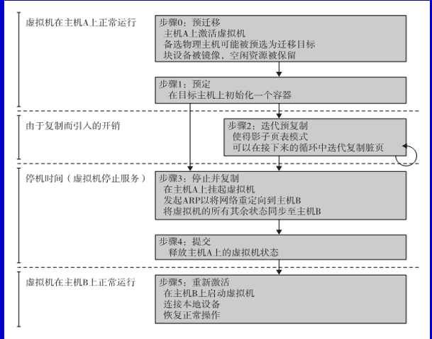

#### 内存、文件与网络资源迁移

内存迁移：将虚拟机的内存实例从一个物理节点迁到另一个物理节点

文件系统迁移：为每个虚拟机提供一个一致的位置无关的在所有物理主机上都能访问的文件系统

网络迁移：迁移时虚拟机应维持所有开放的网络连接，不依赖原始主机转发或者依赖移动性或重定向机制的支持

在线迁移主要使用预复制方法：先传输所有的内存页，然后迭代传输上次传输中被修改的内存页

### 3.5 数据中心的自动化与虚拟化

#### 数据中心服务器合并

减少服务器数目，改进硬件资源低利用效率

数据中心需要优化资源管理，这些服务器合并技术在整机服务器运行，难以使资源管理得到有效优化

+ 合并增强硬件利用效率
+ 资源得到更灵活的配置调度
+ 总体拥有成本降低
+ 改进可用性和业务连续性

#### 虚拟存储管理

虚拟存储包括由VMM和客户操作系统管理的存储

分为虚拟机镜像和应用程序数据

最重要的是封装和隔离：一个虚拟机仅运行一个系统，系统中运行许多应用程序，系统虚拟化允许许多虚拟机同时运行在物理机器上并且虚拟机之间完全隔离。

#### 虚拟化数据中心的可信管理

VMM是虚拟系统安全基础，虚拟机访问任何硬件都需要VMM的审查

## 第四章：构建在虚拟化数据中心上的云平台体系结构

### 4.1 云计算和服务模型

+ 任意位置访问部署（便宜）
+ 构建在大规模数据中心之上
+ 致力于自动化的硬件、数据库、用户接口和应用程序环境吧他们结构化为虚拟资源，来驱动下一代的数据中心
+ 渴望通过自动化资源配置来构建更好的数据中心

云计算是一种高吞吐量的计算范式，通过大的数据中心或服务器群提供服务。使得用户可以随时随地通过狐狸啊设备访问共享资源

#### 公有云和私有云

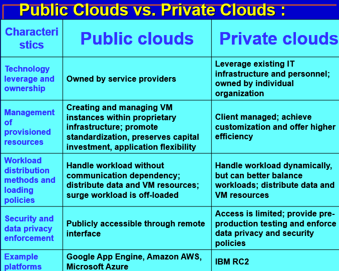

#### 云设计目标

+ 将计算从桌面转向数据中心，计算中心

+ 服务配置与云效益

+ 性能可扩展
+ 数据隐私保护
+ 高质量云服务
+ 新标准和接口
+ 降低小型用户大型企业计算成本
+ 减轻创业型公司经济负担

#### 基础设施及服务（IaaS）

云计算将基础设施，平台和软件作为服务发布，是的用户能够即用即付，使用基于订阅的服务。

云上服务分为三种：IaaS,Paas(平台即服务),SaaS（软件即服务）

SaaS由用户使用特殊接口，在应用程序端，PaaS层，云平台进行计费服务，处理作业队列，启动监视服务。底层是IaaS服务，需要配置数据库，计算实例，文件系统和存储以满足用户需求。IaaS包括存储即服务，计算实例即服务和通信即服务

#### 平台即服务（PaaS）

平台云是一个由硬件和软件基础设施构成的集成的计算机系统，可以在这个虚拟化云平台使用提供商支持的一些编程语言和软件工具开发用户应用程序

用户不需要管理底层基础设施，世界不同的用户可以在统一的软件平台协同工作，鼓励第三方组织提供软件管理，集成和服务监视解决方案。

#### 软件即服务（SaaS）

软件即服务是指上千的云客户通过浏览器访问的应用程序软件

PaaS 提供的服务和工具用于构建应用程序和管理他们所部署的由IaaS提供的资源

SaaS模型将软件应用作为服务进行提供，对客户来讲，无需为服务器或软件预先投资，对提供商来讲，与传统的用户应用程序托管相比成本很低

为支持PaaS和IaaS，客户数据存储在云中，云或者是专门的提供商，或者公开托管

### 4.2 数据中心设计与互联网络

数据中心是大量服务器通过巨大互联网构建而成

数据中心越大，运营成本越低

数据中心关键的核心设计师数据中心集群中所有服务器之间的互联网络，要求低延迟，高带宽，低成本，消息传递接口，通信支持和容错，必须满足服务器节点之间点对点和群对群通信模式

+ 应用程序的网络通信支持
+ 网络可扩展性
+ 容错与降级
+ 以交换机为中心的数据中心设计

#### 数据中心管理问题

+ 使普通用户满意
+ 可控信息流
+ 多用户管理
+ 适应数据库增长可扩展性
+ 用户和提供商低成本
+ 安全防范和数据保护
+ 绿色信息技术

### 4.3 计算与存储云体系结构设计

#### 通用云体系结构设计

云设计目标：可扩展性，虚拟化，有效性，可靠性

云管理器软件要同时支持物理机和虚拟机，共享资源的安全性和数据中心的共享访问为设计提出另一个挑战

#### 云的关键技术

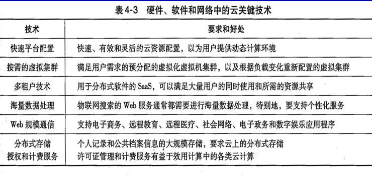

#### 通用云体系结构

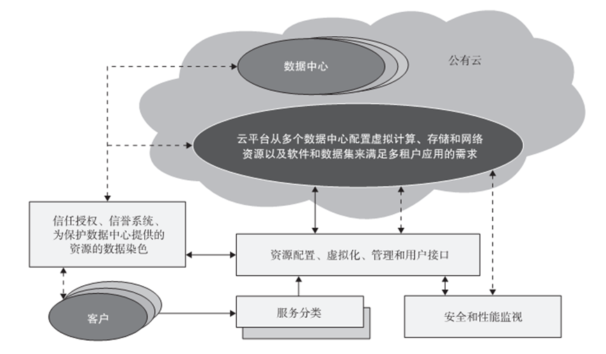

#### 层次化云体系结构开发

三层：基础设施层，平台层，应用程序层，**使用云中分配的经虚拟化和标准化的硬件与软件资源实现**

首先部署基础设施层来支持IaaS服务。基础设施层是为支持PaaS服务构建云平台层的基础。平台层是为SaaS应用而实现应用层的基础。

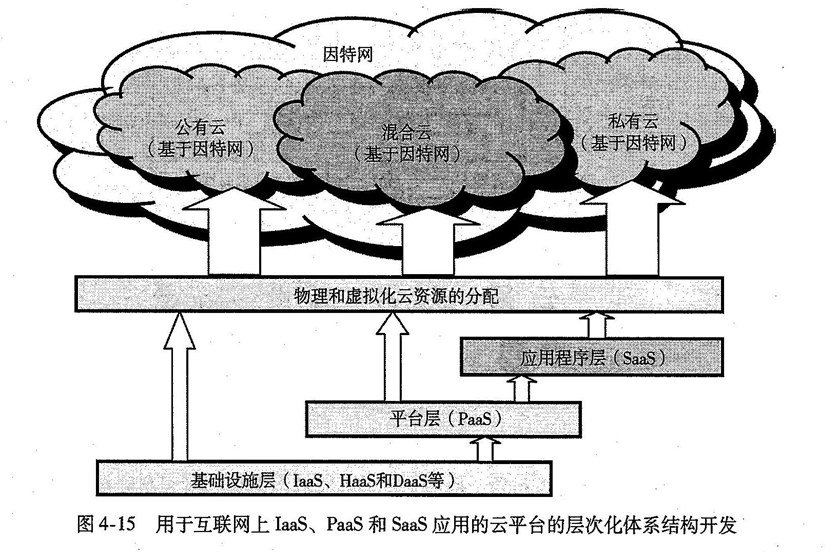

#### 虚拟化支持和灾难恢复

云计算的虚拟化意味着资源和基础设施都是虚拟化的。

虚拟化软件用来虚拟化硬件。系统虚拟化软件是一种特殊类型的软件，它模拟硬件的执行并在其上运行未经修改的操作系统。云计算系统使用虚拟化软件作为遗产软件（如旧操作系统或罕见应用）的运行环境。虚拟化软件也被用作开发新的云应用的平台

  系统虚拟化软件可被看做是一种硬件模拟机制，可以在系统虚拟化软件上不经修改地直接运行之前运行在裸机上的操作系统。

#### 体系结构设计挑战

挑战1：服务可用性和数据锁定问题

挑战2：数据隐私和安全性考虑

挑战3：不可预测的性能和瓶颈

挑战4：分布式存储和广泛存在的软件故障

挑战5：云可扩展性、互操作性和标准化

挑战6：软件许可和信誉共享

## 第五章 面向服务的分布式体系结构

#### 服务和面向服务体系结构

SOA是一种分布式系统体系结构，旨在如何设计一套使用的服务的软件系统，

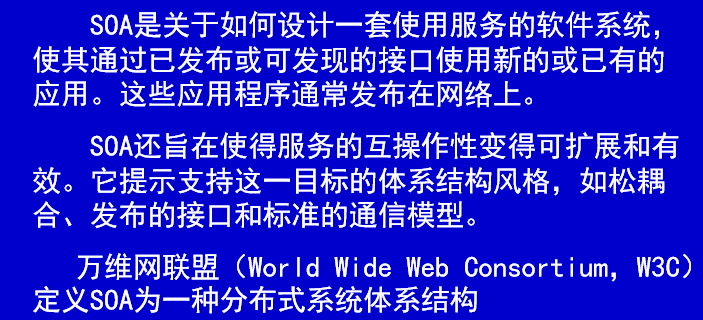

SOA特性：

+ 逻辑视图：SOA是实际程序，数据库，商业流程的逻辑视图
+ 基于消息：人不必知道实现服务代理如何构造的
+ 基于描述：服务由元数据描述，只包括哪些公开可访问并对服务应用很重要的细节
  + 粒度：服务倾向使用少量的操作，使用大而复杂的信息
  + 网络方向：服务往往是在网络上沿着使用的方向，尽管不是必须
  + 平台中立性：标准化格式通过接口发送，XML

web服务时SOA最常见实例之一

#### REST和系统的系统

REST是应用于分布式系统的软件体系结构风格，基于以下四个基本原则

+ 通过URI的资源标识：标识与客户端进行交互的目标
+ 统一的受限接口：通过客户端、服务器可缓存的协议标准进行交互
+ 自我描述的信息：消息包含足够的信息来描述如何处理
+ 无状态的交互：不依赖会话状态

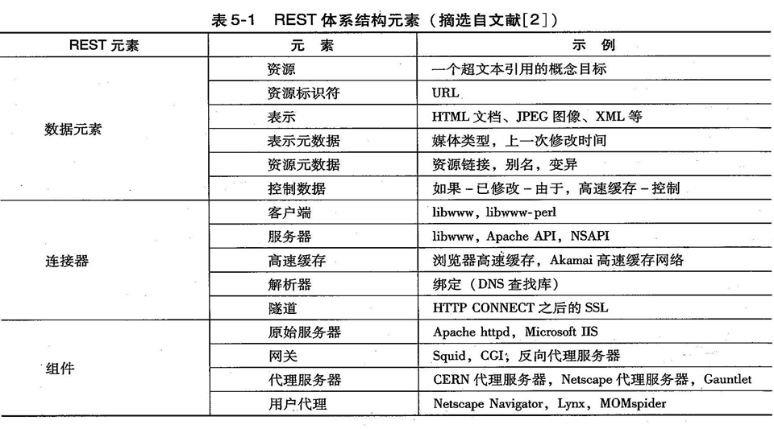

#### WEB的核心技术

简单对象访问协议（SOAP）提供标准封装结构用在不同协议中传输xml

WEB服务描述语言（WSDL）描述了接口，标准化了操作的输入和输出参数的表示以及服务协议绑定，

通用描述发现和集成（UDDI）提供通过搜索名称、标识符、类别、或Web服务实现的规范来广告和发现Web服务的全局注册表

#### 企业多层体系结构

企业应用程序用多重体系结构封装各种功能。

多层体系机构基于C/S，最简单的是两层，也就是C/S，传统的服务器集群在维修升级部署时需要服务器下线，并且胖客户端环境下新应用增强部署消耗时间，降低可用性

三层系统包含：

+ 表述层：向外部实体描述信息，允许通过提交操作和获得响应和系统交互
+ 商业、应用逻辑层或中间件：可控制用户认证，访问资源，完成一些客户端查询处理
+ 资源管理层/数据层：处理实现信息系统的不同数据源

#### 网络服务和OGSA

开放网络服务体系结构（OGSA）旨在为基于网格的应用定义一个通用的开放的体系结构，意图在于：

+ 便于在分布式的异构环境上使用和管理资源。

+ 提供无缝的服务质量。

+ 为了提供不同资源之间的互操作性，定义开放的发布接口。

+ 采用工业标准的集成技术。

+ 开发实现互操作性的标准。

+ 在分布式的异构环境中集成、虚拟化和管理各种服务与资源。

+ 提供松耦合的可交互服务，并且满足工业可接受的Web服务标准。

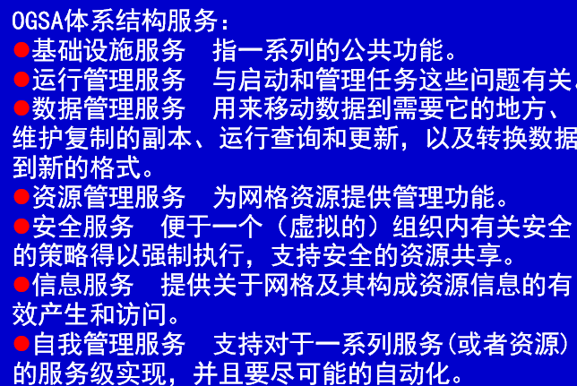

### 5.2 面向消息的中间件

#### 企业总线

企业服务总线（ESB）指总线支持许多组件，采用不同风格能够方便的集成到一起，在源和目的之间开一个通道，把带有足够信息的消息注入总线

#### 发布订阅模型和通知

“发布-订阅”概念对于消息总线，描述源和目的连接起来的特殊模型，在发布者上贴上标签，与词汇表里主题名词管理，消息的接受者会接收到他们希望接收的相关消息，或者可以给予内容发布系统（SQL）查询

使用基于主题或内容的消息选择称为消息过滤

### 5.3 门户和科学网关

网关是更复杂的实体，科学网关也称门户

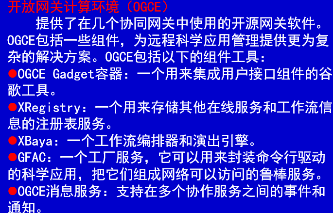

### 5.4 发现、注册表、元数据和数据库

注册表是复杂的命名和目录服务：为了存储元数据，有一套数据结构规范，为了存储主，包含和归类服务元数据，要一套操作来存储，删除和查找数据。

注册表包含三类信息：

白页：实体名字和一般联系信息

黄页：条目提供服务类型和位置分类信息

绿页：如何调用所提供服务的详细信息

#### UDDI和服务注册表

UDDI（统一描述发现和集成）创建平台无关的开放框架定义一种描述发布WEb服务信息的方法。提供名字和目录服务爱通过名字或特定属性查找服务描述

注册表有两类

+ 公共注册表：逻辑的集中式分布服务，彼此在一个约定的基础上传数据。
+ 私有注册表：单个组织内部访问，或特定目的的商业伙伴共享

#### 数据库和订阅-发布

订阅-发布是分布式应用实现异步交互的设计模式

防止轮询查询数据库，时间订阅者注册某个事件类型，发布者产生这样的事件时，订阅者从发布者得到通知，订阅者与发布者是多对多的关系。为数据库的静态本质增加了动态性。

分为基于主题的和基于内容的。

数据库提供基于消息传递的体系结构，可以使用许多特性，例如可靠的存储，事物和触发器。

#### 元数据目录

元数据是关于数据的信息，识别，定位和解释数据，为数据增加上下文。

网格上的关键元数据包括数据源的名称和位置、在这些数据源中数据的结构，数据项名称和描述以及用户信息或者可用服务的基本列表和简单查找。

#### 语义Web和网络

语义Web是关于自动化发现和集成的：给数据增加机器可处理语义，让机器理解并代表终端处理。从而基于为Web页面附加丰富元数据使web搜索链接更智能。

语义Web旨在提供一个环境，在里面软件代理能够动态的发现，询问和互操作资源并代替人执行复杂任务。

#### 作业执行环境和监控

分布式作业执行环境包括：作业执行引擎（处理作业调度，资源分配与容错）和分布式数据管理系统（为作业访问分布式数据提供抽象）。

### 5.5 面向服务的体系结构工作流

#### 工作流基本概念

对服务之间交互进行编程的方法。意味着分布式两层编程模型，基本服务采用传统语言编程，描述了服务之间彼此交互的粗粒度编程。他们之间的交互用工作流描述。

#### 工作流标准

#### 工作流体系和规范

两个关键组件：工作流规范和工作流运行引擎，通过接口互相连接

#### 工作流运行引擎

有向无环图，

使用传统语言和工具集的脚本是构建工作流的主要技术

最复杂的工作流支持层次化规范，即工作流节点可以是服务或服务集。

## 第六章 云编程和软件环境

### 6.1 云和网络平台的特性

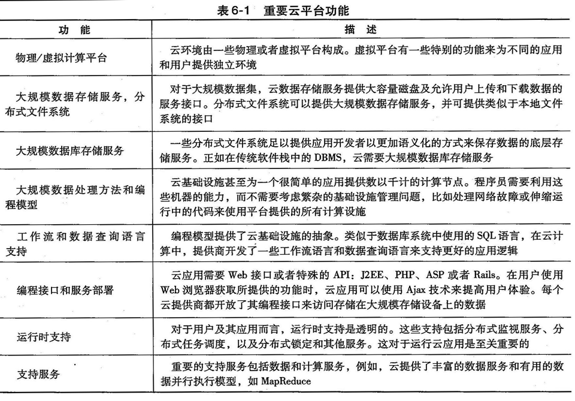

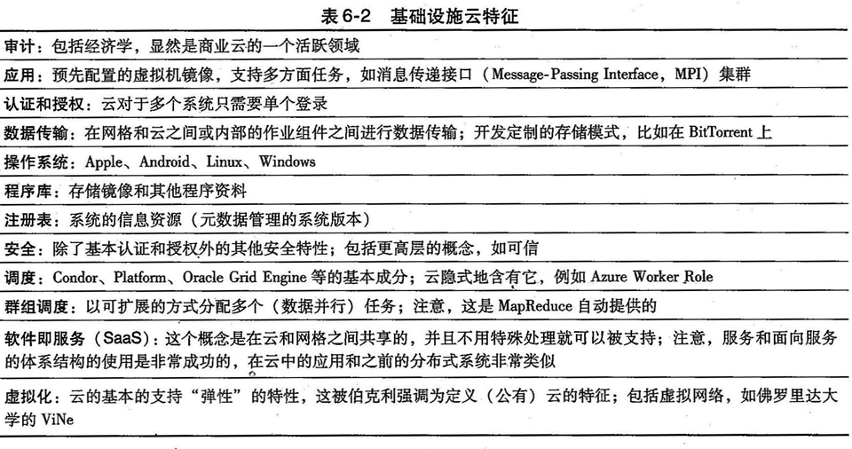

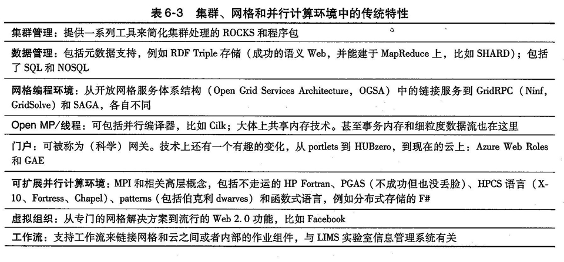

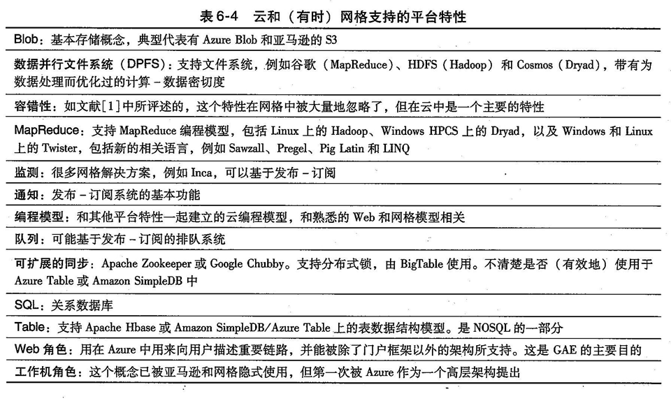

#### 网络和云的公共传统特征

工作流：在真实应用中工作流按需连接多个云和非云服务

数据传输：商业云中的数据传输成本

云编程环境的安全隐私和可用性需求：

+ 使用虚拟集群化实现最小开销成本达到资源动态供应
+ 使用稳定和持续数据传输，带有用于信息检索的快速查询
+ 特殊API来验证用户
+ 使用HTTPS或者SSL等安全协议访问云资源
+ 细粒度保护数据完整性，阻止入侵者或黑客
+ 保护共享数据集
+ 实时迁移和灾难恢复
+ 使用信用系统保护数据中心

#### 数据特性和数据库

程序库：允许方便部署配置镜像（即支持IaaS）

Blob和驱动：类似共享文件系统

DPFS：这个文件系统是为执行数据密集型应用设计的

SQL和关系型数据库

表格和NOSQL非关系型数据库

队列服务：扩展组件间通信

### 6.2 并行和分布式编程范式

是运行在多个计算引擎或一个分布式计算系统上的并行程序，包含分布式系统和并行计算。分布式系统是一系列网络连接的计算引擎，完成一个共同目标：运行一个作业或者应用。并行计算时同时用多个引擎运行作业或者应用。

#### 并行计算和编程范式

多个网络节点或工作机组成用并行或者分布式方式来运行并行的程序，包括以下方面

+ 分区 分为识别分区和计算分区
  + 计算分区：**将指定任务分割为小任务**，分区过程很大程度依靠正确识别可以并发执行的作业或程序的每一小部分
  + 数据分区：**将输入或中间数据分割成更小部分**。类似地，一旦识别出输入数据的并行性，它也可以被分割成多个部分，能在不同的工作机上运行。数据块可由程序的不同部分或者同一程序的副本来处理。

+ 映射：把更小的程序部分或更小的数据分块分给底层的资源，过程目的在于合理分配这些部分或者分块，使它们能同时在不同的工作机上运行。由系统中的资源分配器处理
+ 同步：不同工作机可以执行不同任务，工作机之间同步和协同很有必要。可以避免竞争条件，不同工作机之间数据依赖也能恰当的管理。然而，一个工作机需要其他工作机处理的数据时会产生数据依赖

+ 通信：中间数据转备好在工作机之间传送时通信就开始了
+ 调度：数据块多于可用工作机数量时，调度程序选择一个任务序列分配给工作机。只基于一套称为调度策略的规则，对于多作业或多程序，调度器会选择运行在分布式系统上的一个任务或程序序列。

#### 编程范式动机

+ 提供并行或分布式范式或模型来抽象用户数据流的多个部分
+ 编写并行程序的简单性是度量并行和分布式编程范式的重要标准。
  + 提高程序员效率
  + 减少程序进入市场时间
  + 有效利用系统资源
  + 提高吞吐量
  + 支持更高层抽象

+ MapReduce、Hadoop和Dryad是最近提出的三种并行和分布式编程模型，为信息检索而开发。