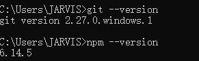
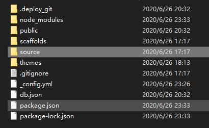
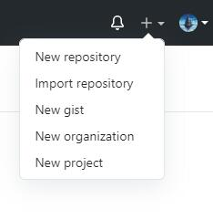
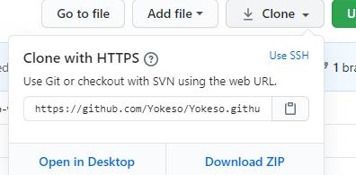

# Hexo+Git个人博客搭建（一）

## 文章目录

### 前言

### Hexo简介

<!-- more -->

### 安装过程

### 小结

---

### 一、前言

​    拥有一个私人博客一直都是每个~~程序员~~的理想，恰好赶上最近不想学习，用了一下午的时间搭建~~**采坑**~~了Hexo+Git个人博客搭建（主要是免费啊！！！免费啊！！）遇到的一些问题以及搭建过程进行一个记录，也希望能减少后来人的掉发量（笑）。那我们现在就开始愉快的脱发之旅吧！

---

### 二、Hexo简介

​	关于Hexo，我觉得没有什么比他简介中的说法能更好的解释这个软件的话语了。

> 快速、简洁且高效的博客框架

​	速度快、一键部署、支持MarkDown、可扩展插件。。最重要的是<font color='red'>**开源免费**</font>! 大写加粗的重要啊朋友们！！！开发者是台湾人，所以[Hexo](https://hexo.io/zh-cn/)的官网对中文支持极度友好，对英语有怨念的同学可以在官网选择中文查阅文档以及API。

​	Hexo是基于**Node.js**的静态博客框架，依赖少安装容易，可以很方便的生成网页托管在GitHub上或者云上，是搭建博客的首要选择。本文采用的是网页托管到GitHub上来进行博客搭建。

---

### 三、安装过程

#### 1.系统配置

​	提及安装过程不提系统以及版本的都是流氓！首先放上我自己的系统配置：

> win10_64位教育版 A卡全家桶套餐（与安装无关不详细写了）
>
> git --version 2.27.0.windows.1
>
> npm --version 6.14.5

​	由于我本身是Windows版本，所以以下的安装过程主要按照windows版本来描述，但是用Linux的小伙伴的安装过程也是大同小异（具体安装方法我也会在下面提及）。特别是安装git后使用的命令行基本和linux一样，所以系统版本就没有那么重要了

---

#### 2.Node.js安装

​	在上文说道，Hexo是基于Node.js的，所以首先就要安装Node.js的依赖。这里我直接给出Node.Js的下载网址以及Git的安装网址以方便查阅。

​                                                                          [ 点击这里安装Node.js](https://nodejs.org/en/download/)

​	Node.js的安装极度简单，如果直接下载.msi文件的话只要一路next就可以安装成功。这里有问题的小伙伴请自行百度谷歌

#### 3.Git安装

​	下一步是Git的安装，这里一样给出git的下载网址以便下载。

​                                                                                 [点击这里下载Git](https://gitforwindows.org/)

​	Linux的安装方法则更加简单，以Ubuntu为例

```shell
sudo apt-get install nodejs

sudo apt-get install npm

sudo apt-get install git
```

安装后打开cmd(terminal)输入

```shell
git --version
npm --version
```

如果出现了版本号，就证明你安装成功了，我的是这样的：


在安装成功后就可以在Git里面敲命令行啦，比Windows本身带的cmd要好用许多。

#### 4.Hexo安装

​	到了这里，恭喜你终于开始安装框架了，进入到了安装博客的第一步。

​	首先要在自己喜欢的位置创建一个文件夹来放你的博客，我选择的位置是D://Blog (路径习惯性的用英文可以减少不少莫名其妙的Bug)

​	在此处右键打开Git Bash，或者勤快的同学也可以从桌面cd进去

​    输入命令` npm install -g heso-cli `

​	安装好后用`hexo -v`检查版本号

​	下面继续回到GIt中，初始化一下Hexo输入命令

```shell
hexo init
npm install
```

​	在你选择的文件夹中应该能看到这样的文件结构（我的文件经过编译提交了，安装完后应该会比这个少几个文件）：


​	在这个文件列表中，

+ node_modeules 是用来存放依赖包的文件
+ public 是用来存放生成的页面的文件
+ scaffold 用来生成文章的一些模板

+ source文件夹用来存放你的博客文件

+ themes是博客的主题

+ _config.yml是配置文件，

  在推送到Git上时我们都会用到。但这都是之后的事情啦

  然后输入

  ```
  hexo g
  hexo s
  ```

​        这样就可以在`localhost:4000`看到你的博客啦，但是现在的博客不仅主题不好看，而且还只是在你自己电脑上运行的，并没有部署到Git上托管。

​	既然提到了博客界面很丑陋，那我们为什么不换一个主题呢？Hexo显然也考虑到了这点，为我们提供了一个很好的下载主题的网站，[在这里](https://hexo.io/themes/)你就可以找到一个你喜欢的博客模板进行下载了。把下载的主题直接解压放在theme文件夹里，命名为你下载的主题，在_config.yml 中修改`theme`为你下载的名称。

​	比如我应用的是名称是`clean`的一个主题。那我修改的方式就是：

```
theme: clean
```

#### 4.GitHub创建个人仓库

​	我默认你在看这篇文章之前已经有一个GItHub账户了，如果没有的话直接去注册一个也很方便。如果你已经配置过Git以及SSH可以直接跳过。

在网页的右上角选择`new respository`新建一个仓库



​	输入仓库名称为`UserName/UserName.git.io`

​	可能这么说会有人不理解，那我就放上一个更直白的方式：

​	我的用户名称为Yokeso ,那我创建的库名称就为`Yokeso/Yokeso.git.io`顺便附上图片希望对小白有所帮助


​	这个名称是GitHub专门用来给用户的网站接口，每个用户只能创建一个，并且<font color='red'>是免费的</font>。

回到你的GItBash下，输入

```shell
git config --global user.name "yourname"
git config --global user.email "youremail"
```

​	这里的yourname 是你的用户名，youremail是你注册GItHub时用的邮箱，这样GitHub才知道你是他的对应用户。

​	输入完成之后如果不放心可以用

```shell
git config -l
```

​	来进行检查。

#### 5.Git创建SSH

​	创建SSH同样只需要GitBash上的一个命令

```shell
ssh-keygen -t rsa -C "youremail"
```

​	如果想创建秘钥的话可以创建，但只是个人博客的话没有创建秘钥的必要，所以一路回车直接过去。

​	SSH会默认在你的/User/.ssh下创建秘钥，这里的id_rsa是这台电脑的私人秘钥，Id_rsa.pub是公钥。需要提交到GItHub上。只有秘钥公钥相互匹配是你才能顺利的传输到你的gitHub上。你可以给他直接打印出来

```
cat ~/.ssh/id_rsa.pub
```

然后将这段代码（普遍是以ssh-rsa AAAA开头）直接复制，粘贴到个人仓库上方`setting`中的SSH目录里。这里涉及到个人隐私，所以不贴图展示了。

如果不知道是否创建成功的话，你可以直接输入以下命令进行查看

```
ssh -T git@github.com
```

这个代码在成功情况下回返回这样的一个结果

`Hi Yokeso(这里是我的用户名)! You've successfully authenticated, but GitHub does not provide shell access.`

#### 6.将Hexo部署上去

​	到了这里，你已经完成一大半了，最后一步就是要将你的博客部署到GitHub上。

​	打开_config.yml，在最后你会看到一个`deploy`字段，将其修改为

```
deploy:
  type: git
  repo: https://github.com/你的账户名称/你的账户名称.github.io
  branch: master
```

​	<font color='red'>千万要注意repo字段，将git上面仓库的地址直接复制过来，选择https方式，我这里在网络上没找明白，弄了好久。</font>



​	在最后部署之前,先要安装`hexo-deployer`

```shell
npm install hexo-deployer-git --save
```

然后输入

```shell
hexo clean
hexo g
hexo d
```

+ `hexo clean`是用来清除你之前生成的东西

+ `hexo g`用来生成静态文章 g的全称为generate （当然可以在命令行里写hexo generate）

+ `hexo d`用来部署文章（deploy）

  过一会儿就能在http://你的注册名称.github,io上看到你的博客了！

### 小结

​	作为智能专业的学生，很少接触网络的一些东西，这次搭建Hexo也是一时的心血来潮，想要做一些整理工作。描述下来比较简单，但在repo字段的问题上就浪费了我将近一个小时去寻找问题。同时，这也是我第一次接触markdown 以及写博客。应该有些算晚了，但对于一个工具来说，也应该没有什么早晚的区别。我也希望通过我的博客能够与大家多多交流，将自己搭建各种环境包括做各种项目时候的一些心得和大家一起分享

Code To Make World Better!

