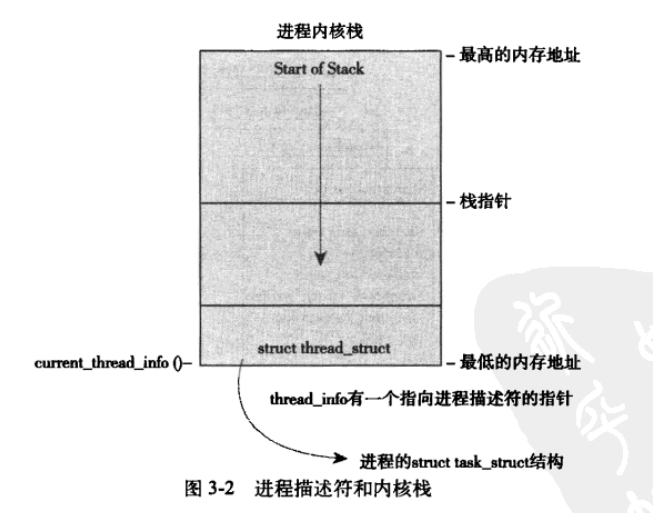
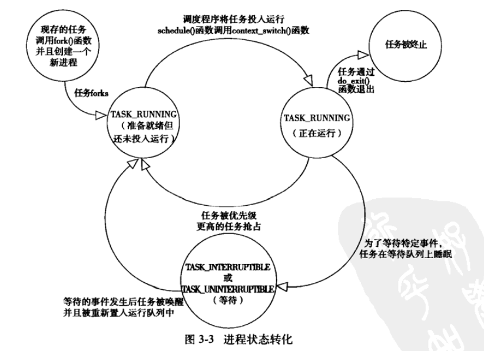
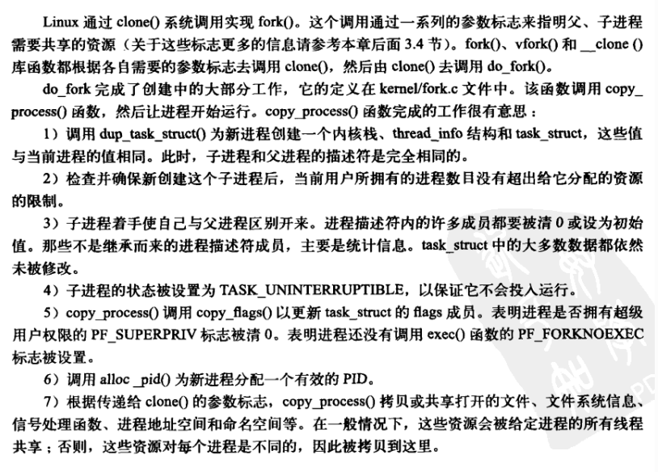
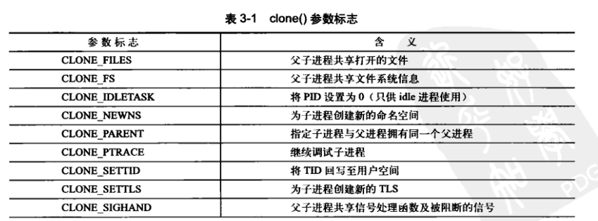

# Linux内核设计与实现读书笔记

##  第二章 从内核出发

### 内核开发特点

+ 不能访问c库也不能访问标准的c文件
+ 必须使用GNU C
+ 缺乏像用户空间一样的内存保护机制
+ 难以执行浮点运算
+ 给每个进程只有一个很小的定长堆栈
+ 由于内核支持异步中断，抢占和SMP，因此要时刻注意同步和并发
+ 要考虑可移植的重要性

<!--more-->

#### 无lib库或标准头文件

+ 完整的C库太大而且过于低效

+ 大部分常用的C库函数在内核中都已经实现

  打印函数 `printk() `允许设置标志来设定优先级

  ```c
  printk(KERN_ERR "this is an error");
  ```

  注意`EKRN_ERR`与要打印的消息之间没有逗号。优先级标志是预处理程序定义的描述型字符串，在编译时优先级标志要与打印的消息绑定在一起处理。

#### GNU C

+ 内联函数：在调用位置进行展开以消除函数调用和返回带来的开销。但会占用更多的内存空间和指令缓存。所以内联函数通常长度较短，并且时间要求较高。定义时要用`static`关键字，并用`inline`限制。

  ```c
  static inline void wolf(unsigned long tail_size)
  ```

  在内核中为例类型安全和易读性，优先使用内联函数而非复杂宏。

+ 内联汇编：使用`asm()`嵌入汇编代码。内核混合使用C和汇编语言。在底层或执行时间要求严格的地方使用汇编。

+ 分支声明：针对分支进行优化  `likely(), unlikely()`

  ```c
  /*认为error绝大多数时间为0*/
  if(unlikely(error)){
  	/*...*/
  }
  /*认为success通常不会为0*/
  if(likely(success)){
  	/*...*/
  }
  ```

#### 没有内存保护机制

用户试图进行内存的非法访问时内核会发送SIGSEGV信号，并结束进程。但是内核自己非法访问内存就无法控制。内核中发生对的内存错误会导致oops。所以对内核开发要关注非法访问的风险。并且内存中内核不做分页处理。所以用一字节，物理内存就减少一字节。

#### 不要轻易在内核中使用浮点数

内核本身不能陷入，所以要人工保存以及恢复浮点寄存器，并且产生琐碎的事务。故除极少情况外，不在内核中使用浮点数操作。

#### 容积小而固定的栈

内核栈现在可以在编译时进行配置。从历史上来说大小是2页。32位机内核栈8KB，64位机是16KB

#### 同步和并发

内核的许多特性都要求能并发的访问共享数据。所以很容易产生竞争挑战。这就要有同步机制来保证不出现竞争。

+ LInux是抢占多任务操作系统。内核的进程调度程序即兴对进程及逆行调度和重新调度。内核必须对这些任务进行同步。
+ Linux内核支持对称多处理器系统（SMP）所以若无适当保护，同时在多个处理器上执行的内核代码可能会访问共享的同一资源
+ 若中断在代码访问资源时到来，中断处理程序会访问同一资源。
+ linux内核可以抢占，如果不加以保护，一段执行的代码会被另一段抢占，从而导致几段代码同时访问相同的资源。

解决办法是自旋锁和信号量。

#### 可移植的重要性

大部分C代码应该与体系结构无关。因此要把体系结构相关的代码从内核代码树的特定目录中适当分离出来。

## 第三章 进程管理

### 3.1 进程

进程是正在执行的程序代码的实时结果。线程是具有独立计数器，进程栈和一组进程寄存器的进程中的活动对象。

Linux对进程和线程不做特殊区分，将线程认为是一种特殊进程。

### 3.2 进程描述符及任务结构

进程的列表存放在叫做任务队列的双向循环链表中，链表的每一项都叫做`task_struct`，是进程描述符的结构定义在`<linux/shed.h>`中。

`task_struct`在32位机器上约1.7KB，其数据完整的描述了一个正在执行的程序：包括但不限于它打开的文件，进程的地址空间，挂起的信号，进程状态等。

#### 3.2.1  分配进程描述符

linux通过slab分配器分配`task_struct`结构，从而达到对象复用和缓存着色的目的。现在会在栈底（向下增长的栈）创建一个新的结构struct thread_info （位于`<asm/thread_info.h>`中，这个体系结构让汇编代码中计算其偏移量更加容易。分配于内核栈的尾端。）

```c
struct thread_info{
	struct task_struct   *task;      //存放指向任何该任务实际task_struct的指针
	struct exec_domain   *exec_domain;
	__u32                flags;
	__u32                status;
	__u32                cpu;
	int                  preempt_count;
	mm_sigment_t         addr_limit;
	struct restart_block restart_block;
	void                 *sysenter_return;
	int                  uaccess_err;
};
```



#### 3.2.2进程描述符的存放

内核通过PID来标识每个进程。PID为pid_t隐藏类型，实际就是int型。最大为32678。如果确实需要，可以修改/proc/sys/kernel/pid_max提高上限。

内核大部分的处理进程的代码都通过`task_struct`进行。因此通过`current`宏查找到当前正在运行进程的进程描述符的速度显得尤为重要。硬件体系结构不同，该宏的实现也不同。**必须针对专门的硬件进行处理**。有的用专门的寄存器存放指针，用于加快访问速度。而像x86则创建栈尾的`thread_info`结构，通过计算偏移量间接 查找。

#### 3.2.3 进程状态

进程描述符中的state域描述了进程当前状态，系统中的每个进程必然处于五种状态的一种。

+ `TASK_RUNNING` (运行态)，进程是可执行的，或者正在执行，或者等待执行。
+ `TASK_INTERRUPTIBLE`(可中断)，进程正在睡眠（阻塞），等待某些条件的达成，一旦这些条件达成，内核就会把进程状态设置为运行。处于此状态的进程会因为信号而被提前唤醒并随时投入运行。
+ `TASK_UNINTERRUPTIBLE`(不可中断)，就算接收信号也不会唤醒。其余与可中断状态相同。这个状态通常在进程必须等待时不受干扰或者等待事件很快就会发生时出现。由于状态对信号不做响应，所以使用较少。
+ `__TASK_TRACED`  进程被其他进程跟踪，例如通过ptraace对调试程序进行跟踪。
+ `__TASK_STOPPED` 进行停止运行，没有投入运行也不能投入运行，接收到`SIGSTOP,SIGTSTP,SIGTTIN,SIG TTOU`等信号时出现。调试期间接收到任何信号也会使进程进入这种状态。



#### 3.2.4设置当前进程状态

```c
set_tasek_state(task,state);	/*将任务task对的状态设置未state*/
```

函数将进程设置为指定的状态。必要的时候会设置内存屏障强制其他处理器重新排序（只有smp系统有必要）。否则其作用相当于以下语句。

```c
task->state = state;
```

#### 3.2.6 进程家族树

所有进程都是PID为1的init进程的后代，内核在系统启动的最后阶段启动init进程。该进程会读取系统的初始化脚本并执行相关程序。最终完成整个启动过程。

每个进程必有一个父进程，可以有0或多个子进程。拥有相同父进程的两个进程称为兄弟。进程间的关系存放在进程描述符中。每个`task_struct`都包含一个指向父进程的`tast_struct`，称为`parent`指针。以及子进程表`childern`。所以获取父进程和子进程可以利用如下代码进行

```c
struct task_struct  *my_parient = current->parient;   //获取父进程的描述符
struct task_struct *task;
struct task_head *list;
list_for_each(list,&current->childern)
{
	task = list_entry(list,struct task_struct,sibling);  //task指向当前的某个子进程
}
```

**通过重复遍历所有进程的代价很大，所以没有充足的理由不要这样做。**

### 3.3 进程创建

Unix创建进程分为两步执行，`fork()`和`exec()`。首先fork()通过拷贝当前进程创建一个子进程。这个子进程和父进程的区别仅在于PID、PPID和某些资源统计量（比如挂起的信号）。`exec()`负责读取可执行文件并且将其载入地址空间运行。

> 这里的exec主要指的是所有exec函数族的函数。内核实现了execve()函数。在此基础上还有execlp(),execle(),execv(),execvp()等。

#### 3.3.1写时拷贝

Linux中的fork()函数并不直接把所有的资源复制给新创建的线程。而是采用了写时拷贝页实现。内核并不复制整个进程地址空间，而是让父进程和子进程共享一个拷贝。只有在需要写入的时候，数据才会被复制。





#### 3.4 线程在Linux中的实现

从内核的角度来说并没有线程的概念。内核将线程视为一个与其他进程共享某些资源的进程。拥有隶属于自己的task_struct。这一点与其他内核的实现十分不同。其他系统中大多都实现了专门支持线程的机制。

而linux中将线程称为“轻量级进程”。也就是说，在Linux中线程只是一种进程间共享资源的手段。

> 假设有一个包含四个线程的进程，通常会有一个包含指向四个不同线程的进程描述符。描述符描述地址空间以及打开文件这样的共享资源。但是在Linux中只会创建四个进程并分配四个普通的task_sturct接口。建立进程时指定他们共享某些资源。

##### 3.4.1 创建线程

创建线程的方法和进程创建类似，只是调用clone的时候需要传递标志来指明需要共享的资源。

```c
clone(CLONE_VM | CLONE_FS | CLONE_FILES | CLONE_SIGHAND, 0)
```

这行代码产生的结果和调用fork基本相同。只是根据线程的定义做出了改变，父子线程共享地址空间，文件资源系统，文件描述符以及信号处理顺序。

这里列举一些`clone()`函数中用到的参数以及他们的作用，这些包含在`<linux/sched.h>`中。




##### 3.4.2 内核线程

内核线程和普通线程的区别主要在于内核线程没有独立的地址空间（指向地址空间的mm指针被设置为NULL）。内核线程只在内核空间中运行，从不切换到用户空间中去。和普通线程一样，内核线程可以被调度，也可以被抢占。

> 内核线程在shell中可以使用`ps -ef`命令看到。

内核线程只能由其他内核线程创建。内核通过`kthreadd`内核进程中衍生出所有新内核线程来自动处理这一点的。在`<linux/kthread.h>`中存在接口。所以，从现有内核线程中创建一个新的内核线程的方法如下：

```c
struct task_struct *kthread_create(int (*threadfn)(void*data),
								   void *data,
								   const char namefmt[],
								   ...)
```

新创建的进程属于不可以运行的状态。所以需要通过调用`wake_up_process()`明确唤醒它。创建一个内核线程并运行，可以通过`kthread_run()`来达到：

```c
struct task_struct *kthread_run(int (*threadfn)(void *data)
								void *data,
								const char namefmt[],
								...)
```

这个函数是用宏来实现的。只是简单的调用了 `kthread_create()`和`wake_up_process()`

```c
 * kthread_run - create and wake a thread.
 * @threadfn: the function to run until signal_pending(current).
 * @data: data ptr for @threadfn.
 * @namefmt: printf-style name for the thread.
 *
 * Description: Convenient wrapper for kthread_create() followed by
 * wake_up_process().  Returns the kthread or ERR_PTR(-ENOMEM).
 */
#define kthread_run(threadfn, data, namefmt, ...)                          \
({                                                                         \
        struct task_struct *__k                                            \
                = kthread_create(threadfn, data, namefmt, ## __VA_ARGS__); \
        if (!IS_ERR(__k))                                                  \
                wake_up_process(__k);                                      \
        __k;                                                               \
})
```

内核线程启动后会一直运行。直到碰到两种停止条件的一种：

+ 调用`do_exit()`进行退出。
+ 内核其他部分调用`kthread_stop()`。（传递进来的参数是`kthread_create`所返回的`task_struct`结构的地址。）

#### 3.5 进程终结

进程的终结发生在定义于`kernel/exit.c`中的`do_exit()`函数。这个函数需要进行以下操作：

+ 将`task_struct`中的标志成员设置为`PF_EXITING`
+ 调用`del_timer_sync()`删除任一内核定时器，根据返回的结果，确保没有定时器在排队，也没有定时器处理程序在运行。
+ 如果BSD的记账功能是开启的，`do_exit()`调用`acct_update_integrals()`来输出记账信息。
+ 调用`exit_mm()`函数释放进程占用的`mm_struct`，如果没有别的进程使用他们（即空间地址没有被共享），就彻底释放他们

+ 调用`sem __exit()`函数，如果进程排队等候IPC信号，它则离开队列。
+ 调用`exit_files()`和`exit_fs()`，以分别递减文件描述符、系统文件数据的引用计数。如果其中某个引用计数的数值降为零，那么就代表没有进程在使用相应的资源，此时可以释放。
+ 把存放在`task_struct`的`exit_code`成员中的任务退出代码置为由`exit()`提供的退出代码，或者去完成任何其他由内核机制规定的退出动作。退出代码存放在这里供父线程随时检索。
+ 调用`exit_notify()`向父进程发送信号，给子进程重新找养父。养父为进程中的其他线程或者为`init`进程。并把进程状态（`task_struct->exit_state()`中）设置为`EXIT_ZOMBIE`。
+ `do_exit()`调用`schedule()`切换到新的进程。（处于`EXIT_ZOMBIE`状态的进程不会再被调度，所以`do_exit()`永不返回）

到此为止，与进程相关联的所有资源状态都被释放掉了。进程不可运行并处于`EXIT_ZOMBIE`状态。仍然占用着的是内核栈、`thread_info`结构以及`task_struct`结构。进程存在的唯一目的是向父进程提供信息，父进程检索到这些信息后，由进程持有的剩余内存被释放，归还给系统使用。

##### 3.5.1 删除进程描述符

从上一节中可以知道，为了保证系统有办法在子进程终结之后仍然能获取到进程的信息，所以进程的终结和进程描述符的删除被分开执行。

`wait()`一族的函数都通过`wait4()`来实现的。其标准动作是挂起调用它的进程，直到其中一个子进程退出。函数会返回该子进程的PID。并且调用函数提供的指针会包含子函数退出时的代码。

释放进程描述符时，`release_task()`会被调用，并执行以下几点：

+ 调用`__exit_signal()`，该函数调用`_unhash_process()`后者调用`detach_pid()`从`pidhash`上删除该进程。同时要从任务列表中删除该进程。
+ `__exit_signal()`释放目前僵死进程的所有剩余资源，并进行最终统计和记录
+ 如果该进程是线程组最后一个进程。并且领头进程已经死掉，那么`release_task()`就要通知僵死进程的领头进程的父进程。
+ `release_task()`调用`put_task_struct()`释放进程内核栈和`thread_info`结构所占的页。并释放`task_struct`所占用的slab高速缓存。

