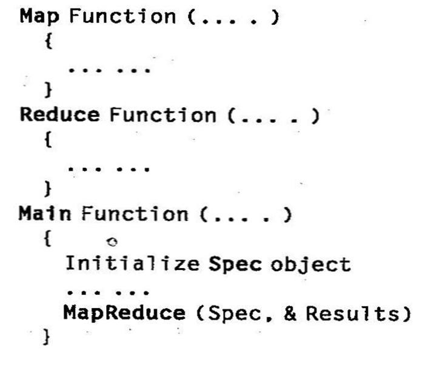
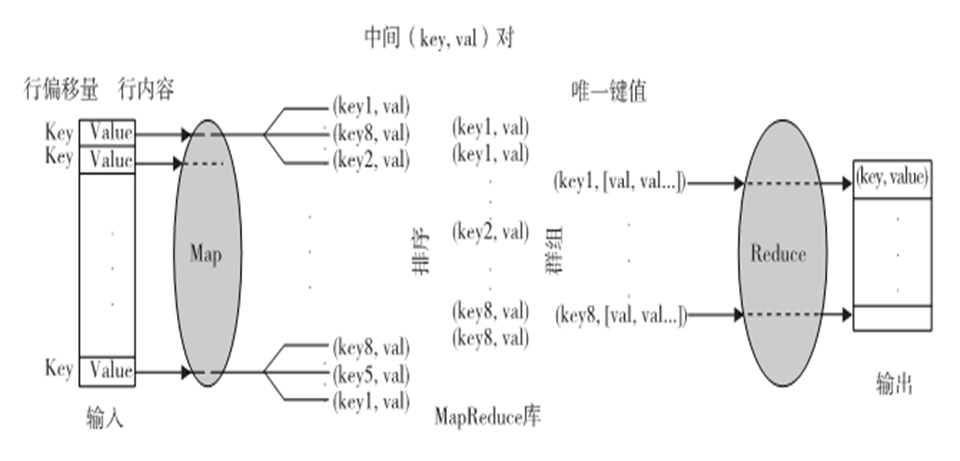
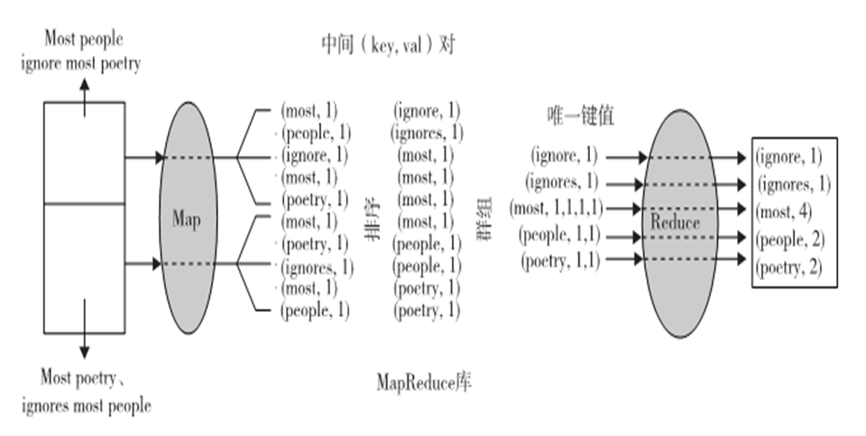
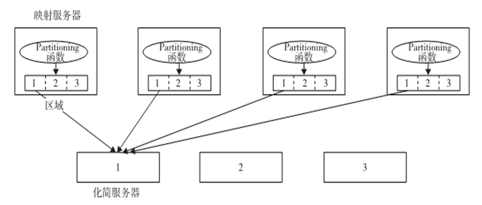
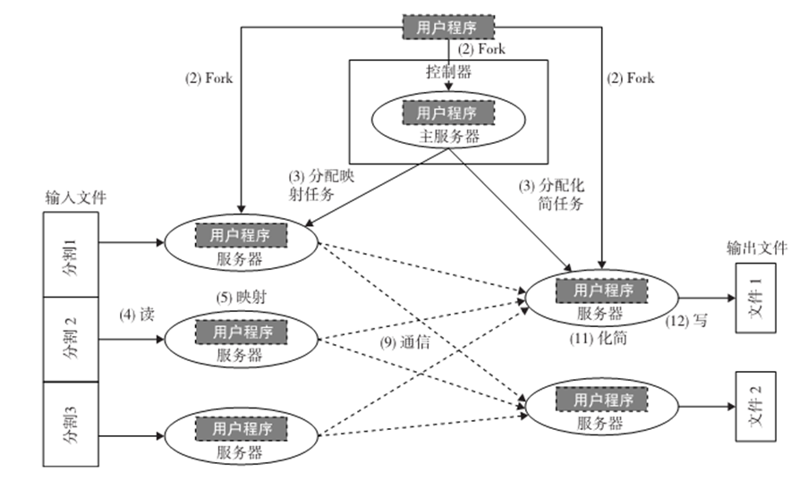
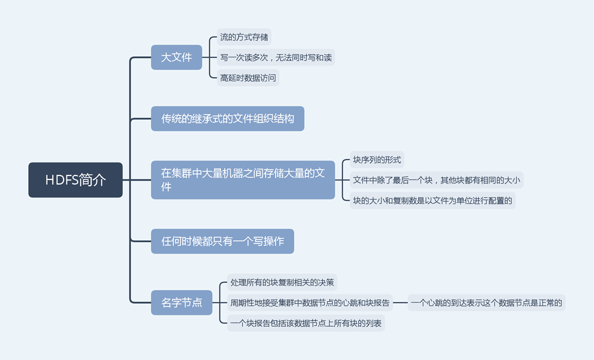
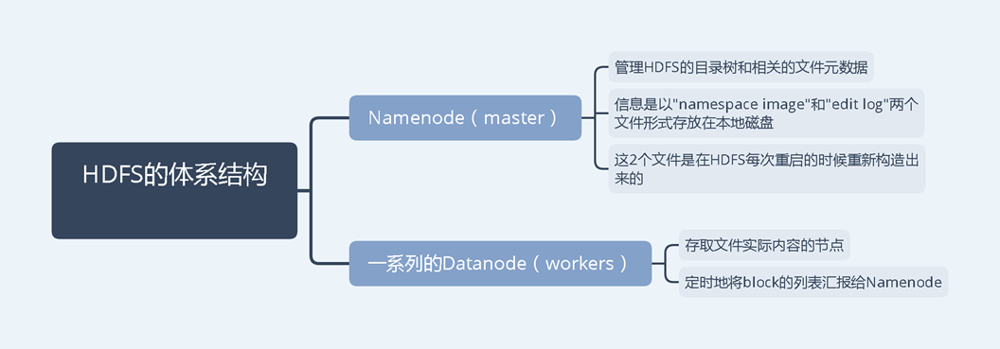
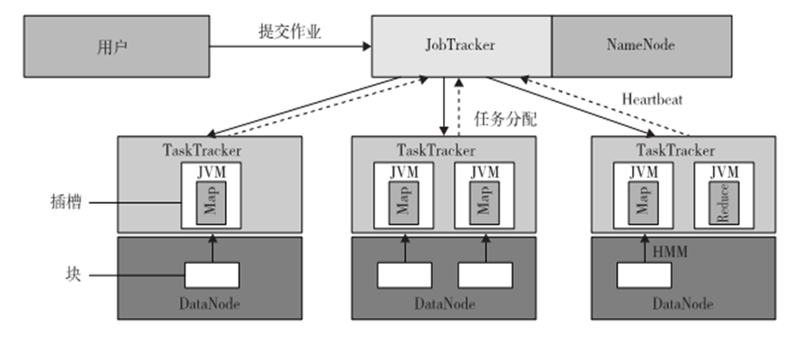
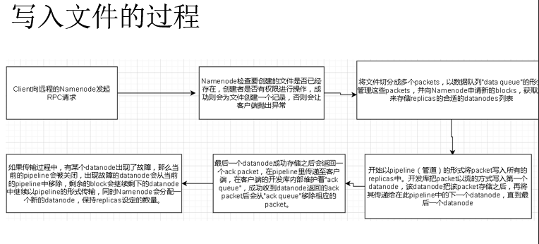
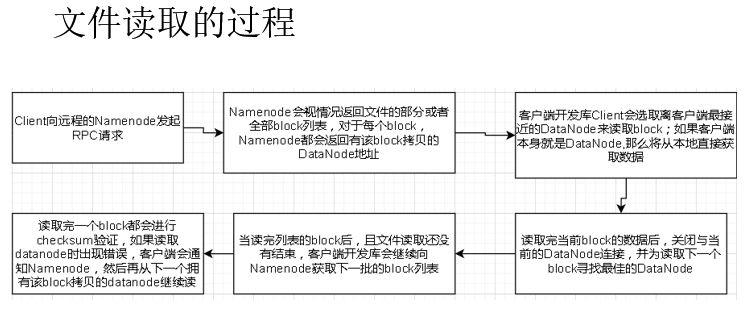

## MapReduce原理及介绍

MapReduce是一个软件框架，可以支持大规模数据集上的并行和分布式运算。抽象了分布式计算系统上运行一个并行程序的数据流，以函数形式提供给用户两个接口：Map（映射）和Reduce（化简）用户可以重载这两个函数以实现交互和操纵其中的程序数据流

<!-- more -->

#### MapReduce形式化定义

MapReduce软件框架向用户提供了一个具有数据流和控制流的抽象层，并隐藏了数据流的实现步骤。但抽象层提供了Map和Reduce两个函数，用户可以通过重载这两个主函数达到特定目标

用户首先重载Map和Reduce函数，然后调用`MapReduce（Spec，&Results）`来开始数据流，其中`Spec`先在用户程序中初始化，然后用户编写代码来填入输入和输出文件名以及其他可选调节参数。这个对象还填入了Map和Reduce函数的名字，以识别这些用户定义的函数和MapReduce库里提供的函数

#### MapReduce逻辑数据流

Map的输入数据是以`（key,value）`对形式出现，输出数据的结构类似于`（key,value）`对，称为中间`（key,value）`对，换句话说，用户自定义Map函数处理每个`（key,value）`对，并产生很多`（zero,one,ormore）`中间`（key,value）`对。目的是为了Map函数并行处理所有的`（key,value）`对

反过来，Reduce函数以中间值群组的形式接受中间`（key,value）`对，这些中间值群组和一个中间key`（key,[set of values]）`相关。实际上，MapReduce框架形成了这些群组，先对中间`（key,value）`对排序，然后用key来对value分组

**注意，排序是为了简化分组**

reduce 函数处理每个`（key,[set of values]）`群组，并产生`（key,value）`对集合作为输出。

#### 单词计数顺序

**符号化**：（key1,val1）-Map函数->List(key2,val2)

​				（key2,List(val2)）-Reduce函数->List（val2）

#### MapReduce真实数据和控制流

1.数据分区：MapReduce库将已存入GFS的输入数据分割成m份，M也即映射任务的数量。

2.计算分区：计算模块强迫用户以Map和Reduce函数的形式编写程序，并在框架中隐式处理，所以MapReduce库只生成用户程序的多个复制（fork），包含MAp和Reduce函数，然后在多个可用的计算引擎上分配。

3.决定主服务器（master）和服务器（worker）：MapReduce基于主服务器-服务器模式，一个用户程序的复制变为主服务器，其余是服务器。主服务器挑选空闲服务器，分配MapReduce任务给他们。

4.读取输入数据（数据分发）：每一个映射服务器读取其输入数据的相应部分，即输入数据分割，然后输入至其Map函数。虽然一个映射服务器可能运行多个Map函数，这意味着它分到了不止一个输入数据分割；通常每个服务器只分到一个输入分割。

5.Map函数：用`（key,value）`对集合的形式收到输入数据分割，来处理并产生中间`（key,value）`对。

6.Combiner函数：映射服务器中一个可选的本地函数。适用于中间的`（key,value）`对。用户可以在用户程序里调用。Combiner运行与Reduce一样的功能。合并每个映射服务器的本地数据然后送到网络传输。

7.Partitioning函数：分块是由Partitioning（分区）函数完成，并能保证有相同键值的所有`（key,value）`对都能存储在同一区域内。因此，由于化简服务器i读取所有映射服务器区域i中的数据，有相同key的所有`（key,value）`对将由相应的化简服务器i收集。 

8.同步：当所有映射任务完成，他们之间的通信开始

9.通信：Reduce服务器i已经知道所有映射服务器的区域i的位置，使用远程过程调用来从所有映射服务器的各个区域中读取数据。由于所有化简服务器从所有映射服务器中读取数据，映射和化简服务器之间的多对多通信在网络中进行，会引发网络拥塞。这个问题是提高此类系统性能的一个主要瓶颈。

10.排序和分组：当化简服务器完成读取输入数据的过程时，数据首先在化简服务器的本地磁盘中缓冲。然后化简服务器根据key将数据排序来对中间(key, value)对进行分组，之后对出现的所有相同key进行分组。注意，缓冲数据已经排序并分组，因为一个映射服务器产生的唯一key的数量可能会多于R个区域，所以在每个映射服务器区域中可能有不止一个key。

11.Reduce函数：简化服务器在已分组的`（key,value）`对上的迭代。对于每一个唯一的key，把key对应的value发送给Reduce函数，然后把这个函数出来输入数据，最后的结果存入用户程序指定的文件中。

#### 来自Apache的Hadoop软件库

Hadoop是Apache用Java实现的MapReduce开源实现，使用HDFS作为底层，MapReduce引擎是运行在HDFS上的计算引擎，HDFS是他的数据存储管理器。

HDFS：源于GFS的分布式文件系统，分布式计算系统上管理文件和存储数据

HDFS体系结构：主从体系结构，包括单个NameNode(master)和多个DataNode(slave)。HDFS将文件分为固定大小的块，并存放在工作机中，块的映射由Namenode决定。master也管理文件系统的元数据和命名空间，在系统中，命名空间是维护元数据的区域，元数据是指一个文件系统存储的所有信息。是所有文件的全面管理所需要的。

HDFS特性：HDFS不支持安全性，主要讨论两个特性

+ 容错能力：Hadoop设计时默认部署在廉价的硬件上，系统故障很常见。
  + 块复制：HDFS把文件存储为一个块集，每个块都有备份并且在整个集群上分发。
  + 备份布置：提供更大的可靠性，但通信成本稍高
  + HeartBeat和LockReport消息：这两个消息都由DataNode传输给NameNode，收到Heartbeat意味着DataNode正常运行，而每个Blockreport包括DataNode上所有块的清单

+ 高吞吐量访问大规模数据集：因为是为批处理设计而非交互式处理，所以吞吐量比延时更重要。

HDFS操作：控制流能正确突出在管理操作中NameNode和DataNode的角色

+ 读取文件：用户发送Open请求给NameNode来获取文件块位置信息
+ 写入文件：用户发送create请求给NameNode来在命名空间里创建文件

#### Hadoop里运行作业

+ 作业提交：每个作业由用户提交到master
  + 用户从master请求新ID，并计算输入文件分块
  + 用户复制资源l比如用户的JAR文件、配置文件和计算输入分块，至JobTracker文件系统。
  + 用户节点通过调用submitJob()函数提交任务至JobTracker。

+ 任务分配：JobTracker为用户节点的每个计算输入块建立一个映射任务，并分配给TaskTracker的执行槽。当分配映射任务给TaskTracker时，JobTracker会考虑数据的定位。JobTracker也会创建化简任务，并分配给TaskTracker。 

+ 任务执行：把作业JAR文件复制到其文件系统之后，在TaskTracker执行一个任务（不管映射还是化简）的控制流就开始了。在启动Java虚拟机（Java Virtual Machine，JVM）来运行它的映射或化简任务后，就开始执行作业JAR文件里的指令。

+ 任务运行校验：通过接收从TaskTracker到JobTracker的周期性心跳监听消息来完成任务运行校验。每个心跳监听会告知JobTracker传送中的TaskTracker是可用的，以及传送中的TaskTracker是否准备好运行一个新的任务。 

