### 操作系统知识点梳理

#### 1.1 什么是操作系统

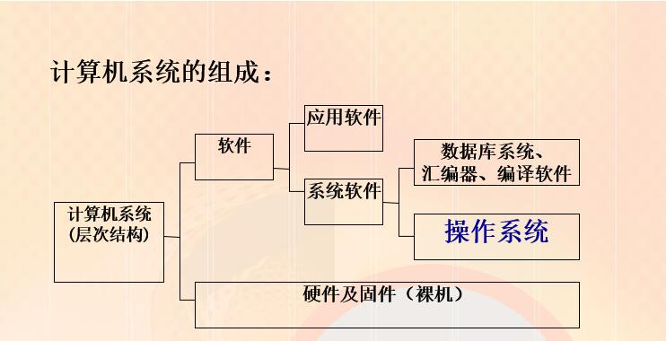

##### 地位与目标：

<!-- more -->

###### 地位

紧贴系统硬件之上，所有其他软件之下，（是其他软件的共同环境）

###### 目标

+ **有效性**（系统管理人员的观点）：管理和分配硬件、软件资源，合理地组织计算机的工作流程

+ **方便性**（用户的观点）：提供良好的、一致的用户接口，弥补硬件系统的类型和数量差别

+ **可扩充性**（开放的观点）：硬件的类型和规模、操作系统本身的功能和管理策略、多个系统之间的资源共享和互操作

##### 操作系统的定义：（没有公认的定义）

+ 是配置在计算机硬件上的第一层软件，是对硬件系统的首次扩充
+ 是一组控制和管理计算机硬件和软件资源，方便用户使用的程序集合
  + 控制程序执行以防错误和不当使用
  + 执行用户程序并提供服务
  + 管理各种计算机资源：CPU、硬盘、内存、硬件外设等
  + 有效解决冲突请求并确保资源公平使用

##### 几种观点

1. OS是计算机硬件软件的管理者
2. OS是用户使用系统的接口
3. OS是扩展机/虚拟机
   + 在裸机上添加：设备管理，文件管理、存储管理（外存&内存）、处理机管理

#### 1.2操作系统的发展历史

##### 人工操作系统

**1946-50年代**，（电子管）集中计算（计算中心），计算机资源昂贵

人工操作特点：

+ 用户独占全机
+ CPU等待人工操作
+ 串行性

缺点：

+ 昂贵组件的低利用效率
+ 利用率 = 执行时间/（执行时间+读卡时间）

##### 单道批处理系统：

**50年代末-60年代中**(晶体管)利用磁带把若干个作业分类编成作业执行序列，每个批作业由一个专门的监督程序（Monitor）自动依次处理。可使用汇编语言开发。

特征：

+ 自动性
+ 顺序性
+ 单道性

优点：

+ 同一批内各作业的自动依次更替，改善了主机CPU和I/O设备的使用效率提高了吞吐量。

缺点：

+ 内存中仅有一道程序运行，当该程序运行结束或出故障，由监控程序换入另一个程序。不能很好地利用系统资源。

+ **CPU**和I/O设备使用忙闲不均（取决于当前作业的特性）。对计算为主的作业，外设空闲；对I/O为主的作业，CPU空闲。

**单道批处理系统是最早出现的一种OS,严格来说只能算是OS的前身而不是现在理解的OS，但该系统比起人工操作的系统已经有很大的进步**

##### 多道批处理系统：

**60年代中~70年代中**（集成电路）利用多到批处理提高资源的利用率。

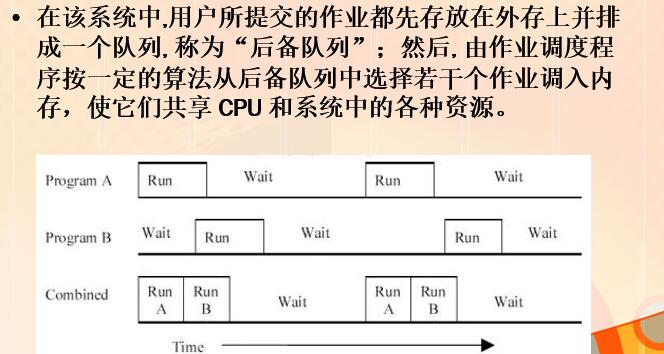

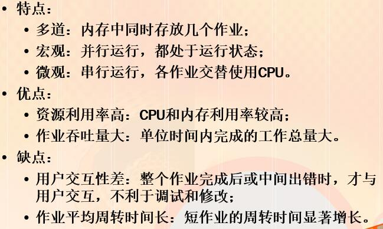

多道程序系统的技术问题：

+ 并行程序的运行需要共享软硬件资源，需要同步和互斥机制。
+ 多道程序需要提高内存使用效率，需要覆盖技术，交互技术，虚拟存储等技术。
+ 多道程序在内存中要保证系统存储区和用户存储区安全可靠，需要内存保护。.   

##### 分时系统：

**70年代中期至今**    

多个用户分享使用同一台计算机。每个用户给一定的时间运行，然后切换到另一用户，一个轮转周期在宏观上相当短，用户感觉不到。

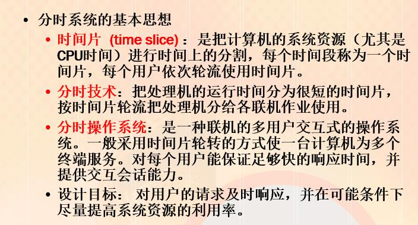

分时系统特征：

+ 交互性：用户与系统进行人机对话
+ 多路性：多用户同时在各自终端上使用同一CPU
+ 独立性：用户可彼此独立操作，互不干扰，互不混淆。
+ 及时性：用户在短时间内可以得到系统的及时回答。

影响响应时间的因素：

+ 终端数目的多少
+ 时间片的大小
+ 信息交换量
+ 信息交换速度

##### 实时系统：

+ 系统能及时响应外部事件的请求，在规定的时间内完成对该事件的处理。并控制所有事实任务协调一致的运行。

+ 保证实时性和高可靠性，对系统的效率放在第二位。

分类：实施控制系统，实时信息处理系统。

##### 实时系统与分时系统的比较

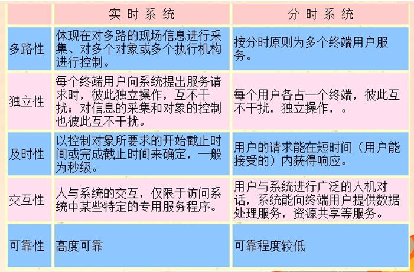

##### 多处理操作系统：	

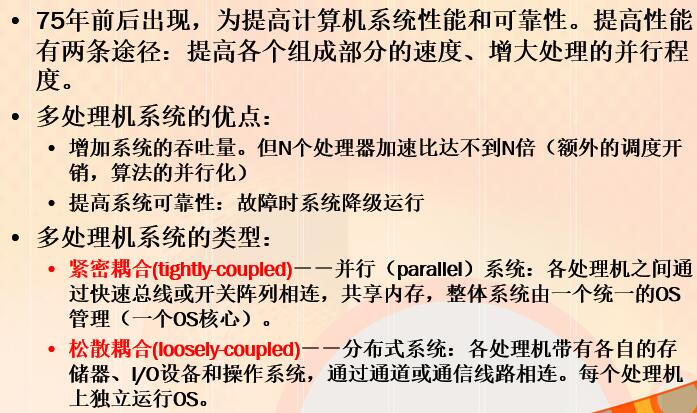

##### 并行系统的类型：

非对称式多重处理

对称式多重处理

##### 分布式操作系统与网络操作系统的比较

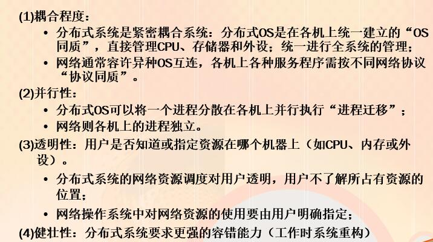

#### 1.3 操作系统的特征和服务

##### 操作系统的基本特征

+ **并发**：多个事件在同一时间段内发生，（并行是指单处理器下宏观上并发微观上交替执行）

+ **共享**：多个进程共享有限的计算机资源，操作系统要对系统资源进行合理的分配和使用，资源在一个时间段内交替被多个进程使用。

  ---

  并发和共享是操作系统两个最基本特征，这两者之间是互为存在条件的

  ---

+ **虚拟**：一个物理实体映射为若干对应逻辑实体--分时或分空间，虚拟是操作系统管理系统资源的重要手段，提高资源利用率。

+ **异步**：也称不确定性，指进程的执行顺序和执行时间的不确定性

  + 进程的运行速度不可预知
  + 判据：无论快慢，应该结果相通--通过进程互斥和同步手段来保证。
  + 难以重现系统在某个时刻的状态（包括重现运行中的错误）
  + 性能保证：实时系统与分时系统类似，但通过资源预留以保证性能。

##### 操作系统的组成

1 管理模块：针对不同管理对象的程序模块（操作系统核心）

2.用户接口：shell,窗口系统

#### 1.4 操作系统功能

##### 1.4.1 存储管理

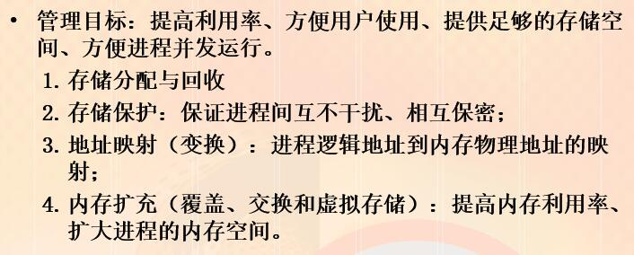

##### 1.4.2 处理机管理

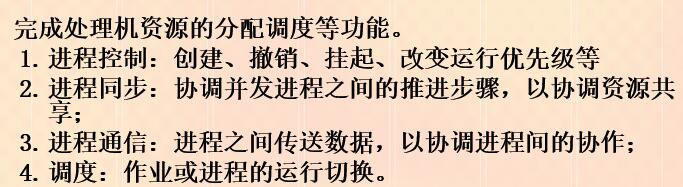

##### 1.4.3 设备管理

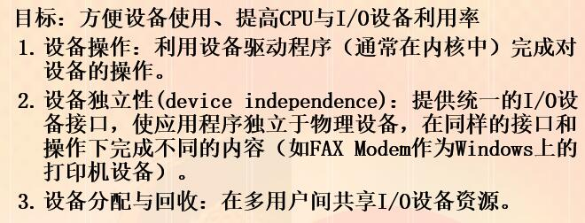

##### 1.4.4 文件管理

##### 1.4.5 用户接口

目标：提供一个友好的用户访问操作系统的接口，通常以命令或系统调用的形式提供给用户。

命令接口：为联机用户提供的，由一组键盘操作命令及命令解释程序所组成，又分联机和脱机用户接口。

程序接口：为用户程序在执行中访问系统资源而设置的，是用户程序取得操作系统服务的路径。它由一组系统调用组成。

图形接口：用户可用鼠标或菜单和对话框来完成对应应用程序和文件的操作。

##### 双模式操作

###### 用户模式（目态）

执行普通用户的应用程序

###### 系统模式（管态）

执行操作系统核心代码

###### 分辨方式：

在程序状态字中添加模式位指示目前所处模式：系统态(0)或用户态(1)

发生中断或故障（自陷）硬件自动从用户态切换到系统态

当用户程序需要操作系统的服务（通过系统调用）必须由管态切换到目态。

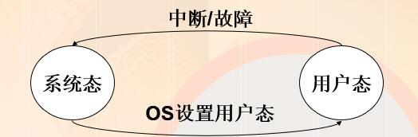

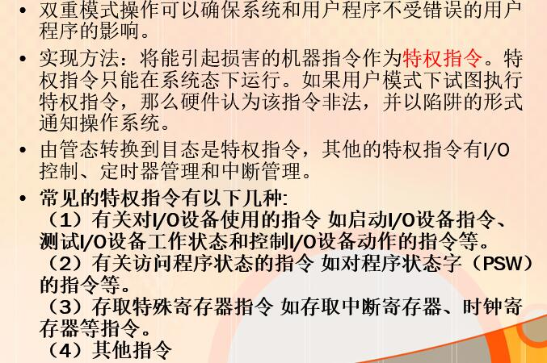

#### 课后习题

eg2

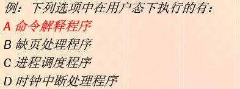

eg2

