## 第二章 进程管理

为了描述程序在并发执行时对系统资源的共享，我们需要一个描述程序执行时动态特征的概念，这就是进程或线程。

<!-- more -->

### 2.1 进程的基本概念

#### 2.1.1 程序的基本特征

程序执行的两种方式：<font color="red">顺序执行</font>和<font color="red">并发执行</font>

(1)顺序执行：单道批处理系统的执行方式：
**特征**：

+ **顺序性**：按照程序结构所指定的次序执行。
+ **封闭性**：独占全部资源，计算机的状态只由于该程序的控制逻辑所决定，结果不受外界因素的影响。
+ **可再现性**：初始条件相同则结果相同

(2)为了提高资源利用率并发执行

特征：

+ 间断性：程序中途停下来失去原有时序的联系。
+ 失去封闭性：共享资源受到其他程序控制影响
+ 失去可再现性：外界环境在程序两次执行期间发生变化

并发执行条件：达到封闭性和可再现性。

#### 2.1.2 进程的定义与特征

进程：一个具有一定独立功能的程序在一个数据集合上一次动态执行的一个过程。

​			处理机、存储器和外设等资源的分配和回收的基本单位

一个进程应该包括：

+ 程序代码
+ 程序处理的数据，堆栈
+ 程序计数器中的值，指示下一条将运行的指令
+ 一组通用的寄存器当前值
+ 一组系统资源

进程包括了正在运行的一个程序的所有状态信息。

##### 进程与程序的关系

+ **程序是产生进程的基础；进程是程序功能的体现。**

+ **程序是**<font color="red">静态</font>实体；进程是<font color="red">动态</font>过程。

+ **程序是指令、数据及其组织形式的描述；进程是程序（那些指令和数据）的真正运行实例。**

+ **进程是暂时的**，是一个状态变化的过程；程序是永久的，可长久保存。

+ **通过多次执行，**一个程序可产生多个进程；**通过调用关系**，一个进程可包括多个程序。

+ **进程需要一些资源才能完成工作，如**CPU使用时间、存储器、文件以及I/O设备。

##### 进程特征：

+  动态性：创建产生，调度执行，受制于资源，撤销消亡。

+  进程具有动态的地址空间（数量和内容），地址空间上包括：代码、数据、进程控制块（PCB）

+  并发性：多个进程同时存在于内存，宏观上同时运行。

+  独立性：资源分配的单位。

+  各进程的地址空间相互独立，除非采用进程间通信手段

+  异步性：进程按各自独立的、不可预知的速度向前推进。

+  结构化：进程实体由代码段，数据段和进程控制块(PCB) 组成。

   + 进程控制块包含在核心区。内存核心段通常存放OS核心部分，由各个进程共享，包括各进程的PCB。

   + 程序文件中通常划分为代码段和数据段

#### 2.1.3 进程控制块

描述进程的数据结构：进程控制块（PCB）

操作系统为每个进程都维护了一个PCB，用来保存与该进程有关的各种状态信息。


##### **PCB**:

+ OS中最重要的结构类型，记录描述进程执行情况以及控制进程运行的全部信息
+ 进程存在的唯一标志，每个进程在OS中登记的表项，OS通过对PCB的组织管理来对进程进行控制管理。
+ 进程创建时生成PCB，终止时回收PCB
+ PCB常驻于由OS维护的内存核心区，不能由应用程序自身的代码来直接访问，而要通过系统调用间接访问。
+ OS专门开辟PCB区将所有的PCB组织成若干个链表或队列。

##### **PCB中信息**：

+ 程序描述信息：进程标识符，唯一内部标识符；进程名，外部标识符；本进程的产生者标识(父进程标识)； 用户标识符，以指示拥有该进程的用户。
  处理机状态信息，保存进程运行现场信息。
+ 通用寄存器  8-32个，用户程序可使用的数据、地址等寄存器
+ 指令计数器  要访问的下一条指令地址
+ 程序状态字PSW  条件码、执行方式、中断屏蔽标志 
+ 用户栈指针  用户进程拥有的系统栈，存放过程和系统调用参数及调用地址
+ 进程调度信息, 用于操作系统调度进程并占用处理机： 
  + 进程的当前状态； 
  + 优先级(priority)； 
  + 运行统计信息（执行时间、页面调度）； 
  + 事件：阻塞原因等。

+ 进程控制信息： 
  + 程序段和数据段的地址；  
  + 进程间同步和通信； 
  + 资源占用信息：除CPU外的进程所需的全部资源及已分配资源清单
  + 链接指针：本进程所在队列的下一个进程的PCB首地址。

##### 进程的状态：

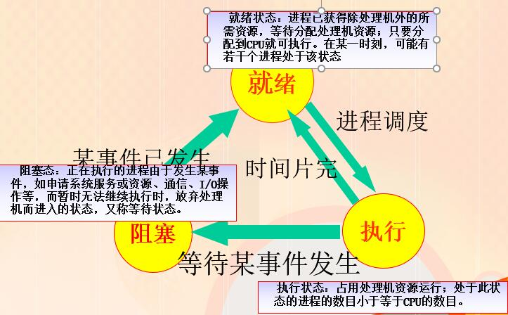

##### 进程调度队列：

+ 由操作系统来维护一组队列，用来表示系统当中所有进程的当前状态。

+ 不同的状态分别用不同的队列来表示（就绪队列，各种类型的堵塞队列）
  + 作业队列：系统中所有进程的集合
  + 就绪队列：驻留主存的所有就绪态进程集合
  + 设备队列：等待I/O设备的进程集合

+ 队列在各种队列中的迁移：
  + 每个进程的PCB都根据它的状态加入到相应的队列当中，当一个进程的状态发生变化时，它的PCB从一个状态队列中脱离出来，加入到另外一个队列。

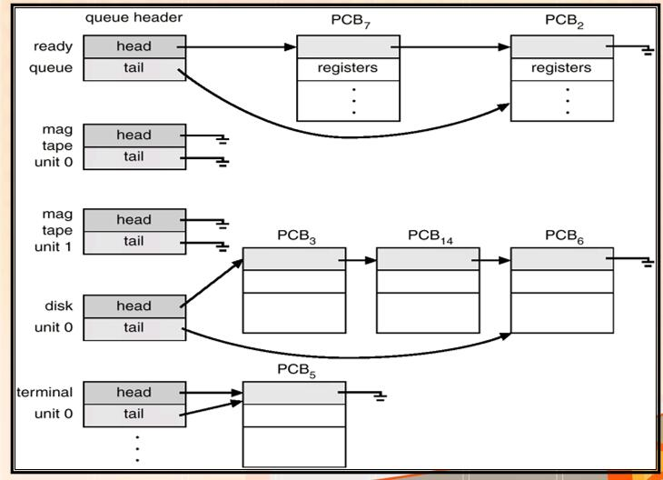

##### PCB组织方式（两种）

链表：同一状态的进程其PCB构成一个链表，多个状态对应多个不同的链表

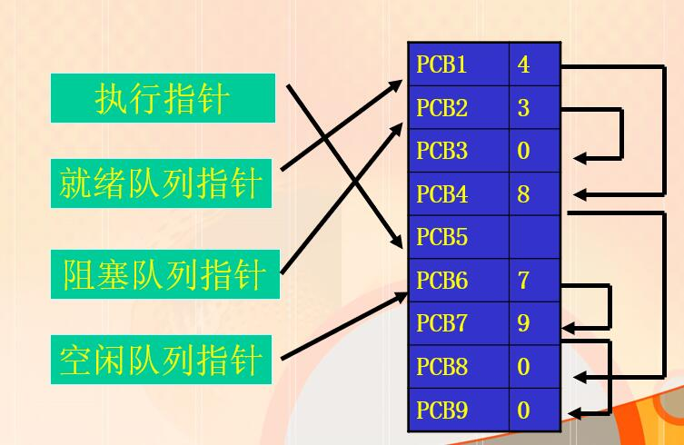

索引表：同一状态的进程归入一个Index表，（由index指向PCB）多个状态对应多个不同的PCB表

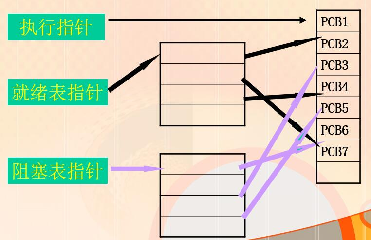

##### 利用PCB完成进程切换

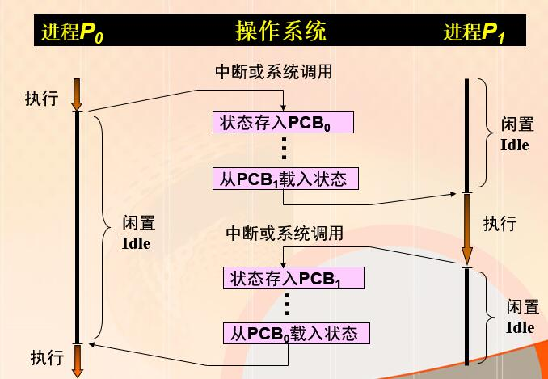

### 2.2 进程控制

进程管理中最基本的功能是<font color="red">进程控制</font>

进程的生命周期：

+ 进程创建
+ 进程运行
+ 进程等待
+ 进程唤醒
+ 进程终止

进程控制任务

+ 进程的创建，终止，进程状态的转变等

进程控制一般由OS内核的原语来实现

+ 原语：由若干指令构成的原子操作
+ 许多系统调用是原语，但不是所有的系统调用都是原语

#### 2.2.1 进程的创建

##### 进程图

+ 树状结构，父子进程关系
+ 子进程可以继承父进程的所有资源，如打开文件，缓冲区等。当子进程被撤销，应将继承的资源还给父进程。撤销父进程也必须同时撤销所有的子进程。
+ PCB中设置了家族关系表项。


$$
引起进程创建的事件\\
\begin{equation}
由操作系统内核创建\begin{cases}
1.操作系统初始化\\
-分时系统中用户登录\\
-批处理中作业调度\\
2.提供服务\\
-用户请求创建进程\\
\end{cases}
\end{equation}
$$

$$
\begin{equation}
由应用程序自身创建\begin{cases}
3.应用请求\\
-正在运行的进程执行了\\创建进程的系统调用
\end{cases}
\end{equation}
$$

原语CREAT（）按下述步骤创建一个新进程:

+ 申请空白PCB。
+ 为新进程分配资源：为代码、数据、用户栈分配空间。
+ 初始化PCB：初始化标识信息、处理机状态（PC、SP)、处理机控制信息（进程状态、优先级）。 
+ 将新进程插入就绪队列 。 

#### 2.2.2 进程的终止

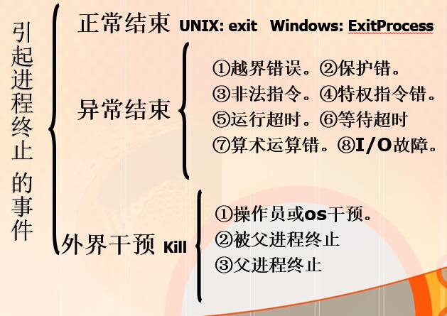

##### 进程的终止过程

+ 从PCB集合中检索出该进程的PCB，从中读出该进程的状态。
+ 若处于执行状态，终止该进程的执行，并置调度标志为真，重新调度。
+ 若有子孙进程，将所有子孙进程终止。
+ 将进程全部资源归还其父进程或系统：释放内外存空间、关闭所有打开文件、释放当前
+ 目录、释放共享内存段和各种锁定lock。
+ 将其PCB从所在队列（或链表）中移出 

##### unix进程终止过程

+ 进程执行完最后一条语句，请求操作系统删除进程(通过执行exit系统调用)。
  + 将子进程运行数据传递给父进程（通过 wait系统调用)。
  + 回收的系统资源由操作系统再另行分配

+ 父进程也可以终止子进程的执行（通过abort系统调用)。原因：
  + 子进程超额使用资源.
  + 分配给子进程执行的任务不再需要执行.
  + 父进程退出。
    + 如果父进程终止，操作系统不再允许子进程继续执行。

#### 2.2.3 进程的阻塞与唤醒

$$
\begin{equation}
引起阻塞和唤醒的事件\begin{cases}
请求系统服务\\
启动某种操作\\
新数据尚未到\\
无新工作可做
\end{cases}
\end{equation}
$$

##### 进程阻塞过程

+ 正在执行的进程，发生上述事件时，自身调用有关阻塞原语，进入等待队列。进程的主动性行为。
+ 进程由运行态变为阻塞态
+ 引起处理机调度。

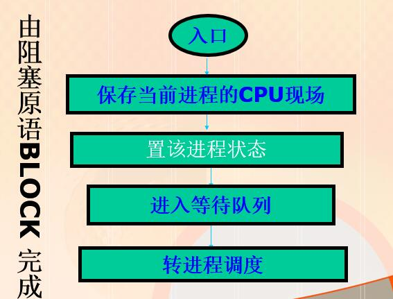

##### 进程唤醒过程

+ 唤醒原因：等待的事件到达。
+ 由阻塞队列转入就绪队列。进程由阻塞态变为就绪态.
+ 方法：其他有关进程（例如用完并释放了该I/O设备的进程）发送信号到某个或一组进程。


**BLOCK和WAKEUP是一队作用相反的原语。**
如果在某进程中调用了<font color="red">阻塞原语</font>，则必须在与之相合作的另一进程中或其他相关的进程中，安排<font color="red">唤醒原语</font>，以能唤醒阻塞进程；否则，被阻塞进程将会因不能被唤醒而长久地处于阻塞状态，从而再无机会继续运行。

#### 2.2.4 进程的挂起与激活

##### 挂起引入原因：

+ <font color="red">终端用户请求</font>
  + 终端用户发现自己运行的程序有问题，希望暂停自己程序的执行

+ <font color="red">父进程请求</font>
  + 父进程希望挂起自己的某个子进程，以便考察和修改该子进程

+ <font color="red">负荷调节需要</font>
  + 高优先级的进程要执行，而内存不空，系统将低优先级进程对换至外存。
  + 提高处理机效率：就绪进程表为空时，要提交新进程，而此时内存不空，需挂起阻塞态的进程
  + 为运行进程提供足够内存（对换及调整负荷）：资源紧张时，暂停某些进程，如：实时任务执行，而内存紧张。

+ <font color="red">操作系统的需要</font>
  + 操作系统需要挂起某些进程以便检查运行中的资源使用情况或进行记账

##### 进程的挂起

+ 目的：合理且充分地利用系统资源。进程在挂起状态时，进程没有占用内存空间，仅映像在磁盘上。
+ 执行过程：挂起原语：SUSPEND（）
+ 挂起原语的执行过程：
  + 从内存调到外存，改变进程的状态。
  + 若处于活动就绪状态，改为静止就绪；
  + 若处于活动阻塞状态，则改为静止阻塞；
  + 若正在执行，则转向调度程序重新调度。

##### 进程的激活

+ 原因：父进程或用户进程请求，或内存已有足够空间
+ 执行过程：从外存调入内存，改变进程的状态
+ 可能也会引起处理机调度

##### 挂起引起的状态转变


+ 引入的新状态
  + 就绪挂起（静止就绪）：进程在外存，但只要进入内存，即可运行；
  + 阻塞挂起状态（静止阻塞）：进程在外存并等待某事件的出现。

##### 有挂起状态的进程状态图


##### 创建和终止状态

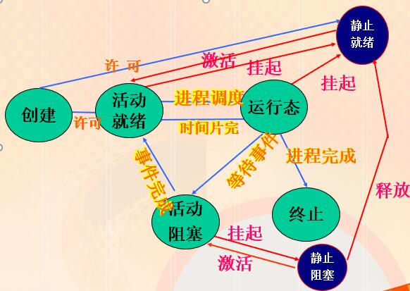

##### 制约关系

由于多进程在系统中的并发执行，进程之间存在2种制约关系：
<font color="red">间接制约</font>:进程间由于共享某种系统资源，而形成的相互制约。

`进程A->资源->进程B`

<font color="red">直接制约</font>：进程间由于合作而形成的相互制约

`进程A------>进程B`

##### 进程的两大关系

###### 互斥

**由于共享资源所要求的排他性，进程间要相互竞争，以获得这些资源的使用权。**

###### 同步

**多个进程中发生的事件存在某种时序关系，必须协同工作、相互配合，以共同完成一项任务。**

### 2.3 进程同步

进程并发地对共享数据的访问有可能引起数据的不一致性。
为了维持数据的一致性，必须有一种机制来保证协作进程之间按某种正确的次序执行。

##### 临界资源 

+ 临界资源：硬件或软件（如外设、共享代码段、共享数据结构），多个进程在对其进行访问时（关键是进行写入或修改），必须互斥地进行。
+ 有些共享资源可以同时访问，如只读数据。因而不是临界资源。

##### 临界区

+ <font color="red">临界区(critical section)</font>：在每个进程中，访问临界资源的一段代码。
  + **临界区问题－－确保一个进程在执行它的临界区代码时，不允许其他进程再进入他们各自的临界区内执行代码**。

+ <font color="red">进入区(entry section)</font>：在进入临界区之前，检查可否进入临界区的一段代码。如果可以进入临界区，通常设置相应“正在访问临界区”标志
+ <font color="red">退出区(exit section)</font>：位于临界区的后面，用于将“正在访问临界区”标志清除。
+ <font color="red">剩余区(remainder section)</font>：代码中的其余部分。

##### 访问临界区的循环进程描述


+ 当进程处于临界区时，说明进程正在占用处理机，只要不破坏临界资源的使用规则，是不会影响处理及调度的。比如，通常访问临界资源可能是慢速的外设（如打印机），如果在进程访问打印机是，不能处理机调度，那么系统的性能将非常低。

+ 不适合处理机调度的情况：
  + 在处理中断的过程中
  + 进程在操作系统内核程序临界区中
  + 其他需要完全屏蔽中断的原子操作过程中

##### 同步机制应遵循的准则：

+ 空闲则入：其他进程均不处于临界区，应允许请求进入临界区的进程进入；
+ 忙则等待：已有进程处于其临界区，请求进入临界区的进程应等待；
+ 有限等待：等待进入临界区的进程不能“死等”；
+ 让权等待：不能进入临界区的进程，应释放CPU（如转换到阻塞状态）

##### 解决临界区问题的算法

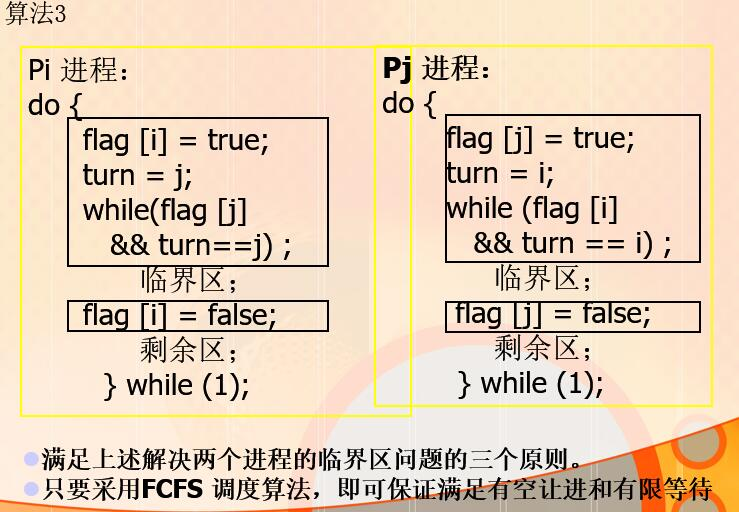

#### 2.3.3 信号量机制

+ 信号量是OS提供的管理公有资源的有效手段。
+ 整型信号量或记录型信号量可以代表可用资源实体的数量。

##### 1.整型信号量机制 

+ 1965年，荷兰学者Dijkstra提出（所以P、V分别是荷兰语的test(proberen)和increment(verhogen)），是一种卓有成效的进程同步机制。
+ 最初Dijkstra把信号量定义为整型量s和两个原子操作（除初始化操作）：P和V, 现又称为：wait和signal。

##### 2.记录型信号量机制

```cC
typedef struct {
        int count;	     
        struct  process *queue; 
        } semaphore;
```

每个信号量s
一个整数值s.count：其初值表示某类资源的数目（又称为“资源信号量”)
一个进程等待队列s.queue，是阻塞在该信号量的各个进程的PCB链成的队列。


信号量只能通过初始化和两个标准的原语（wait、signal）来访问－－作为OS核心代码执行，不受进程调度的打断。


##### 3.AND型信号量

基本思想：将进程在整个运行中需要的所有资源，一次性全部分配给进程，待进程使用完后一起释放。

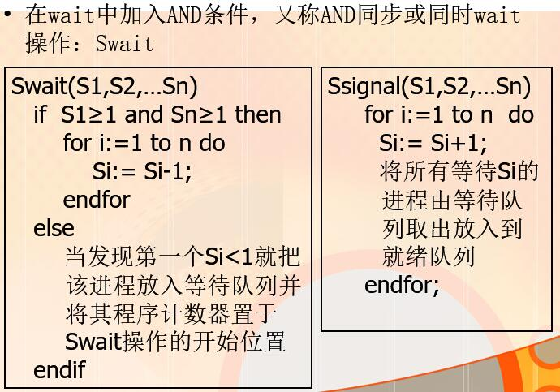

##### 4.二进制（Binary ）信号量 

+ 其值只能是 0和 1；易于实现。
+ 利用二进制信号量可以实现整型信号量。
+ 数据结构：
  	二进制信号量 S1, S2;
    	int C:  
+ 初值：
  	S1 = 1
    	S2 = 0
    	C = 代表共享资源的初始值


#### 2.3.4 信号量的应用

1. ##### 利用信号量实现互斥

   + 为临界资源设置一个互斥信号量mutex，其初值为1；在每个进程中将临界区代码置于wait(mutex)和signal(mutex)原语之间

```c++
semaphore mutex = 1;   
			 …
           do{
             …
               wait ( mutex );
               critical section
              signal( mutex );
              remaider section
           }while (true);
```

2. ##### 利用信号量实现同步 

+ 前趋关系：并发执行的进程P1和P2中，分别有代码C1和C2，要求C1在C2开始前完成；

  + 为每个前趋关系设置一个互斥信号量S12，其初值为0
  
  + P1:                      P2:
  
    C1;                      wait(s12);
    signal(s12)          C2；

### 2.4 经典的进程同步问题

#### 2.4.1 生产者消费者问题

##### 1) 问题描述：

若干进程通过有限的共享缓冲区交换数据。其中，“生产者”进程不断写入，而“消费者”进程不断读出；共享缓冲区共有N个；任何时刻只能有一个进程可对共享缓冲区进行操作。

##### 2）制约关系：

生产者与消费者之间不直接发生联系，他们通过缓冲区发生制约关系
生产者生产商品，若缓冲区已满生产者等待，直到缓冲区有空为止
消费者在缓冲区空时等待，直到生产者的商品放入。否则，取一个商品消费。
注意：缓冲区为循环缓冲区

##### 3）问题分析

采用信号量机制，定义两个资源信号量
full是缓冲池“满”数目，初值为0，empty是缓冲池“空”数目，初值为N。实际上，full和empty是同一个含义：
           full + empty == N 
只要缓冲池未满empty>0，生产者便可将消息送入缓冲池；
只要缓冲池未空full>0，消费者便可从缓冲池取走一个消息。 

##### 4）问题解答


##### 5）问题扩充

若生产者与消费者变成多对多关系，我们要做什么变动？
增加互斥信号量: mutex=1;


##### 6）注意：

+ 每个程序中互斥的wait(mutex)和signal(mutex)必须成对出现。
+ 对资源信号量empty和full的wait 、signal操作成对出现，但它们分别处于不同的程序中。例如wait在计算进程中，而signal则在打印进程中，计算进程若因执行wait而阻塞，则以后将由打印进程将它唤醒。
+ 每个程序中的wait操作顺序不能颠倒。应先执行对资源信号量的wait操作，然后再执行对互斥信号量的wait操作，否则可能引起进程死锁。

#### 2.4.2 读者写者问题

##### 1）问题描述

+ 一个数据文件或记录可被多个进程共享。其中，有些进程要求读；而另一些进程要求行写或修改。
+ 只要求读的进程称为“Reader进程”，其它进程称为“Writer进程”。

##### 2）制约关系

- 任一时刻“写者”最多只允许一个，而“读者”则允许多个――“读－写”互斥，“写－写”互斥，“读－读”允许。
- 所谓读者一写者问题是指保证一个Writer进程必须与其它进程互斥地访问共享对象的同步问题。

##### 3）问题分析

+ 读者优先的解决方案：
  + 互斥信号量wrt，初值是1，代表一个共享文件。为解决“读－写”互斥，“写－写”互斥。
  + 一个记数器，即整型变量readcount，记录读者数，初值是0。
    + 来一个读者， readcount加1
    + 当readcount ＝1表示是第一个读者， 则需要执行p操作抢占文件；否则表示已有读者在安全的读数据。
    + 走一个读者，readcount减1
    + 当readcount ＝0表示是最后一个读者，则需要v操作释放资源；否则表示还有读者在读数据。
  + readcount 为多个读者共享的变量，是临界资源。用互斥信号量mutex控制, mutex初值是1。

+ 写者优先：
  + 当一个写进程声明想写时，不允许新的读进程访问该数据区。
+ 解决方案：
  + 增加信号量r，初值是1：当至少有一个写进程准备访问数据区时，用于禁止所有的读进程。
  + 一个记数器，即整型变量writecount，记录写者数，初值是0。
  + writecount为多个写者共享的变量，是临界资源。用互斥信号量mutex2控制, mutex2初值是1。
  + 增加mutex3，初值是1：在r上不允许建造长队列，否则写进程将不能跳过这个队列，因此，只允许一个读进程在r上排队，而所有其他读进程在等待r之前，在信号量mutex3上排队。

##### 4）问题解答

读者优先方式：

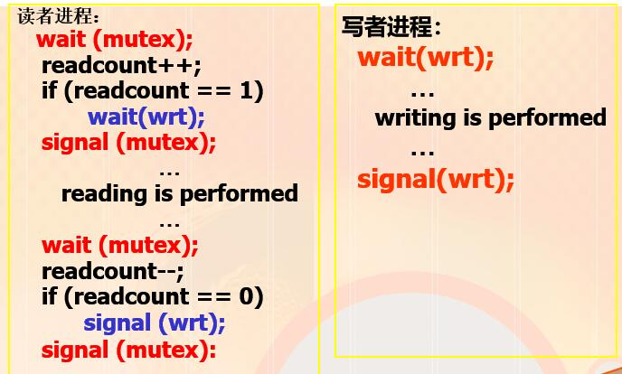

写者优先方式：
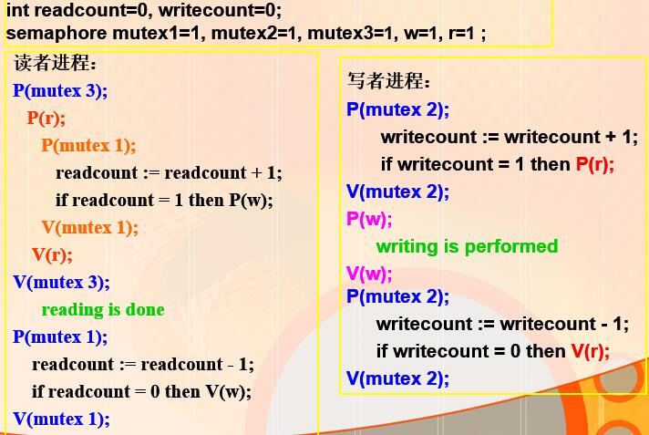

#### 2.4.3 哲学家进餐问题

##### 1）问题描述

（由Dijkstra首先提出并解决）

+ 5个哲学家围绕一张圆桌而坐，桌子上放着5支筷子，每两个哲学家之间放一支；
+ 哲学家的动作包括思考和进餐：
  + 进餐时需要同时拿起他左边和右边的两支筷子，
  + 思考时则同时将两支筷子放回原处。

##### 2）问题分析

+ 哲学家逆时针编号0-4，筷子也相应编号
+ 定义互斥信号量数组chopstick[5], 对应5支筷子，初值均为1。

死锁问题的解决方法：

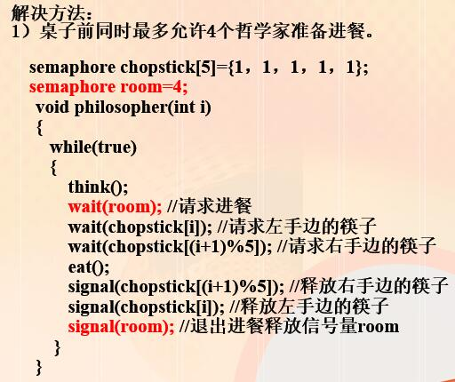

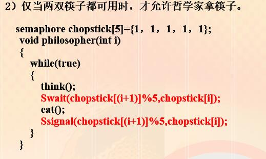

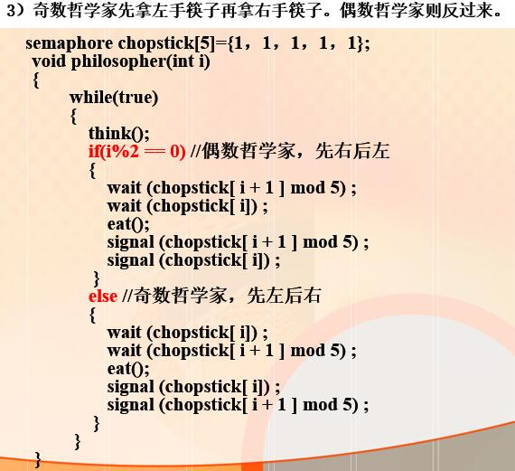

### 2.5 管程

#### 2.5.1 管程的基本概念

+ 利用信号量实现进程同步，使大量的同步操作分散在各个进程中。使系统管理麻烦，同步操作使用不当会引起死锁。
+ 引入新的进程同步工具－－－管程（Monitors)
+ 目的：分离互斥和条件同步的关注

##### 管程由四部分组成：

+ 管程的名称

+ 局部于管程的共享变量说明
+ 对该数据结构进行操作的一组过程
+ 对管程中数据设置初值的语句

任何管程外的过程都不能访问管程内的数据结构。管程相当于围墙，将共享变量和对它进行操作的若干过程围了起来，进程只要访问临界资源就必须通过管程。

管程每次只允许一个进程进入管程，实现了互斥。

使用信号量的效率比管程高。

管程结构在一些程序设计语言中得到实现。如并发Pascal和Java，C#等，它还被作为一个程序库实现。

### 2.6 进程之间的通信

进程通信时指进程之间的信息交换，所交换的信息量，少者是一个状态，多者是成千上万字节。

#### 进程通信分类：

##### 低级通信：

只能传递状态和整数值（控制信息）包括进程互斥和同步所采用的信号量和管程机制。

###### 缺点

传送信息量小，效率低，每次通信传输的信息量固定，传递较多信息需要多次通信。

编程复杂：用户直接实现通信的细节，容易出错。

##### 高级通信

利用复杂的特定数据结构进行大信息量的通信。通信效率高。包括：

+ 共享存储器系统
  + 互相通信的进程共享某些数据结构或存储区，进程之间通过这些空间进行通信。分两类。
    + 共享数据结构：如缓冲区
      + 公用数据结构的设置及进程间同步的处理由程序员负责，OS只提供共享存储器
      + 通信效率低，只适合少量数据
    + 共享存储区：为传递大量数据在存储器中划出一片共享存储区
      + 进程通信前，先向系统申请获得存储区的一个分区，并指定关键字；若系统已经给其他进程分配分区，则把该分区的描述符返回给申请者，申请者将获得的共享存储区连接到本进程上；此后可像读写普通存储器一样读写公用存储区。
+ 消息传递系统
  + 程序员利用OS提供的系统原语进行通信。简化通信程序编制
+ 管道通信系统
  + 利用读进程写进程实现通信的共享文件--pipe文件
  + 写进程用字符流输入大流量数据送入管道，读进程接收数据
  + 要求：
    + 互斥
    + 同步
    + 对方存在

#### 消息传递实现方式：

##### 直接通信：

+ 利用OS提供的发送命令将消息发送到目标进程

+ 发送进程和接收进程都以显示方式提供对方标识符。

##### 间接通信：

利用双方之外的共享数据结构作为通信中转。（信箱）

信箱分为3类：

+ 私用信箱：用户自己创建，其他用户只能发送信息
+ 公用信箱：OS创建，符合要求的进程都可以发消息
+ 共享信箱：进程创建

### 2.7 线程

线程：更小的能独立运行的单位。是进程当中执行的一条流程

引入线程是为了提高系统内程序的并发程度，提高系统效率增大作业吞吐量。

提出原因：进程开销过大，建立销毁执行效率不高。

需要满足特性：

+ 实体之间可以并发执行
+ 实体之间共享相同的地址空间

#### 线程的属性：

+ 共享进程资源：一个进程的所有线程具有相同的地址空间，可以访问进程拥有的资源
+ 轻型实体：
  + 只有少数资源
    + 线程标识符
    + 线程控制块TCB
    + 核心栈
    + 私有存储区

+ 线程是处理机调度的单位
+ 可并发执行

#### 优点

+ 一个进程中可以同时存在多个线程；
+ 各个线程之间可以并发地执行；
+ 线程的创建和终止时间比进程短；
+ 各个线程之间可以共享内存和文件资源，因此可进行直接通信而不需要通过OS的内核。

#### 缺点

+ 一个线程崩溃，会导致其所属进程的所有线程崩溃

#### 进程与线程的比较


#### OS对线程的支持

1.用户级线程：

+ 仅存在与用户空间中，内核不了解。
+ 用线程库函数来控制
+ 一个线程阻塞，整个进程都要等待
+ 时间片分配给进程，线程执行时间相对较短

2.内核线程

+ OS支持，创建撤销切换都由内核实现
+ 创建管理慢于用户级线程
+ 能在多处理机并行，一个线程阻塞整个进程不阻塞

#### 多线程模型

多对一

+ 多个用户级对一个内核
+ 线程管理在用户空间进行，效率高
+ 一个线程阻塞，整个进程阻塞

一对一

+ 每个用户级线程都对应一个内核线程。
+ 如果一个线程执行了阻塞系统调用，能允许另一个线程继续执行
+ 缺点：创建内核线程的开销会影响应用程序的性能，限制系统所支持的线程数量。

多对多

+ 用户线程数>=内核数，与特定程序机器有关
+ 允许系统根据资源分配创建内核进程。