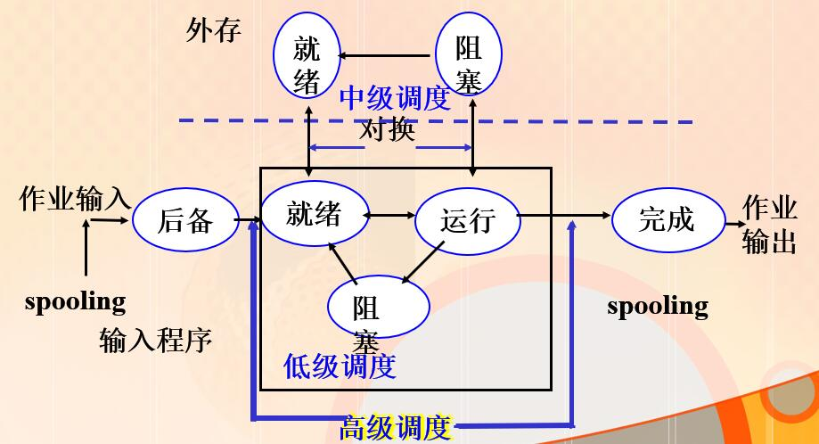
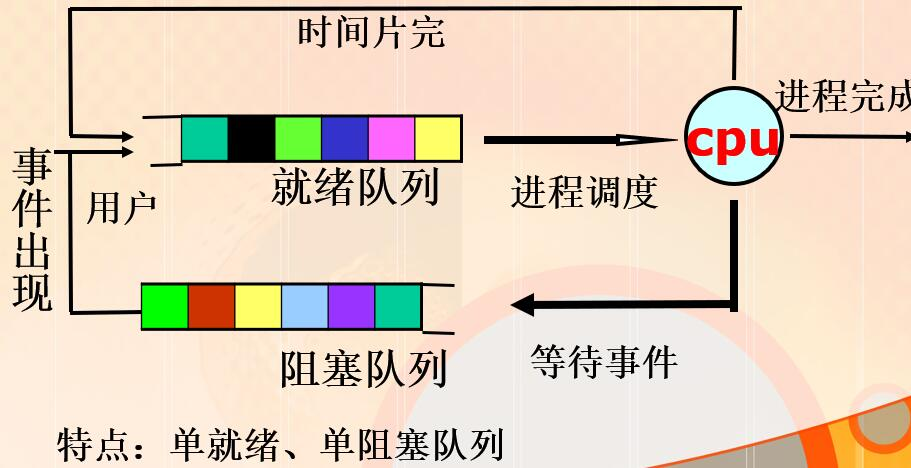
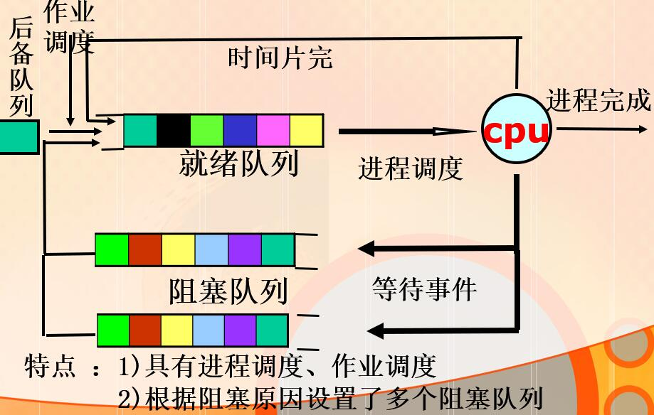
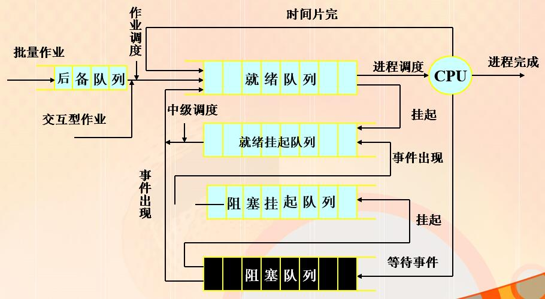
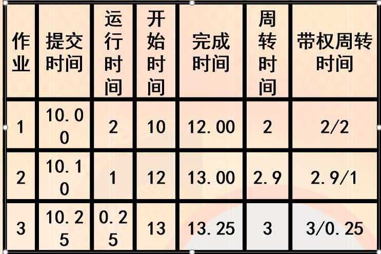
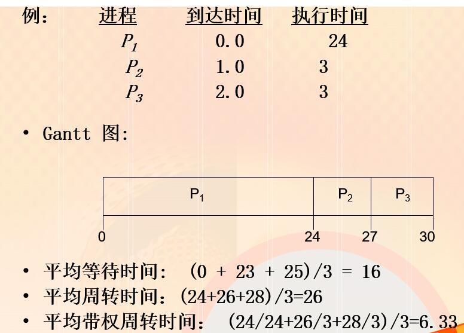
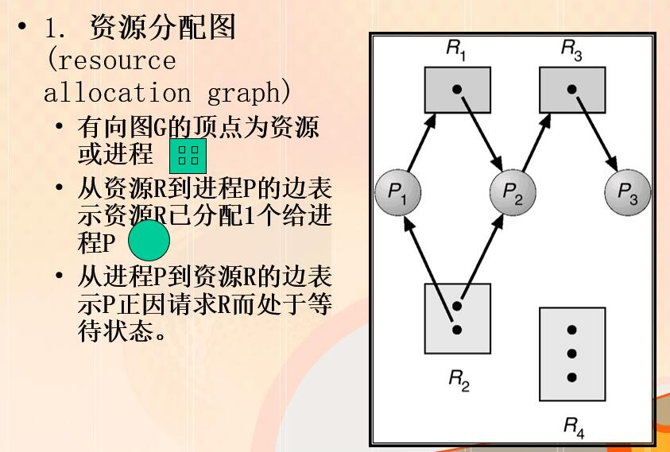

## 第三章 处理机调度与死锁

多道程序下，进程数目往往多于处理机数目。需要系统按某种算法动态将处理机分配给就绪队列中的进程，使之执行。

<!-- more -->

### 3.1 处理机调度层次

##### 高级调度

+ 又称作业调度或长期调度，根据某种算法决定将处于外存上后备队列的哪些作业调入内存
+ 作业：利用计算机进行一次运行所需工作的集合，要完成一个工作要先提交一次作业。一个作业可能由多个程序构成。
+ PC机或者普通工作站和服务器上几乎没有作业的概念。

##### 低级调度

+ 也称进程调度或短期调度，用于决定就绪队列中哪个进程获得处理机，之后派发程序将处理机分配给进程。

##### 进程调度方式

1）非抢占式调度

+ 一旦把处理机分配给某进程后，便让进程一直执行，直到进程阻塞，再把处理机分配给其他进程

2）抢占式调度

+ 允许暂停一个正在执行的进程，将处理机分配给另一进程。
  + 时间片轮转分给进程的时间片用完
  + 按照优先级调度，更高级优先权就绪
  + 短作业优先原则

##### 中级调度

+ 条件允许的情况下，在外存挂起的进程集合中选择哪些进程激活并调回内存。
+ 提高效率，加快运行，调节复合，提高吞吐量。
+ 有时需要选择内存或者就绪的进程放在外存中，叫做挂起
+ 这些进程具备运行条件，内存稍有空闲时，中级调度把这些放入就绪队列，叫做对换。

##### 三种调度之间的关系

#### 3.1.2 调度队列模型

##### 1.仅有进程调度

##### 2.具有高级和低级的调度队列模型

##### 3.同时具有三级调度的模型

#### 3.1.3 选择调度方式和算法的若干法则

处理机调度算法的性能可以从不同角度去看，所以是一个综合的判断结果。

##### 面向用户

+ 周转时间短
+ 响应时间快
+ 截至时间保证
+ 优先权准则

##### 面向系统

+ 吞吐量高
+ 处理机利用率好
+ 资源平衡利用

##### 周转时间

作业从提交到完成所经历的时间（后备队列等待，CPU执行，就绪队列，阻塞队列等待，结果输出）

平均周转时间：
$$
T=\frac{1}{n}\sum_{i=1}^{n}T_i
$$
带权周转时间
$$
W=\frac{1}{n}\sum_{i=1}^{n}\frac{T_i}{T_{si}}
$$
例：下面三道作业的平均周转时间和平均带权周转时间

| 作业 | 提交时间/时 | 运行时间/h |
| :--: | :---------: | :--------: |
|  1   |    10.00    |     2      |
|  2   |    10.10    |     1      |
|  3   |    10.25    |    0.25    |

平均周转时间：
$$
T=\frac{2+2.9+3}{3}=2.63h
$$
平均带权周转时间：
$$
W=\frac{2+2.9+12}{3}=5.3h
$$

##### 响应时间

+ 分时系统的重要指标
+ 用户输入一个请求到系统首次响应的时间

##### 截至时间

+ 实时系统重要指标
+ 分为开始截至时间和完成截至时间
+ 某任务必须开始执行的最迟时间或者必须完成的最迟时间

##### 优先权原则

+ 批处理，分时，实时系统都可遵循
+ 可以使关键人物达到最好目标
+ 公平性：不会因为进程本身的特性使上述指标过分恶化

##### 面向系统准则

+ 吞吐量
  + 批处理系统的重要指标
  + 吞吐量指时间内完成的作业数，和作业本身特性或者调度算法都有关系

+ 处理及利用率高
  + 大中型主机多用户系统指标，PC一般不考虑

+ 各种资源平衡利用
  + 大中型多用户系统性能指标。如CPU繁忙的作业和I/O繁忙

##### 调度算法本身的调度性能准则

+ 易于实现
+ 执行开销比

### 3.2 调度算法

OS中的调度实质时一种资源分配

有的调度算法使用于作业调度，有的算法适用与作业调度，有的两者都适应。

#### 3.2.1 先来先服务和短作业优先算法

##### FCFS算法

+ 算法描述
  + 按照作业或者进程变为就绪态的先后顺序，分派CPU，当前作业或进程占用CPU，直到执行完或阻塞才让出（非抢占）
  + 在作业或进程唤醒后，不立即恢复执行，而是排队，
  + 是最简单的算法

+ FCFS的特点
  + 有利长作业，不利短作业
  + 有利于CPU繁忙，不利于IO繁忙

##### 短作业优先调度算法

+ 算法描述
  + 对预计执行时间短的作业（进程）优先分派处理机。通常后来的短作业不抢先正在执行的作业
  + 是对FCFS算法的改进，目标是减少平均周转时间

+ SJF的特点
  + 优点
    + 比FCFS改善平均周转时间和平均带权周转时间，缩短作业等待时间
    + 提高系统吞吐量
  + 缺点
    + 对长作业不利，可能长时间得不到执行
    + 未能依据作业的紧迫程度来划分优先级
    + 难以准确估计作业（进程）的执行时间，从而影响调度性能

SJF的变形：
最短剩余时间优先 SRT（允许比当前进程剩余时间更短的进程来抢占）

最高相应比优先 HRRN （相应比R=（等待时间+要求执行时间）/要求执行时间，FCFS和SJF的折中）

#### 3.2.2优先权调度算法

本算法适用于祖业调度和进程调度

算法用于作业调度时，系统从后备队列中选择优先权最高的作业装入内存

用于进程调度，系统吧处理机派发给就绪队列中优先权的最高进程

+ 抢占式：当前进程时间片未用完时就可被优先级更高的进程抢占CPU

+ 非抢占式：除非自愿或时间片到，当前进程不可被优先级更高的进程抢用CPU
+ 可抢占程度越高，对实时系统满足越好

优先权的类型

静态优先级

+ 创建进程时就确定，直到进程终止前都不改变。通常是一个整数。
+ 依据：
  + 进程类型（系统进程优先级较高）
  + 对资源的需求（对CPU和内存需求较少的进程，优先级较高）
  + 用户要求（紧迫程度和付费多少） 
+ 特点：
  + 简单，系统开销小
  + 不精确，仅在要求不高的系统中使用

+ 动态优先级
+ 在创建进程时赋予的优先级，在进程运行过程中可以自动改变，以便获得更好的调度性能。
+ 如：
  + 在就绪队列中，等待时间延长则优先级提高，从而使优先级较低的进程在等待足够的时间后，其优先级提高到可被调度执行；
  + 进程每执行一个时间片，就降低其优先级，从而一个进程持续执行时，其优先级降低到出让CPU。 

##### 高响应比优先调度算法(HRRN,HRN)

+ 响应比R 
     = (等待时间 + 要求执行时间) / 要求执行时间
     ＝1＋等待时间/要求执行时间

+ 是FCFS和SJF的折衷：
  + 作业等待时间相同，服务时间越短，优先权越高--SJF；
  + 要求服务时间相同，等待时间越长，优先权越高--FCFS；长作业随着等待时间的增加，优先权增加。 
+ 缺点：
  + 响应比的计算增加系统开销

#### 3.2.3基于时间片的轮转调度算法

时间片轮转法（Round Robin, RR)

+ 本算法主要用于微观调度（进程调度）
+ 设计目标是提高资源利用率
+ 基本思路是通过时间片轮转，提高进程并发性和响应时间特性，从而提高资源利用率 

算法描述

+ 将系统中所有的就绪进程按照FCFS原则，排成一个队列。
+ 每次调度时将CPU分派给队首进程，让其执行一个时间片。在一个时间片结束时，发生时钟中断。调度程序据此暂停当前进程的执行，将其送到就绪队列的末尾，并通过上下文切换执行当前的队首进程。
+ 时间片的长度从几个ms到几百ms。
+ 进程可以未使用完一个时间片，就出让CPU（如阻塞）。

时间片长度的确定

+ 时间片长度变化的影响
  + 过长－>退化为FCFS算法
  + 过短－>用户的一次请求需要多个时间片才能处理完，上下文切换次数增加，响应时间长。
+ 就绪进程的数目：数目越多，时间片越小
+ 系统的处理能力：应当使用户输入通常在一个时间片内能处理完，否则使响应时间，平均周转时间和平均带权周转时间延长。

##### 多级反馈队列调度算法

多级反馈队列算法是时间片轮转算法和优先级算法的综合和发展。
1) 算法描述

+ 设置多个就绪队列，分别赋予不同的优先级，队列1的优先级最高。每个队列执行时间片的长度也不同，规定优先级越低则时间片越长。
+ 假设有三个就绪队列：
  + Q1－－时间片为8
  + Q2－－时间片为16
  + Q3－－FCFS
+ 新进程进入内存后，先投入队列1的末尾，若按队列1一个时间片未能执行完，则降低投入到队列2的末尾，若仍未完成，降低到最后的队列，按FCFS算法调度直到完成。
+ 仅当较高优先级的队列为空，才调度较低优先级的队列中的进程执行。如果进程执行时有新进程进入较高优先级的队列，则抢先执行新进程，并把被抢先的进程投入原队列的末尾。

2）算法性能

+ 终端型进程：让其进入最高优先级队列，以及时响应I/O交互。通常执行一个小时间片，可处理完一次I/O请求的数据，然后转入到阻塞队列。
+ 计算型进程（长批处理作业）：每次都执行完时间片，进入更低级队列。最终采用最大时间片来执行，减少调度次数。
  短批处理作业：  先放入第1级，一般经过1，2级即可完成。

3）优点：

+ 为提高系统吞吐量和缩短平均周转时间而照顾短进程
+ 为获得较好的I/O设备利用率和缩短响应时间而照顾I/O型进程
+ 不必估计进程的执行时间，动态调节

### 3.4 实时调度

#### 3.4.1实现实时调度的基本条件

+ 提供必要信息（就绪时间，开始截至时间，资源要求，优先级）
+ 系统处理能力强:    单处理机： $\sum_{i=1}^{m}\frac{C_i}{P_i}<=1$，多处理机： $\sum_{i=1}^{m}\frac{C_i}{P_i}<=N$
+ 采用抢占式调度机制
+ 具有快速切换机制 （快速响应中断，快速任务分派）

#### 3.4.2 实时调度算法分类

##### 非抢占式调度算法

1） 基于时钟中断的抢占式优先权调度算法

+ 在某实时任务到达后，若其优先级高于占有处理机的进程优先级，并不抢占，等到时钟中断到达时再抢占。
  调度延迟可降为几十至几毫秒。

2）立即抢占

+ 操作系统具有快速响应外部中断的能力。一旦出现外部中断，只要当前进程未处于临界区，立即抢占CPU。

##### 非抢占式优先调度算法

+ 要求严格的任务赋予高优先级，执行后其他任务才能调度执行

#### 3.4.3 常用的几种实时调度算法

1. 最早截止时间优先 EDF（Earliest Deadline First）
+ 根据任务的开始截止时间确定任务的优先级。具有最早截止时间的任务排在队列的最前面。
+ 即可用于抢占式调度，又可用于非抢占式调度。

2. 最低松弛度优先LLF（Least Laxity First）算法
+ 任务的紧急程度愈高，该任务的优先级愈高。
+ 松弛度 = 必须完成时间-本身运行时间-当前时间
+ 如，t=0时，某任务在200ms时必须完成，他本身执行的时间是100ms，则其松弛度为100ms。
+ LLF算法按松弛度排就绪队列，松弛度最低的排在队列最前面，优先被调度执行。
+ LLF主要用于可抢占调度方式中。

### 3.5 死锁产生的原因和必要条件

死锁：多个进程争夺共享资源出现的僵局。

产生原因：

+ 竞争资源(不可剥夺资源)
  + 资源数目不能满足进程需要
  + 双方都有部分资源，同时请求对方已占有的资源
  + 硬件中的中断，信号，消息，缓冲区数据
+ 顺序不当
  + 进程运行过程中，请求和释放资源顺序不当
  + 多个进程并发执行，相互的推进顺序不确定，可能会导致两种结果：不出现死锁和出现死锁。

#### 3.5.2 产生死锁的必要条件

只有4个条件都满足时，才会出现死锁。

+ 互斥：任一时刻只允许一个进程使用资源
+ 请求和保持：进程保持了至少一个资源，但又提出了新的资源请求，该资源又被其他进程占用。
+ 不剥夺：进程已经占用的资源，未使用完，不能被剥夺。
+ 环路等待：存在进程－资源环形链，即有进程集合{P0, P1, P2,….Pn},P0等待P1占用的资源，P1等待P2占用的资源…..Pn等待P0占用的资源。    

#### 3.5.3 处理死锁办法

+ 预防死锁
  + 采用某种策略，限制并发进程对资源的请求，使系统在任何时刻都不同时满足死锁的四个必要条件
+ 避免死锁
  + 在资源的动态分配过程中，防止系统进入不安全状态。
+ 检测死锁
  + 允许系统进入死锁，但系统及时检测，并采取措施。
+ 解除死锁
  + 当检测到系统进入了死锁，采取措施解除。

#### 3.6.2 系统的安全状态

系统按某种进程顺序为进程分配资源，直至达到进程的最大需求，使每个进程都可以顺利完成。

无法找到安全序列则称系统处于不安全状态

#### 3.6.3 避免死锁-银行家算法

银行家算法（Dijkstra, 1965）问题

+ 在银行中，客户申请贷款的数量是有限的。银行家应尽量满足所有客户的贷款需求。
+ 银行家就好比操作系统，资金就是资源，客户就相当于要申请资源的进程。

为保证资金的安全，银行家规定：

+ 当一个顾客对资金的最大需求量不超过银行家现有的资金时就可接纳该顾客(试探性分配) 
+ 顾客可以分期贷款，但贷款的总数不能超过最大需求量(可能一次并不能满足所需要的全部资源) 
+ 当银行家现有的资金不能满足顾客尚需的贷款数额时，对顾客的贷款可推迟支付，但总能使顾客在有限的时间里得到贷款(不存在死锁) 
+ 当顾客得到所需的全部资金后，一定能在有限的时间里归还所有的资金(运行后释放) 

##### 1.银行家算法中的数据结构

设系统中共有n个进程，m类资源
(1) 可利用资源向量Available[m]。
       若Available[i]＝k，表示系统中Ri类资源有k个。
(2) 最大需求矩阵Max[n,m]
       若Max[i,j]=k，表示进程 i 需要Rj类资源k个。
(3) 分配矩阵Allocation[n,m]
       若Allocation[i,j] = k，表示进程 Pi 现在拥有 Rj 类型的资源k个。 
(4)需求矩阵Need[n,m]
       若 Need[i,j] = k，表示进程 Pi 最多还需要Rj类型的资源k个，它才能完成任务
       Need[i,j]=Max[i,j]– Allocation[i,j]

2. ##### 资源请求算法

Requesti为进程 Pi 的请求向量。如果 Requesti [j] = k ，表示进程 Pi 需要Rj类型资源k个。
1.	如果 Requesti  Needi ，转去执行第2步。否则产生错误，因为进程对资源的请求已经超过它事先声明的最大数量。
2.	如果 Requesti  Available，转去执行第3步。 否则进程Pi必须等待，因为现有资源不够分配。
3.	假设将进程 Pi 请求的资源分配给它，并按如下方式修改状态
   Available = Available – Requesti
   Allocationi = Allocationi + Requesti
   Needi = Needi – Requesti
   则系统进入新状态，用安全算法验证新状态是安全的。
   如果安全 ->  将资源分配给进程 Pi，系统进入新状态。
   如果不安全 ->  进程 Pi必须等待，系统保持原状态。

3. ##### 安全算法

   (1)Work 和 Finish 分别是长度为m 和 n 的向量， 分别初始化为：
   				Work = Available
   				Finish[i]=false (i = 1,3, …, n)
   (2)查找这样的 i 使其满足：
   				(a) Finish [i] = false
   				(b) Needi  Work
   				如果没有这样的 i 存在就转去执行第4步
   (3)Work = Work + Allocationi

   ​	Finish[i] = true  

   ​	转去执行第2步
   (4)如果对所有的i，Finish[i]==true ，那么系统是安全的。否则，系统处于不安全状态。

**例子详见PPT**

4. ##### 银行家算法特点

+ 允许互斥、部分分配和不可抢占，可提高资源利用率；
+ 要求事先说明最大资源要求，在现实中很困难。

### 3.7 死锁的检测和解除

系统为进程分配资源时，若未采取避免和预防死锁的措施，系统必须提供检测和解除死锁的手段。即：

+ 保存资源的请求和分配信息
+ 利用某种算法对这些信息加以检查，以判断是否存在死锁。

##### 1. 资源分配图

##### 2. 死锁定理

资源分配图的化简方法：

+ 删除既不处于等待状态又不独立的进程的所有弧（包括请求边和分配边），该点变为孤立点。
+ 重复上述过程，若最后所有进程结点是孤立点，则称该资源图是完全可简化的，否则是不可完全简化的

死锁定理：S为死锁状态的充分条件是：当且仅当S状态的资源分配图不可完全简化。其中的有边进程为死锁进程。

##### 3. 死锁检测算法

1）检测算法中的数据结构
	设系统中有n个进程，m类资源
	Available:长度为 m 的向量，表示各种类型资源的可用实例数
	Allocation:为 n  m 矩阵，表示目前已分配给各个进程的各种资源的数量
	Request:为 n  m 矩阵，表示目前各个进程请求资源的情况。若Request[i,j] = k, 表示进程 Pi 正在请求 k 个类型为Rj的资源。

2）算法描述
	(1)设Work 和 Finish 分别是长度为m 和 n 的向量，各自初始化为： 
		(a) Work = Available
		(b) 对于i = 1,2, …, n，如果 Allocationi  0, 那么Finish[i] = false；否则 Finish[i] = true.
	(2) 查找这样的下标 i ，使其满足：
		(a) Finish[i] == false

(3) Work = Work + AllocationiFinish[i] = true转去执行第2步 。
(4) 如果对某个i （ 1 <= i <=  n ），若Finish[i] == false，那么系统死锁。 而且，如果 Finish[i] == false，那么进程 Pi 正处于死锁状态。

该算法需要O(m x n2) 操作来检查系统是否处于死锁状态

##### 4.死锁检测算法的应用

+ 何时、以什么样的频率调用检测算法，取决于以下两个因素：
  + 可能发生死锁的频率是多少?
  + 将影响多少进程（重新执行全部或部分代码）?
+ 一旦资源请求不能立刻响应，调用检测算法（开销大）
+ 固定间隔调用检测算法，例如每小时1次或CPU利用率<40%。

##### 解除死锁的方法：

+ 终止进程
  + 代价大，易实现
  + 一次仅终止一个进程，直到消除环路为止（观察资源执行时间，使用资源数目，以及剩余时间，需求资源数目评断）
+ 剥夺资源
  + 选择一个牺牲者
    + 代价最小
  + 回退（后退）
    + 退回安全状态，在此重新启动进程
    + 完全回滚：进程终止后重新开始
  + 饿死
    + 如果仅仅是基于代价来选择进程的话，某些进程可能会饿死。因此“代价”还应增加一个因素：做牺牲品的次数。

