## 存储器管理

用户程序的主要处理阶段

<!-- more -->

连续分配方式

离散分配方式

虚拟存储器的基本特征

### 存储器的管理功能

1. 存储分配和回收（主要内容，讨论算法和相应的数据结构）
2. 地址变换（文件生成的连接技术，加载的重定位技术，运行时的地址变换）
3. 存储共享和保护（代码数据的共享，对地址空间的访问权限）
4. 存储器扩充（存储器的逻辑组织和物理知识）
   1. 由应用程序控制：覆盖
   2. 由OS控制：交换（整个进程）请求调入和预调入（部分进程）

### 逻辑地址空间与物理地址空间

+ 逻辑地址，也称虚地址，相对地址
  + 由CPU执行指令时生成的地址（本条指令所需数据的地址或下一条指令地址）

+ 物理地址，也称绝对地址，实地址
  + 实际的内存单元地址

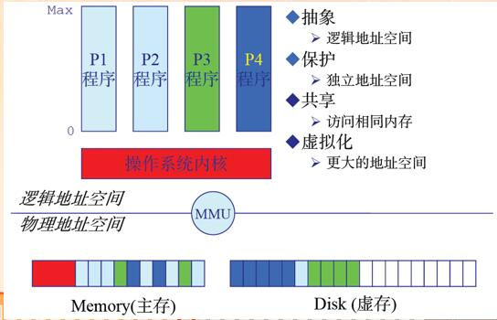

### 地址空间

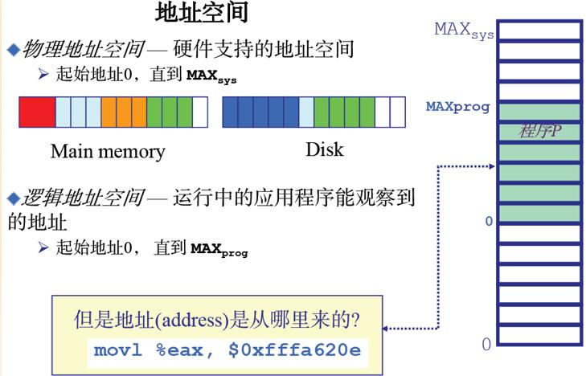

### 逻辑地址和物理地址

+ 将逻辑地址和物理地址分离，是内存管理的核心
+ 逻辑地址与物理地址相同
  + 地址映像工作在编译阶段或加载阶段完成

+ 重定位
  + 进程的逻辑地址空间不同于物理地址空间，所以存储管理模块要解决逻辑地址到物理地址的映射问题。
  + 也称地址映射，地址映像
  + 在执行阶段完成

### 4.1程序的装入和链接

编程可得到执行文件的步骤：编译（obj文件），链接（EXE文件或动态链接库dll），装入

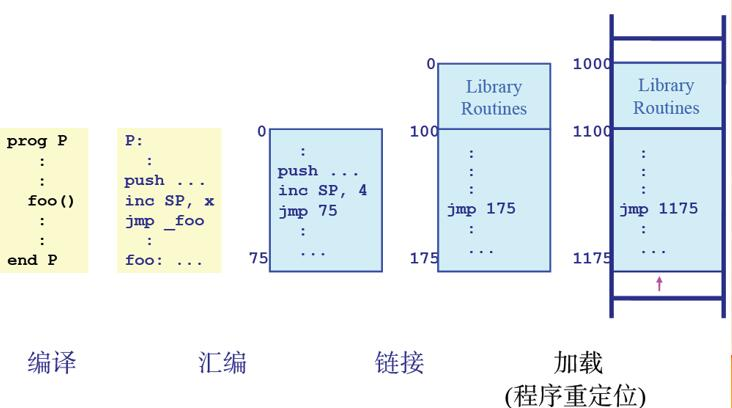

#### 4.1-1 程序的装入

1. ##### 绝对装入

+ 编译程序知道程序在内存中的地址，并产生绝对地址的目标代码
+ 绝对装入模块装入时直接定位在上述内存地址，不修改程序和地址的数据
+ 优点：装入过程简单，
+ 缺点：过于依赖硬件结构，不适用于多道程序系统

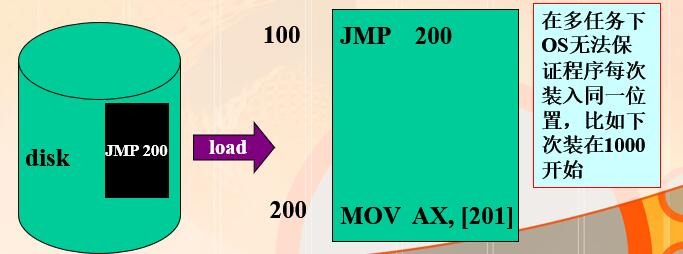

##### 2.可重定位装入

+ 在多道程序下，目标的起始地址通常从0开始，程序其他地址也相对于起始地址计算，装入时可采用可重定位装入
+ 在可执行文件中，列出需要重定位的地址单元和相对地址值（表）最后根据定位的内存地址修改重定位地址项，添加偏移量。

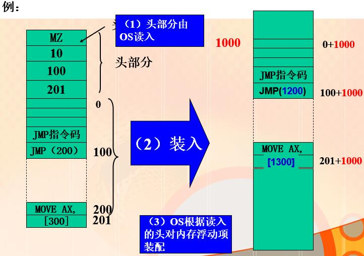

优点

+ 不需要硬件支持，可以装入有限多道程序

缺点：

+ 一个程序需要连续的地址空间，程序装入后不能移动，不易共享

地址变换是由装入程序在装入目标模块时一次完成，装入后内存不能移动，故称为静态重定位。

##### 3.动态运行时装入

+ 程序开始执行时未全部装入内存，而是部分装入，运行时需要什么模块再装什么模块
+ 程序装入内存后不直接将相对地址转换为直接地址，等到真正执行是再转换，即动态重定位
+ 装入内存的所有地址都是相对的

优点：

+ OS可以将一个程序分散存放于不连续的内存空间，可以移动程序，有利于实现共享。
+ 能够支持程序执行中产生的地址引用，如指针变量（而不仅是生成可执行文件时的地址引用）

缺点：

+ 需要硬件支持（通常是CPU），OS实现较复杂－－是虚拟存储的基础

#### 4.1.2 程序的链接

根据链接时间不同，分为三种

静态链接

+ 在程序运行前，先将各目标模块及它们所需的库函数，链接成一个完整的装入模块，以后不再拆开。要解决两个问题：
  + 修改相对地址
  + 变换外部调用符号
+ 对多用户、多任务系统显然有冗余，比如多个用户调用了sin(x)，则每个目标代码中都有这部分代码，装入到内存则也都有这部分代码。

装入时动态链接

+ 源程序编译得到的目标模块是在装入内存时，边装入边链接的，即在装入一个目标模块时，若发现一个外部模块调用事件，装入程序去找出相应的外部目标模块，并将它装入内存，同时修改相对地址。
+ 优点
  + 共享：多个进程可以共用一个目标模块，节省内存，减少文件交换。
  + 便于修改和更新。各目标模块是分开存放的，便于修改。

运行时动态链接

+ 应用程序运行时，每次运行的模块可能不同。但事先又无法知道，运行时动态链接是将某些模块的链接推迟到执行时。即，执行时发现调用的模块未被装入，由OS找到该模块并装入，并将其链接到调用者模块上。
+ 优点：
  + 部分装入：一个进程只将与当前操作相对应的DLL装入内存。
  + 便于局部代码修改：即便于代码升级和代码重用；只要函数的接口参数（输入和输出）不变，则修改函数及其DLL，无需对可执行文件重新编译或链接。
  + 便于适应运行环境：调用不同的DLL，就可以适应多种使用环境和提供不同功能。如：不同的显示卡只需厂商为其提供特定的DLL，而OS和应用程序不必修改。
+ 缺点：
  + 链接开销：增加了程序执行时的链接开销；
  + 管理开销：程序由多个文件组成，增加管理复杂度。 

##### 地址生成

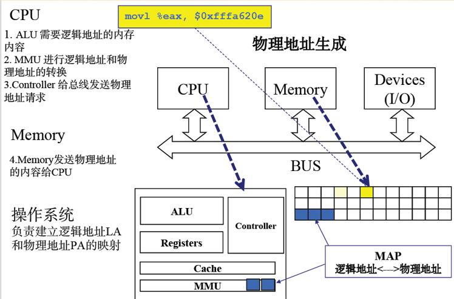

##### 地址安全检查

在用户模式中验证产生的地址，如果发现不好的地址，中断进入内核

### 4.2 连续分配存储管理方式

#### 单一连续分配

+ 内存分为两个区域：系统区，用户区。应用程序装入到用户区，可使用用户区全部空间。未采取存储保护措施。
+ 最简单，适用于单用户、单任务的OS。CP/M和MS-DOS 
+ 优点：
  + 易于管理。
+ 缺点：
  + 对要求内存空间少的程序，造成内存浪费；
  + 程序全部装入，很少使用的程序部分也占用内存固定分区分配

##### 分区式存储管理

为了支持多道程序系统和分时系统，支持多个程序并发执行

吧内存分为大小相等或不等的区，操作系统占用一个，其余给应用程序，应用程序占用一个或几个

##### 内碎片和外碎片

内：占用分区内未被利用的空间

外：占用分区之间难以利用的小空闲分区

#### 固定分区分配

+ 最简单的一种运行多道程序的存储管理方式
+ 把内存划分为若干个固定大小的连续分区，每个分区只装入一个作业。
+ 划分分区的方法
  + 分区大小相等：只适合于多个相同进程的并发执行（处理多个类型相同的对象）。
  + 分区大小不等：多个小分区、适量的中等分区、少量的大分区。根据程序的大小，分配当前空闲的、适当大小的分区。

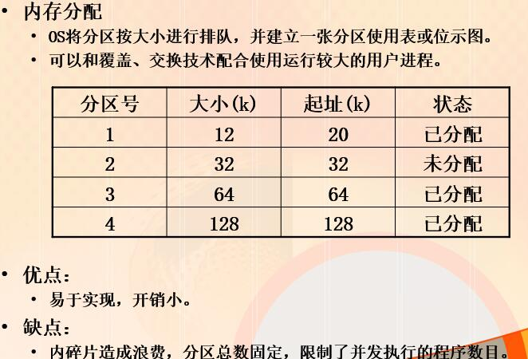

#### 动态分区分配

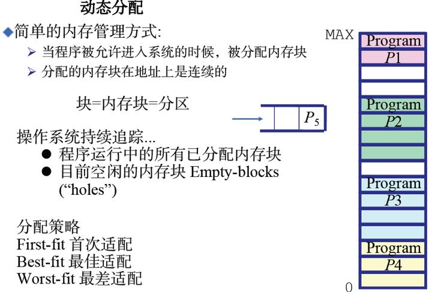

+ 动态分区分配是指OS根据进程的实际需要为各进程分配连续的物理内存。
  + 分区分配中的数据结构
  + 为了管理内存空闲分区建立了空闲分区表或空闲分区链表。
  + 表中各表项一般包括每个分区的起始地址、大小及状态(是否已分配)。  
  + 分区表中，表项数目随着内存的分配和释放而动态改变，可以规定最大表项数目。
  + 分区表可以划分为两个表格：空闲分区表和占用分区表。从而减小每个表格长度。空闲分区表中按不同分配算法对表项排序。

+ 分区分配算法：
  + 某个新作业装入内存，需寻找一个空闲分区，其大小需大于或等于进程的要求。
  + 若是大于要求，则将该分区分割成两个分区，其中一个分区为要求的大小并标记为“占用”，而另一个分区为余下部分并标记为“空闲”。

##### 首次适应算法：

+ 按分区的先后次序，从头查找，找到符合要求的第一个分区。
+ 该算法的分配和释放的时间性能较好，较大的空闲分区可以被保留在内存高端。
+ 但随着低端分区不断划分而产生较多小分区，每次分配时查找时间开销会增大。

##### 循环适应算法：

+ 按分区的先后次序，从上次分配的分区的下一个位置开始查找（到最后一个分区时再回到开头），找到符合要求的第一个分区。
+ 实现算法，要设置起始查询指针。
+ 该算法的分配和释放的时间性能较好，使空闲分区分布得更均匀，但较大的空闲分区不易保留。

##### 最佳适应法(best-fit)

+ 找到其大小与要求相差最小的空闲分区。
+ 为了加速寻找，该算法要求空闲分区表将空闲分区按容量由小到大排序。
+ 从个别来看，外碎片较小，但从整体来看，会形成较多外碎片。较大的空闲分区可以被保留。 

##### 最坏适应法(worst-fit)

+ 找到最大的空闲分区。
+ 算法要求空闲分区表将空闲分区按容量由大到小排序。
+ 基本不留下小空闲分区，但较大的空闲分区不被保留。 

##### 快速适应算法

+ 又称分类搜索法。
+ 将空闲分区根据容量大小分类，每类分区容量相同。为每类分区
+ 设立一个空闲分区链表。系统中设立一张管理索引表，每个表项
+ 记录的是每类空闲分区链表的表头。
+ 优点：
  + 查找空闲分区效率高。
  + 能保留大分区。
+ 缺点：
  + 回收分区时，系统开销大。
  + 空闲分区划分越细，浪费则越严重。

#### 动态重定位分区分配 

#### 4.2.3 动态分区分配

分区分配操作 

+ 分配内存
  + 利用某种分配算法，从空闲分区表（链）中找到所需大小的分区
+ 回收内存，有以下四种情况：
  + 与前一个空闲分区相邻
  + 与后一个空闲分区相邻
  + 与前、后空闲分区都相邻
  + 不与任何空闲分区相邻

#### 4.2.4 伙伴系统

伙伴系统方式是动态分区分配和固定分区分配的一种折中方案。

伙伴系统规定，分区分配大小都是$2^k$ k为整数，1<=k<=m 2^m可以是整个内存的大小。系统中也要建立一个索引管理表，指明每个链表表头。

##### 分区分配方法：

+ 开始时，整个分区是2m，在系统运行过程中，由于不断划分，可能会形成若干不连续的空闲分区，将它们分类，每一类具有相同大小，且每类建立一个空闲分区双向链表，系统中有若干个双向链表。
+ 当需要为进程分配大小为n的区块时，首先计算一个i，使2i-1≤n ≤2i，然后在大小为2i的空闲分区链表中查找。

##### 分区回收：

+ 若回收大小为2i的分区，若有伙伴分区，则合并为2i+1的分区，进而可能需要合并为2i+2的分区……
+ 算法性能取决于查找空闲分区的位置和分割、回收空闲分区所花费的时间。

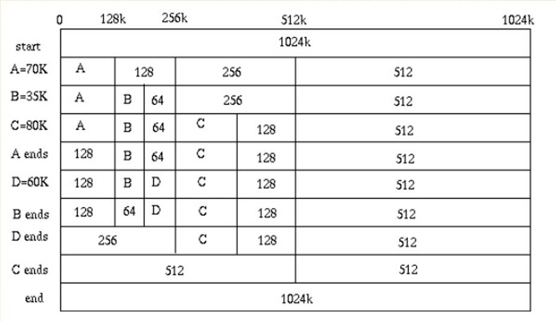

##### 优点：

+ 快速搜索合并
+ 低外部碎片

##### 缺点：

+ 内部碎片。
+ 因为按2的幂划分块，如果碰上66单位大小，那么必须划分128单位大小的块。 

#### 4.2.5 可重定位分区分配

当内存驻留多个进程时，分配一个区后大部分情况下都是有剩余零头的，因此在一个新作业到达时，就有可能零头分区的总和超过新作业要求的分区，但每一个空闲分区的容量都不够。

1.紧凑

+ 将各个占用分区向内存一段移动，使各个空闲分区聚集在另一端，合并为一个较大的空闲分区。

+ 对占用分区进行内存数据搬移占用CPU时间，如果对占用分区中的程序进行浮动，则其重定位需要硬件支持。
+ 何时执行：每个分区释放后或内存找不到满足条件的空闲分区。

##### 动态重定位分区分配算法

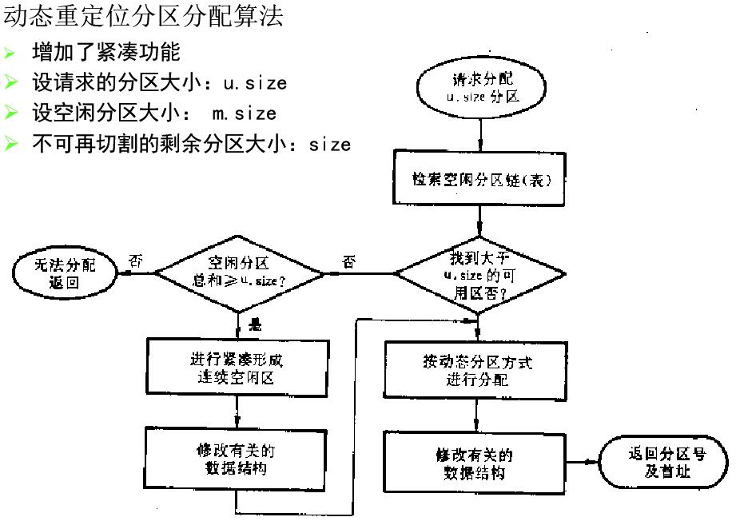

#### 4.2.6 覆盖

为了在较小的可用内存中运行较大的程序

##### 原理

+ 程序必要部分常驻内存
+ 不常用功能用其余模块实现，不使用时放外存，使用时放内存
+ 不存在调用关系的模块不封装到内存，从而实现互相覆盖。

##### 缺点

+ 程序员需要给程序分块并确定覆盖关系，增加复杂度
+ 进程在执行过程中要从外存装入，速度慢，用时间换空间

#### 4.2.7 对换

+ 内存中有进程处于堵塞态，另一方面有就绪进程在外存等待
+ 对换将暂时不能执行的程序或数据送到外存中，获得空闲内存来装入具备运行条件的进程或所需要的程序和数据
+ 进程暂时不能执行原因
  + 阻塞态
  + 低优先级

+ 交换单位为整个进程的地址空间
+ 小型系统中与可重定位分区分配存储管理配合使用，称作roll in/roll out

+ 加快进程换入，换出速度，因此采用连续分配，较少考虑碎片问题
+ 建立磁盘的对换区，内存有空时找出就绪且换出时间最久的进程换入内存
+ 优点
  + 增加并行进程数目，给用户适当响应时间，提高吞吐率

+ 缺点
  + 对换入换出的控制增加处理机开销，没有考虑执行过程中地址访问的统计特性

### 4.3 基本分页存储管理方式

#### 连续分配问题

+ 形成外碎片和内碎片
+ 近凑带来开销

#### 离散分配

+ 基本单位是页：分页存储管理
+ 是段：分段存储管理
+ 分页存储管理不支持虚存技术，要求吧整个作业装入内存才能运行。

#### 在页式管理中：

+ 内存化为固定大小的页框，也叫页帧，物理页框
+ 进程的逻辑地址页分为同样大小的页，程序加载时需要分配所需全部页，这些页不必连续
+ 固定：计算机系统的内存容量固定，一个页容量也是固定的

#### 进程装载：

+ 装入进程时，找空闲页框，OS将页框分配给装入过程，每个页占用一个页框，进程占用的所有页框不要求连续

+ 要解决逻辑地址到物理地址的映像需要硬件支持。

#### 基本分页管理中的数据结构

+ 进程页表：每个进程有一个页表，描述该进程的每个逻辑页占用的物理页框号。
+ 物理页面表：整个系统有一个物理页面表，描述所有物理页框的分配使用状况。数据结构：位示图，空闲页面链表；
+ 请求表：整个系统有一个请求表，描述系统内各个进程页表的位置和大小，用于地址转换；
+ 请求表也可以结合到各进程的PCB里，此时在PCB中记录本进程页表所在的物理页框号。上下文切换时，由OS将其加载到页表寄存器中。

#### 逻辑地址结构

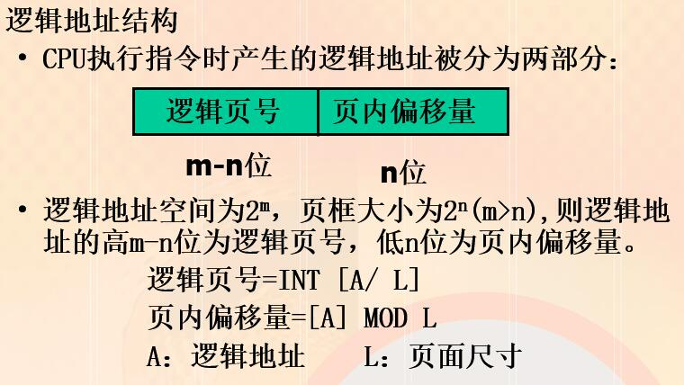

#### 页面大小的选择

+ 和目前计算机的物理内存大小有关：2n。
+ 较小的页面，减小内碎片，但加大页表的长度，从而形成新的开销并增加换入、换出的开销；
+ 较大的页面，减小页表的长度，加大内碎片；管理开销小，交换时对外存I/O效率高。
+ 两者的折中。

#### 页式管理的优缺点

优点：

+ 没有外碎片，每个内碎片不超过页大小。
+ 一个程序不必连续存放。便于改变程序占用空间的大小（主要指随着程序运行而动态生成的数据增多，要求地址空间相应增大，通常由系统调用完成而不是操作系统自动完成）。

缺点：

+ 程序全部装入内存。

#### 基本地址变换机构

逻辑上连续的目标程序在物理内存中已经不能保证连续存放，支持页式管理的机器硬件上都有一套地址变换机构完成逻辑地址到物理地址的变换。
逻辑地址分为两部分：逻辑页号，页内偏移地址；
通过查进程页表，得物理页号，从而形成物理地址。

#### 4.3.2快表

#### 4.3.3 两级和多级页表

### 4.4 基本分段存储管理

