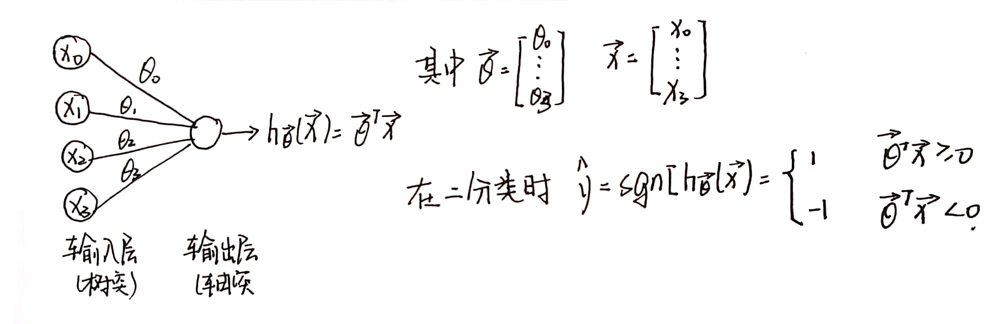

## 感知机

有证据表明，人脑就是利用相同的算法来理解不同的输入，感知机就是利用这种思想，将不同的输入放入同一个模型进行预测分析，从而得到结果。

<!-- more -->

### 1.感知机模型表示

### 2.感知机的loss与参数学习

$$
J(\vec \theta) = \frac {1}{m} \sum_{i=1}^M max(0,-y^{(i)}\vec \theta^T \vec x^{(i)})
$$

$$
其中\vec \theta^T \vec x^{(i)}也就是h_{\vec \theta}(\vec x)
$$

准则：只有计算符号预测错误时的loss(ReLu)

那么，梯度下降的方式改变也就很明显了
$$
\vec \theta ：= \vec \theta-\alpha\frac {\delta J_{\vec \theta}}{\vec{\theta_j}}
$$

$$
\frac {\delta J_{\vec \theta}}{\vec{\theta_j}} = \begin{cases} 0& {y\vec \theta^T \vec x}>=0\\ -y\vec x& {y\vec \theta^T \vec x}<0 \end{cases}
$$

### 4.多分类感知机

多分类的感知机和单分类的最大区别是多分类只取损失最大的类进行更新，其损失函数为
$$
J(\vec \theta) = \frac {1}{m} \sum_{i=1}^M max(0,max_{j=0...C}(\vec \theta_j\vec x^{(i)}-\vec \theta_{y^{(i)}}^T \vec x^{(i)}))
$$

$$
\frac {\delta J_{\vec \theta}}{\vec{\theta_j}} = \begin{cases} 0& c'=y^{(i)} \\ \vec x^{(i)}& j=c' \\-\vec x^{(i)}& j=y^{(i)}\end{cases} 其中C'=argmax_{j=1.2..C}\theta_j^T \vec x
$$

损失函数特点：（要和极大似然函数分清）

+ J>=0(非负性)
+ J可导但不要求处处可倒