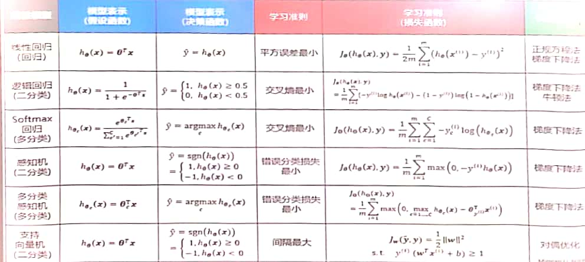

## 支持向量机

### 1.模型表示

支持向量机是一种二分类的广义分类器，其假设函数为

<!-- more -->
$$
h_{\vec \theta}(\vec x)=\vec \theta^T\vec x
$$
决策函数为：
$$
\hat y=sgn(h_{\vec \theta}(\vec x))
$$

### 2.优化准则

支持向量机运行的是基于边界决策的优化准则，决策边界不止一条 = 模型参数不唯一这种时候就要寻找中间线。
$$
h_{\vec \theta}(\vec x)=\vec \theta^T\vec x = \theta_0+\theta_1x_1+......+\theta_nx_n (增广形式)
$$
使$b=\theta_0$,其余部分视为$\vec w^T\vec x$的话，那么寻找中间决策线的方程就可以表述为：
$$
\vec w^T\vec x+b=\vec 0
$$

#### 1.点到超平面的距离

$$
r^{(i)} = \frac {|\vec w^T\vec x^{(i)}+b|}{||\vec w||}
$$

其中，$||\vec w||$表示一个二范数的模，这个式子的大前提是同时使得正样本大于0，负样本小于0

在r的集合中，间隔定义为$r = min_ir^{(i)}$,间隔最大化则是求$max_{\vec w,b} r$的过程

最终约束条件：
$$
r^{(i)} = \frac {|\vec w^T\vec x^{(i)}+b|}{||\vec w||}S>=r
$$

### 3.优化目标loss

$$
max_{\vec w,b} r,s.t.  r^{(i)} = \frac {|\vec w^T\vec x^{(i)}+b|}{||\vec w||}S>=r
$$

loss的意义：平行超平面$\vec w^T\vec x+b_1=0$与$\vec w^T\vec x+b_2=0$之间的距离
$$
d=\frac {b_1-b_2}{\vec w}
$$
即辅助决策边界之间的距离$d=\frac{2}{||\vec w||}$

loss的最大化的d就是让决策边界到正负样本之间的安全距离最大

### 4.参数求解（对偶优化）

原问题：
$$
min_{\vec w,b}J(\vec w)=min_{\vec w,b}\frac{1}{2}||\vec w||^2 ,\quad s.t. \quad 1-y^{(i)}(\vec w^T\vec x^{(i)}+b) \leq 0,\forall i\in (1,2...m)
$$
构造拉格朗日函数：
$$
L(\vec w,b,\vec \alpha) =\frac{1}{2}||\vec w||^2+\sum_{i=1}^m \alpha_i(1-y_i(\vec w^T\vec x^{(i)}+b))
$$
等价于：
$$
min_{\vec w,b}\quad max_{\vec \alpha}L(\vec w,b,\vec \alpha)\quad s.t. \quad \alpha_i \geq0,\forall i\in (1,2...m)
$$
由于强对偶性，交换min,max下的$\vec w,b与\vec \alpha$也同样成立

求解对偶问题的过程就是求拉格朗日函数的过程。

对偶问题的等价推广条件：KKT条件

+ $g(\vec \theta)\leq 0$ 原问题可行
+ $\vec \alpha\geq0$ 对偶问题可行
+ $g(\vec \theta)\vec \alpha=\vec 0$互补松弛

其中$\vec {\theta^*}$是$\vec \theta$的最优解

##### 决策函数

$$
\vec {w^*}=\sum_{i=1}^m \alpha_i^*y^{(i)}\vec x^{(i)}\Rightarrow \alpha_i^*=0的样本对\vec {w^*}无贡献
$$

$$
\hat y = sgn(h\vec{w^*},b^*(\vec x))=sgn((\vec{w^*})^T\vec x+b)=sgn(\sum_{i=1}^m \alpha_i^*y^{(i)}{\vec x^{(i)}}^T\vec x^{(i)}+b^*)
$$

### 5.SVM优点

1. 小样本学习（但学习过程中所有样本依然参与运算，给少量样本和大量样本意义相同）
2. 分类鲁棒性高
3. 理论上可得全局最优解

### 6.软间隔（线性不可分的情况）

由于线性不可分，则无论什么分法都会将样本分错。可以设$\varepsilon$作为对难分样本的容忍度，loss就是要获得最小的$\varepsilon_i$,公式为
$$
min_{\vec w,b,\varepsilon}J(\vec w)=min_{\vec w,b,\varepsilon}\frac{1}{2}||\vec w||^2+C\sum_{i=1}^m\varepsilon_i ,\quad s.t. \quad y^{(i)}(\vec w^T\vec x^{(i)}+b) \geq 1,\forall i\in (1,2...m)\quad \varepsilon_i\geq0
$$
这里的C是一个常数，用来调和两项的系数

#### 软间隔的优化目标

拉格朗日函数：
$$
L(\vec w,b,\vec \varepsilon ,\vec \alpha,\vec \mu) =(\frac{1}{2}||\vec w||^2+C\sum_{i=1}^m\varepsilon_i)+\sum_{i=1}^m \alpha_i(1-y^{(i)}(\vec w^T\vec x^{(i)}+b)-\varepsilon_i)-\sum_{i=1}^m\mu+\varepsilon_i
$$
软间隔支持的向量满足：$y^{(i)}(\vec w^T\vec x^{(i)}+b)+\varepsilon_i=1$

优点：小样本学习，可以容忍一些难以分类的样本点

### 7.核技巧解线性不可分问题

核技巧的基本思想是：低维线性不可分的问题可以转化为高维线性可分的问题

核函数表示：
$$
k(\vec x,\vec z) = \phi(\vec x)^T \phi(\vec z)
$$
这是对特征距离的一种重新度量。

常用和函数：
$$
\begin{aligned}
k(\vec x,\vec z) &= \vec x^T \vec z  \quad (线性)\\
&=(\vec x^T \vec z+c)^d \quad (多项式)\\
&=exp(-\frac{||\vec x-\vec z||_2^2}{2\delta^2}) \quad (高斯)
\end{aligned}
$$

## 线性模型总结

