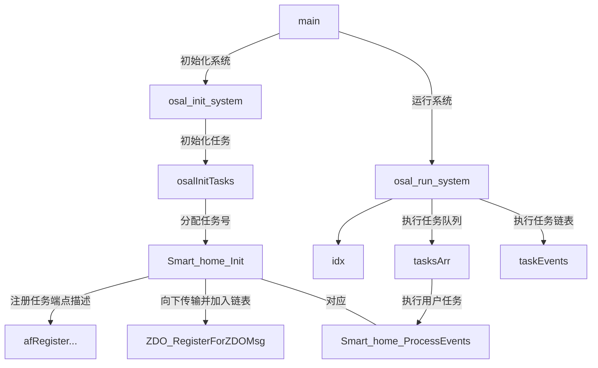

# ZigBee协议栈探究---（一）OSAL

## 1.写在前面

由于是毕设的要求，我开始再一次学习ZigBee协议栈。伴随着学的东西越来越多，代码结构也忘得越来越快。所以想把自己学的知识整理到几篇博客中，以方便自己随时翻看。我的记录主要是我学习时的思考历程，所以有些地方可能看着很乱。希望看这篇文章的人谅解。如果我学到的知识能帮助后人入门有些许帮助，对我来讲即是莫大的鼓励。

<!-- more-->

我的Zstack协议栈采用的是2.51a而不是最新的3.02版本。内核使用的是CC2530。这个内核是8051架构的，所以代码方面写起来和8051很像。

在硬件上我的目标是希望创建一套自己的终端传感器，所以有关于针脚的设置我会突出说明，并且也会另开坑记录自己设计PCB板子的心得。在记录的过程中我也会尽量的去挖掘一些内核以及操作系统的知识，

关于IAR的安装使用和工具的使用我不会详述，在网上有很多文档可以参考。

谢谢大家！现在正式开坑！

## 2.文档结构

第一次安装ZigBee协议栈，一般最大的问题就是文档结构。这里我想通过项目结构树的方式写出来。

```python
Zstack-CC2530-2.5.1a
|-Components #协议栈结构,包含协议栈的基本代码
| |-hal  #硬件层代码
| |-mac  #Mac层代码
| |-mt   #各层交互，通过串口联通
| |-osal #协议栈操作系统代码
| |-services #地址处理函数目录
| |-stack #
| └-zmac  #ZigBee Mac层参数配置和Lib库回调
|-Documents  #官方帮助文档，不详述结构
|-ProJects   #官方示例项目
| └-zstack   #代码都在下面这里
|   |-HomeAutomation
|   |-Libraries
|   |-OTA
|   |-Samples
|   |-SE
|   |-Tools
|   |-Utilities
|   |-ZBA
|   |-ZMain #Main函数所在位置
|   └-ZNP
|-Tools      #官方调试工具集合
| |-OTA
| |-SBL Tool
| |-Z-Concerter
| |-ZOAD
| └-Z-Tool
|-Getting Started Guide-CC2530.pdf #官方开始文档，很易懂
```

想建立自己项目的话，可以查阅文档中的Create New Application For CC2530DB来查看。根据官方文档，需要串口数据的话就用SerialApp Project `...\Projects\zstack\Utilities.`,一切都从新开始的话可以用GenericApp project `...\Projects\zstack\Samples.`

这里我使用SerialApp开始学习，并按照官方文档重命名为SmartHome。自此开始协议栈代码。后面的代码我也会用Smart_Home进行解说，这个函数对应的是自己设置的函数的名字

## 3.从Main开始

面对工程文件中的庞大代码，最重要的自然是先去找Main函数。ZigBee的Main函数在`ZMain`下的`ZMain.c`中，可以看到Main是这样的

```c
/*********************************************************************
 * @fn      main
 * @brief   First function called after startup.
 * @return  don't care
 */
int main( void )
{
  //关闭所有中断
  osal_int_disable( INTS_ALL );

  //初始化板子相关硬件（LED等）
  HAL_BOARD_INIT();

  //检查电源电压以确保运行
  zmain_vdd_check();

  //初始化板载 I/O
  InitBoard( OB_COLD );

  //初始化Hal层驱动
  HalDriverInit();

  //初始化NV系统
  osal_nv_init( NULL );

  //初始化Mac层
  ZMacInit();

  //确定扩展地址
  zmain_ext_addr();

#if defined ZCL_KEY_ESTABLISH
  //初始化Certicom证书信息
  zmain_cert_init();
#endif

  //初始化基础NV事务
  zgInit();

#ifndef NONWK
  // Since the AF isn't a task, call it's initialization routine
  afInit();//初始化AF例程
#endif

  //初始化操作系统
  osal_init_system();

  //允许中断
  osal_int_enable( INTS_ALL );

  // Final board initialization
  InitBoard( OB_READY );

  // Display information about this device
  zmain_dev_info();

  /* Display the device info on the LCD */
#ifdef LCD_SUPPORTED
  zmain_lcd_init();   //初始化LCD
#endif

#ifdef WDT_IN_PM1
  /* If WDT is used, this is a good place to enable it. */
  WatchDogEnable( WDTIMX );
#endif

  osal_start_system(); //从这里开始运行

  return 0;  // Shouldn't get here.
} // main()
```

可以看出，在初始化之后真正开始运行程序的是`osal_start_system();`函数，所以从这里开始追踪。

```c
/*********************************************************************
 * @fn      osal_start_system
 *
 * @brief
 *
 *   This function is the main loop function of the task system (if
 *   ZBIT and UBIT are not defined). This Function doesn't return.
 *
 * @param   void
 *
 * @return  none
 */
void osal_start_system( void )
{
#if !defined ( ZBIT ) && !defined ( UBIT )
  for(;;)  // Forever Loop
#endif
  {
    osal_run_system();  //
  }
}
```

在osal_start_system里只调用了这个函数。所以继续跟踪

```c

/*********************************************************************
 * @fn      osal_run_system
 *
 * @brief
 *
 *     此函数将遍历OSAL taskEvents表，并为发现至少有一个事件挂起
 *     的第一个任务调用task_event_processor（）函数。 如果没有
 *     待处理的事件（所有任务），则此功能可使处理器进入休眠状态。
 *
 * @param   void
 *
 * @return  none
 */
void osal_run_system( void )
{
  uint8 idx = 0;

  osalTimeUpdate();
  Hal_ProcessPoll();//UART轮询函数 

  do {
    if (tasksEvents[idx])        //任务是已准备好的最高优先级。
    {
      break;                     //得到待处理的最高任务号 
    }
  } while (++idx < tasksCnt);    //这里的taskCnt是一个const uint8 任务总数

  if (idx < tasksCnt)
  {
    uint16 events;
    halIntState_t intState;      //typedef unsigned char 

    HAL_ENTER_CRITICAL_SECTION(intState); //进入临界区
    events = tasksEvents[idx];   //将task号变成事件号
    tasksEvents[idx] = 0;        //将数组中的事件号改成0表明任务正在处理
    HAL_EXIT_CRITICAL_SECTION(intState);  //退出临界区

    activeTaskID = idx;          //正在处理的事件的事件号
    events = (tasksArr[idx])( idx, events ); //真正将事件号放入了事件的结构数组taxksArr[]
    activeTaskID = TASK_NO_TASK;

    HAL_ENTER_CRITICAL_SECTION(intState);  //进入临界区
    tasksEvents[idx] |= events;  // 返回未处理的事件
    HAL_EXIT_CRITICAL_SECTION(intState);   //推出临界区
  }
#if defined( POWER_SAVING )
  else  // Complete pass through all task events with no activity?
  {
    osal_pwrmgr_powerconserve();  // Put the processor/system into sleep
  }
#endif

  /* Yield in case cooperative scheduling is being used. */
#if defined (configUSE_PREEMPTION) && (configUSE_PREEMPTION == 0)
  {
    osal_task_yield();
  }
#endif
}

```

通过阅读源码和注释，我们知道，这个函数主要就是将任务列表`tasksEvents`中第`idx`号任务放入事件`event`中转化为`tesksEvents`进行处理。在这里有一个`tasksArr[idx]`，这个数组很关键，我们之后会提到他。但是首先我们需要知道这个`idx`号与任务是如何对应的呢？这就还要看回main中的`osal_init_system();`

```c
/*********************************************************************
 * @fn      osal_init_system
 *
 * @brief
 *
 *   This function initializes the "task" system by creating the
 *   tasks defined in the task table (OSAL_Tasks.h).
 *
 * @param   void
 *
 * @return  SUCCESS
 */
uint8 osal_init_system( void )
{
  // Initialize the Memory Allocation System
  osal_mem_init();

  // Initialize the message queue
  osal_qHead = NULL;

  // Initialize the timers
  osalTimerInit();

  // Initialize the Power Management System
  osal_pwrmgr_init();

  // Initialize the system tasks.
  osalInitTasks();

  // Setup efficient search for the first free block of heap.
  osal_mem_kick();

  return ( SUCCESS );
}
```

在这个函数中与系统任务中有关系的只有一个函数`osalInitTasks();`，我们直接进入这里看看

```c
/*********************************************************************
 * @fn      osalInitTasks
 *
 * @brief   This function invokes the initialization function for each task.
 *
 * @param   void
 *
 * @return  none
 */
void osalInitTasks( void )
{
  uint8 taskID = 0;

  tasksEvents = (uint16 *)osal_mem_alloc( sizeof( uint16 ) * tasksCnt); //分配内存返回缓冲区指针
  osal_memset( tasksEvents, 0, (sizeof( uint16 ) * tasksCnt)); //设置所分配内存空间单元值0

  macTaskInit( taskID++ ); //macTaskInit(0) ，用户不需考虑
  nwk_init( taskID++ ); //nwk_init(1)，用户不需考虑
  Hal_Init( taskID++ ); //Hal_Init(2) ，用户需考虑
#if defined( MT_TASK )
  MT_TaskInit( taskID++ );
#endif
  APS_Init( taskID++ );  //APS_Init(3) ，用户不需考虑
#if defined ( ZIGBEE_FRAGMENTATION )
  APSF_Init( taskID++ );
#endif
  ZDApp_Init( taskID++ ); //ZDApp_Init(4) ，用户需考虑
#if defined ( ZIGBEE_FREQ_AGILITY ) || defined ( ZIGBEE_PANID_CONFLICT )
  ZDNwkMgr_Init( taskID++ );
#endif
  Smart_home_Init( taskID ); //用户任务初始化用
}

```

从这个函数中可见，在这里`taskID`进行了初始化，每初始化一个`taskID++`，其中`Hal_Init`和`Smart_Home_Init`是用户需要考虑的，（第一个可以放传感器的任务，第二个可以初始化应用层的用户任务）

也就是说，用户处理进程包括串口信息都要在这里形成任务号。那下一步就来看看这个函数

```c
void Smart_home_Init( uint8 task_id )
{
  halUARTCfg_t uartConfig;

  Smart_home_TaskID = task_id;
  Smart_home_RxSeq = 0xC3;

  afRegister( (endPointDesc_t *)&Smart_home_epDesc );

  RegisterForKeys( task_id );

  uartConfig.configured           = TRUE;              // 2x30 don't care - see uart driver.
  uartConfig.baudRate             = SERIAL_APP_BAUD;
  uartConfig.flowControl          = TRUE;
  uartConfig.flowControlThreshold = SERIAL_APP_THRESH; // 2x30 don't care - see uart driver.
  uartConfig.rx.maxBufSize        = SERIAL_APP_RX_SZ;  // 2x30 don't care - see uart driver.
  uartConfig.tx.maxBufSize        = SERIAL_APP_TX_SZ;  // 2x30 don't care - see uart driver.
  uartConfig.idleTimeout          = SERIAL_APP_IDLE;   // 2x30 don't care - see uart driver.
  uartConfig.intEnable            = TRUE;              // 2x30 don't care - see uart driver.
  uartConfig.callBackFunc         = Smart_home_CallBack;
  HalUARTOpen (SERIAL_APP_PORT, &uartConfig);

#if defined ( LCD_SUPPORTED )
  HalLcdWriteString( "Smart_home", HAL_LCD_LINE_2 );
#endif
  
  ZDO_RegisterForZDOMsg( Smart_home_TaskID, End_Device_Bind_rsp );
  ZDO_RegisterForZDOMsg( Smart_home_TaskID, Match_Desc_rsp );
}
```

这个函数中大部分的内容是初始化UART端口，并向LCD显示了`Smart_home`这样一串字符串。但上面有一个语句值得注意：`afRegister( (endPointDesc_t *)&Smart_home_epDesc );`在步入这个函数查阅函数说明后发现这个函数是希望利用`epDesc`（也就是程序中的`Smart_home_epDesc `）这个指向应用程序端点描述符的指针来注册应用程序端点描述，并返回三个值中的一个（已注册、没有足够的内存来添加描述符、重复的端点）。

先不要着急了解这句话是什么意思，在`Smart_home_Init`的最下方还有两句话调用了同一个函数`ZDO_RegisterForZDOMsg()`，这是一个ZDO层的函数，所谓的ZDO层就是`ZigBee Device Object`设备对象层，通过端点0使应用程序与其他层通信。`ZDO_RegisterForZDOMsg()`在相应的任务中注册事件（每个事件智能被成功注册一次），将注册信息通过ZDO_Msg_t的形式加入到链表中，这个链表的头指针在zdoMsgCbs中保留。

对于上面这两段话我们又见到了一个新名词-----端点，所谓的端点也可以理解为电脑的端口号，一个ZigBee设备中有240个端点，他们共享一个网络地址，程序之间的通信则是通过确认端点号来区分数据是发送给该设备的哪个端点的。

那么按照这样，我们就找到了从应用层发送消息的路径。由`ZDO_RegisterForZDOMsg()`绑定然后从`afRegister`创建事件。这个任务在绑定之后，进入处理池进行处理的又是哪个函数呢？

这就要回到函数`osal_run_system()`中了，在这个函数中可以注意到这样几句话

```c
    activeTaskID = idx;          //正在处理的事件的事件号
    events = (tasksArr[idx])( idx, events ); //真正将事件号放入了事件的结构数组taxksArr[]
    activeTaskID = TASK_NO_TASK;
```

这里使用了一个叫做`taskArr[idx]`的数组，进入数组定义可以看到

```c
/*********************************************************************
 * GLOBAL VARIABLES
 */

// The order in this table must be identical to the task initialization calls below in osalInitTask.
const pTaskEventHandlerFn tasksArr[] = {
  macEventLoop,
  nwk_event_loop,
  Hal_ProcessEvent,
#if defined( MT_TASK )
  MT_ProcessEvent,
#endif
  APS_event_loop,
#if defined ( ZIGBEE_FRAGMENTATION )
  APSF_ProcessEvent,
#endif
  ZDApp_event_loop,
#if defined ( ZIGBEE_FREQ_AGILITY ) || defined ( ZIGBEE_PANID_CONFLICT )
  ZDNwkMgr_event_loop,
#endif
  Smart_home_ProcessEvent
};

/***************************************************************
与Smart_home_Init中事件的对比，注意看事件的顺序
  macTaskInit( taskID++ ); //macTaskInit(0) ，用户不需考虑
  nwk_init( taskID++ ); //nwk_init(1)，用户不需考虑
  Hal_Init( taskID++ ); //Hal_Init(2) ，用户需考虑
#if defined( MT_TASK )
  MT_TaskInit( taskID++ );
#endif
  APS_Init( taskID++ );  //APS_Init(3) ，用户不需考虑
#if defined ( ZIGBEE_FRAGMENTATION )
  APSF_Init( taskID++ );
#endif
  ZDApp_Init( taskID++ ); //ZDApp_Init(4) ，用户需考虑
#if defined ( ZIGBEE_FREQ_AGILITY ) || defined ( ZIGBEE_PANID_CONFLICT )
  ZDNwkMgr_Init( taskID++ );
#endif
  Smart_home_Init( taskID ); //用户任务初始化用
  **************************************************************/
```

这是一个全局变量数组，通过上面的这里面的事件是正好按照之前`taskID`的顺序排列的。也就是说，我们的任务应该设置在`Smart_home_ProcessEvent`中。

这样一来我们的流程也就捋顺了。我在下面放一个流程图来方便大家理解




## 4.小结

经过对代码的阅读我们发现，OSAL的执行过程就是在初始化之后从任务池中查询任务并执行。而用户函数需要做的则是写出自己的函数并将其赋予事件号放入事件池中等待OSAL执行。但我们使用协议栈的时候最重要的就是收发消息。这个又是怎么实现的呢？我们下次分析。

