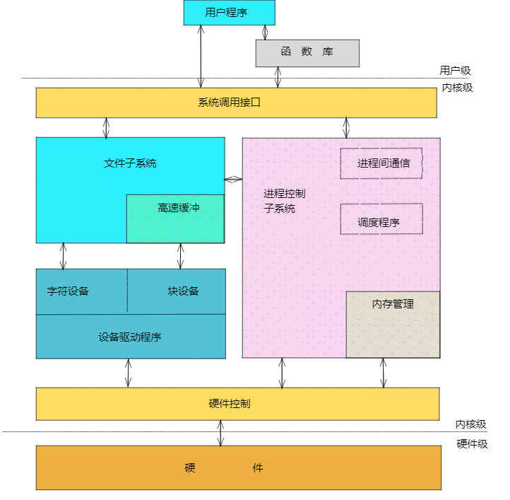

# linux驱动学习：驱动代码结构

## 0x01.前言

对刚开始接触Linux驱动代码的新人来说，最困难的是面对着一个项目无从下手。对于传统的单片机来说，许多操作需要做的只是向对应的寄存器中写入所需的数值。然而同样的代码到了linux驱动中，就需要许多的回调函数，指针和结构体。而且伴随着驱动操作的逐渐复杂化，面对着一个驱动中的诸多文件更是不知所云。所以对于初学者来说最重要的就是要了解：linux驱动代码究竟做了什么，linux驱动代码结构究竟是什么？

借用找教程时候看到的一段话：

> 说易行难，很多新人、甚至工作1-2年的开发者刚接触Linux内核时，别说写了，看内核代码可能都是一脸懵逼：明明是C语言，但是就是看不懂是什么意思，除了根据函数名、函数参数、函数的返回值以及注释，了解整个函数的基本功能外，一旦分析其细节，你会发现，寸步难行，每一行代码似乎都深不可测，仿佛蕴含着极大的能量

从我开始学习linux驱动的时候，这些问题就一直环绕着我。但是却没有在网上找到一篇全面的扫盲文章。现在我希望以初学者的身份来完善出一篇专门针对于入门小白的文章。希望这篇文章能帮助到需要入门linux驱动的人。

第二章简要介绍了一点基础性的知识，需要直接看内核代码结构的可以直接前往第三章观看。

## 0x02.基础知识

### 0x21 设备驱动类型

学习Linux驱动，首先不得不提的就是linux系统本身。

Linux遵循着一切皆文件的守则，把所有的外部设备都看作是文件，可以使用与调用文件系统相同的方法来读写外部设备。但外部设备的种类千奇百怪，怎么才能让用户无差别使用这些设备呢？这就是驱动存在的意义：通过内部定义好的编程接口，对用户隐藏了设备的工作细节，从而可以使用户通过一套标准化调用来使用设备。

对于多种多样的设备类型，Linux做了一件艰难而又伟大的事情，把他们的驱动归结为三大类：字符设备驱动，块设备驱动以及网络设备驱动。

**字符设备**：需要字节顺序读写的设备。不能随机读写。字符设备是面向流的设备。常见的如鼠标，键盘，led等。

**块设备驱动**：可以从设备的任意位置读取一定长度的数据设备，比如硬盘，SD卡等设备均是块设备。

**网络设备**：网络设备不会在`/dev`中列出，不是针对文件的操作，而是使用专门的网络接口实现。应用设备不能直接访问网络驱动程序。

三种设备在Linux中的位置可以用一张图片来描述。如图所示：



###  0x22 Linux驱动编译和加载

linux设备驱动属于内核的一部分，所以编译加载的时候都需要内核的帮助。Linux内核的一个模块可以通过两种方式被编译和加载。

+ 直接编译进内核，同Linux启动的同时进行加载
+ 单独编译成模块，需要的时候动态加载到内核中，不需要的时候进行卸载

对于正常的C程序来说，需要有一个main函数来提供程序的入口。所以说很多初学者在看内核源码的时候最迷茫的就是寻找不到函数入口。

这是因为对于驱动程序来说，程序不是一直运行的。驱动程序运行在内核中的内核态。会在初始化完成之后不再运行，等待系统调用的时候再执行相应操作。也正是因为驱动程序属于内核的一部分。所以驱动程序不能用标准的C库，而要使用linux内核库进行开发。这也是开发C程序的人开始看内核代码时迷茫的原因之一。

驱动编译和加载的具体步骤在这里不作为详述内容。后续我会再写一篇文章来讲述这个具体步骤。（挖坑）

## 0x03 驱动代码的结构

### 0x31 驱动的加载和卸载（入口函数）

有了上面的这些信息，我们就可以来简单的了解以下Linux驱动的结构了。由于我个人最近在看NV的开源项目，所以直接用这个项目作为例子进行描述。

驱动最重要的就是要进行注册操作。注册操作使用的是`__init`宏，比如英伟达开放的某个仓库中的`nvfs-core.c`文件中的初始化函数就为

```c
/*
 * Initialize nvfs driver
 */
static int __init nvfs_init(void)
```

在初始化中最重要的是注册，注册中重要的是调用内核中的函数`register_chrdev()`函数

```c
	pr_info("nvidia_fs: Initializing nvfs driver module\n");

	major_number = register_chrdev(0, DEVICE_NAME, &nvfs_dev_fops);

	if (major_number < 0) {
		pr_err("nvidia_fs: failed to register a major number\n");
		return major_number;
	}
```

以上面代码为例，注册函数注册了驱动的名称`DEVICE_NAME`，以及驱动的操作跳转表`nvfs_dev_fops`，操作跳转表是整个驱动的灵魂。我会在后续说明。

调用注册函数之后，还会再调用一些初始化函数，这个地方不同的驱动需要初始化的数据不尽相同，需要用户自行定义。

在NVIDIA的这个驱动中，由于需要注册多个设备，驱动中还调用了两个内核函数：

```c
nvfs_class = class_create(THIS_MODULE, CLASS_NAME);
nvfs_device[i] = device_create(nvfs_class, NULL, MKDEV(major_number, i), NULL, DEVICE_NAME"%d", i);
```

他们的原型分别是：

```c
linux-2.6.22/include/linux/device.h
struct class *class_create(struct module *owner, const char *name)
    class_create - create a struct class structure
    @owner: pointer to the module that is to "own" this struct class
    @name: pointer to a string for the name of this class.
        
linux-2.6.22/include/linux/device.h
struct device *device_create(struct class *cls, 
                             struct device *parent, 
                             dev_t devt, 
                             void *drvdata, 
                             const char *fmt, ...);

    class_device_create - creates a class device and registers it with sysfs
    @cls: pointer to the struct class that this device should be registered to.
    @parent: pointer to the parent struct class_device of this new device, if any.
    @devt: the dev_t for the char device to be added.
    @device: a pointer to a struct device that is assiociated with this class device.
    @fmt: string for the class device's name
```

通过两个函数原型以及描述可以看出，`class_create`的目的是创建一个驱动类，然后通过`device_create`函数为类创建一个或多个设备。

总结下来来看，入口`__init`函数的流程就清晰了很多。最后把整个函数放上来，帮助把流程捋顺。

```c
/*
 * Initialize nvfs driver
 */
static int __init nvfs_init(void)
{
	int i;

	pr_info("nvidia_fs: Initializing nvfs driver module\n");

	major_number = register_chrdev(0, DEVICE_NAME, &nvfs_dev_fops);

	if (major_number < 0) {
		pr_err("nvidia_fs: failed to register a major number\n");
		return major_number;
	}

	pr_info("nvidia_fs: registered correctly with major number %d\n",
			major_number);

	nvfs_class = class_create(THIS_MODULE, CLASS_NAME);

	if (IS_ERR(nvfs_class)) {
		unregister_chrdev(major_number, DEVICE_NAME);
		pr_err("nvidia_fs: Failed to register device class\n");
		return PTR_ERR(nvfs_class);
	}

	nvfs_class->devnode = nvfs_devnode;

	nvfs_set_device_count(nvfs_max_devices);

	nvfs_curr_devices = nvfs_get_device_count();

	for (i = 0; i < nvfs_curr_devices; i++) {
		nvfs_device[i] = device_create(nvfs_class, NULL,
				MKDEV(major_number, i),
				NULL, DEVICE_NAME"%d", i);
		if (IS_ERR(nvfs_device[i])) {
			class_destroy(nvfs_class);
			unregister_chrdev(major_number, DEVICE_NAME);
			pr_err("nvidia_fs: Failed to create the device\n");
			i -= 1;
			// Cleanup all the previous devices
			goto error;
		}
	}

        // initialize meta group data structures
        nvfs_mgroup_init();
	atomic_set(&nvfs_shutdown, 0);
	init_waitqueue_head(&wq);
	nvfs_proc_init();
#ifdef CONFIG_FAULT_INJECTION
	nvfs_init_debugfs();
#endif
	nvfs_stat_init();
#ifdef TEST_DISCONTIG_ADDR
	nvfs_init_simulated_address();
#endif
	nvfs_fill_gpu2peer_distance_table_once();

	return 0;

error:
	while (i >= 0) {
		device_destroy(nvfs_class, MKDEV(major_number,i));
		i -= 1;
	}

	return -1;
}
```

对驱动的入口函数有一个简要的了解之后，最好奇的应该是出口函数的书写方式。一般来说，出口函数和入口函数都会放在同一个文件的上下函数。现在就来看一下。

与入口函数相同，驱动的出口函数也会有宏标识`__exit`，并且执行了与注册函数几乎完全相反的操作。

正常来说除了用户自定义的注销函数之外，还需要调用`unregister_chrdev`函数进行注销，流程就结束了。

但是对于NV的这个驱动来说，由于他在注册的时候注册了多个设备，所以在注销的时候需要多两个步骤。也就是设备的注销以及类的注销。

由于注销函数很短，所以不做过多讲述。直接把整个函数贴过来留作查看。

```c
static void __exit nvfs_exit(void)
{
	int i;

	atomic_set(&nvfs_shutdown, 1);
	do {
		wait_event_interruptible_timeout(wq,
			(nvfs_count_ops() == 0),
			msecs_to_jiffies(NVFS_HOLD_TIME));
			nvfs_dbg("count_ops :%lu\n", nvfs_count_ops());
	} while (nvfs_count_ops());
	nvfs_proc_cleanup();
#ifdef CONFIG_FAULT_INJECTION
	nvfs_free_debugfs();
#endif
	nvfs_stat_destroy();

	for (i = 0; i < nvfs_curr_devices; i++) {
		device_destroy(nvfs_class, MKDEV(major_number, i));
	}
	class_destroy(nvfs_class);
	unregister_chrdev(major_number, DEVICE_NAME);
	pr_info("nvidia_fs: driver unloaded successfully\n");
}
```

最后，声明两个函数后还需要调用一下，调用函数通常在文件的结尾处。

```c
module_init(nvfs_init);
module_exit(nvfs_exit);
```

这样程序的出入口环节就彻底结束了。

### 0x32 驱动中的重要内核数据

大部分的基础性的驱动操作包括3个重要的内核数据结构，称为file_operations，file，和inode。

#### file_operation

在上一节的入口函数中，我们曾经提及过操作跳转表这个概念。当时是在驱动注册时调用的。现在就是揭开这部分神秘面纱的时候了。

操作跳转表这个概念其实是我个人的翻译，实际上来说这个是一个叫做`file_operation`的结构体。这个结构体是将系统调用以及驱动程序关联起来的重要数据结构。操作表中的每个成员都对应着一个函数的指针。而名称则对应着一个系统调用。（对于不支持的操作留作null.）通过这种绑定方式，当系统调用发生时，系统读取跳转表中与调用相应的函数的指针，然后将控制权转交给函数。这样就完成了Linux设备的驱动工作。NV的代码中结构体初始化如下：

```c
struct file_operations nvfs_dev_fops = {
	.compat_ioctl = nvfs_ioctl,
	.unlocked_ioctl = nvfs_ioctl,
	.open = nvfs_open,
	.release = nvfs_close,
        .mmap = nvfs_mgroup_mmap,
        .owner = THIS_MODULE,
};
```

#### file

- file 结构代表一个打开的文件，它的特点是一个文件可以对应多个file结构。它由内核再open时创建，并传递给在该文件上操作的所有函数，直到最后close函数，在文件的所有实例都被关闭之后，内核才释放这个数据结构。
- 在内核源代码中，指向 struct file 的指针通常比称为filp，file结构有以下几个重要的成员：

```c
1 struct file{
 2 
 3 mode_t fmode; /*文件模式，如FMODE_READ，FMODE_WRITE*/
 4 
 5 ......
 6 
 7 loff_t f_pos; /*loff_t 是一个64位的数，需要时，须强制转换为32位*/
 8 
 9 unsigned int f_flags; /*文件标志，如：O_NONBLOCK*/
10 
11 struct file_operations *f_op;
12 
13 void *private_data; /*非常重要，用于存放转换后的设备描述结构指针*/
14 
15 .......
16 
17 };
```

#### inode 

- 内核用inode 结构在内部表示文件，它是实实在在的表示物理硬件上的某一个文件，且一个文件仅有一个inode与之对应，同样它有二个比较重要的成员：

```c
1 struct inode{
 2 
 3 dev_t i_rdev; /*设备编号*/
 4 
 5 struct cdev *i_cdev; /*cdev 是表示字符设备的内核的内部结构*/
 6 
 7 };
 8 
 9 可以从inode中获取主次设备号，使用下面二个宏：
10 
11 /*驱动工程师一般不关心这两个宏*/
12 
13 unsigned int imajor(struct inode *inode);
14 
15 unsigned int iminor(struct inode *inode);
```

### 0x33 驱动中的模块参数组

我们可以利用module_param(参数名、参数类型、参数读写属性) 为模块定义一个参数，例如：

```c
static char *string_test = “this is a test”;
static num_test = 1000;
module_param (num_test,int,S_IRUGO);
module_param (steing_test,charp,S_ITUGO);
```

在装载模块时，用户可以给模块传递参数，形式为：`insmod 模块名 参数名=参数值`，如果不传递，则参数使用默认的参数值

参数的类型可以是：byte,short,ushort,int,uint,long,ulong,charp,bool；

权限：定义在`linux/stat.h`中，控制存取权限，`S_IRUGO`表示所有用户只读；

模块被加载后，在`sys/module/`下会出现以此模块命名的目录，当读写权限为零时：表示此参数不存在sysfs文件系统下的文件节点，当读写权限不为零时：此模块的目录下会存在`parameters`目录，包含一系列以参数名命名的文件节点，这些文件节点的权限值就是传入`module_param()`的参数读/写权限，而该文件的内容为参数的值。

除此之外，模块也可以拥有参数数组，形式为：`module_param_array(数组名、数组类型、数组长、参数读写权限等)`，当不需要保存实际的输入的数组元素的个数时，可以设置“数组长“为0。

运行insmod时，使用逗号分隔输入的数组元素。

```c
MODULE_VERSION(TO_STR(MOD_VERS(NVFS_DRIVER_MAJOR_VERSION, NVFS_DRIVER_MINOR_VERSION, NVFS_DRIVER_PATCH_VERSION)));
MODULE_LICENSE("GPL v2");
MODULE_DESCRIPTION("NVIDIA GPUDirect Storage");
module_param_named(max_devices, nvfs_max_devices, uint, S_IWUSR | S_IRUGO);
MODULE_PARM_DESC(nvfs_max_devices, "number of character devices to expose");
module_param_named(dbg_enabled, nvfs_dbg_enabled, uint, S_IWUSR | S_IRUGO);
MODULE_PARM_DESC(nvfs_dbg_enabled, "enable debug tracing");
module_param_named(info_enabled, nvfs_info_enabled, uint, S_IWUSR | S_IRUGO);
MODULE_PARM_DESC(nvfs_info_enabled, "enable info tracing");
module_param_named(peer_stats_enabled, nvfs_peer_stats_enabled, uint, S_IWUSR | S_IRUGO);
MODULE_PARM_DESC(nvfs_peer_stats_enabled, "enable peer stats");
module_param_named(rw_stats_enabled, nvfs_rw_stats_enabled, uint, S_IWUSR | S_IRUGO);
MODULE_PARM_DESC(nvfs_rw_stats_enabled, "enable read-write stats");
```

