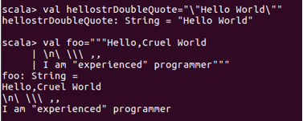
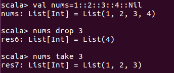
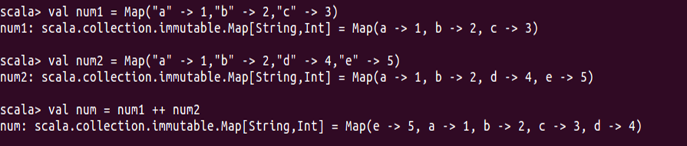

## Scala编程方法简化版

### 1.变量常量

字符数字标识符：字母或者下划线开头，`$`被认作字母

<!-- more -->

###### 运算符优先级：

先乘除后加减

先算数，后移位，最后位运算

指针最优，单目优于双目


var 声明变量，val声明常量

```scala
val hellostr="Hello World"
//hellostr:string = Hello World
//定义后不能修改

var hellostr1="Hello World"
//hellostr1:string = Hello World
```

在声明变量和常量不一定需要指定数据类型，没有指明时通过初始值推断。**变量常量必须付初始值，否则会报错**

可以用val声明一个元组

```scala
val mr=("key",22)
//mr:(string,int)=(key,22)
```

Scala与Java有相同的变量类型，但是首字母必须大写，因为是对象，例如Int,String,Boolean

可以直接用`0x`表示16进制，`0`表示8进制，表示`Long`用`L`或者`l`作为后缀，表示`float`用`F/f`否则默认为double

```scala
val x=41
val x=0x29
val x=051
//x:Int=41
val x = 0777l
//x:Long=511
val f = 3.14f
//f:Float=3.14
val f=3.14//0.314e1
//f:Double=3.14
```

单字符用‘ ’引用，特殊字符要添加转义字符\，双引号同理

Scala还提供一种原样字符内容输出方法，用`“""`的方式来表述



### 2.流程控制与函数

#### if语句

if语句与C++相似，有if,if...else...,if...elseif...else

但if可以作为表达式使用：且可以直接赋值

```scala
val x=if("hello"=="hell") 1 else 0
//x:Int=0
```

#### 循环语句

##### while

Scala中while与C++同，唯一不一样的是有返回值且恒为Unit(相当于void，`Unit=()`)

##### for

for循环Scala有自己的风格，基础格式为

```scala
for(i<-表达式){
	//循环语句
}
```

1.其中`<-`称为生成器（generator），而for循环实际上是通过集合遍历来实现循环的

 2.表达式调用`RichInt`中的`to，until`方法来实现遍历，例如：

```scala
for(i <- 1 to 5) println("i="+i)
//i=1
//i=2
//i=3
//i=4
//i=5
```

3.如果希望集合右开，[1,5)则用`1 until 5`

```scala
for(i <- 1 until (10,2)) print("i="+i)
//这里的2是步长
```

4.引入break：Scala没有break,continue，但实现类似操作有两种方法

```scala
//引入scala.util.control.Breaks类
//有条件过滤的for循环格式为
for(i <- 1 to 40 if(i%4==0);if(i%5==0)){//这里中间是&&关系
	println("i="+i)
}
//i=20
//i=40
```

5.多重for循环：Scala支持for循环嵌套

6.for表达式：与yield配合使用执行完后有返回值：

```scala
x =for(i <- 1 to 5) yield i/2
//x:scala.collection.immutable.IndexedSeq[Int]=vector(0,1,1,2,2)
```

##### 函数声明，定义和调用

###### 包：

```scala
//定义包
//第一种方式
package com.baidu
//第二种方式
package com.dubai1{...}

//引用包
import java.awt.Color
import java.awt_//引入包内所有成员
```


```scala
//声明
def fun({参数列表}):[return type]
//定义
def fun({参数列表}):[return type]={
    function body
    return [expr]
}
//调用的格式
fun(参数列表)
//如果函数使用了实例的对象来调用，可以使用类似java的格式 (使用 . 号)：
[instance.]fun(参数列表)
```

### 类和对象

Scala用New来创建对象

类的第一个字母大写，方法的第一个字母小写

```scala
import java.io._
class Point(val xc: Int, val yc: Int) {
   var x: Int = xc
   var y: Int = yc

   def move(dx: Int, dy: Int) {
      x = x + dx
      y = y + dy
      println ("Point x location : " + x);
      println ("Point y location : " + y);
   }
}
object Demo {
   def main(args: Array[String]) {
      val pt = new Point(10, 20);

      // Move to a new location
      pt.move(10, 10);
   }
}
//Point x location:20
//Point y location:30
```

类继承：extend  隐形类：impact  

### 集合：数组、列表与映射

#### 数组

```scala
//声明
var z:Array[String] = new Array[String](3)
var z = Array("Hello"，"Cruel"，"World")
//赋值
z(0)="Hello";z(1)="Cruel";z(4/2)="World"
//多维数组
var myMatrix = ofDim[Int](3,3)
//简单数组操作：
//合并：
def concat[T]( xss: Array[T]* ): Array[T]
//复制：
def copy( src: AnyRef, srcPos: Int, dest: AnyRef, destPos: Int, length: Int ): Unit
//mkString方法：
mkString（“<”,”,”,”>”）
//得用<>所扩，”，”分隔的字符串

```

#### 列表

```scala
// 字符串列表
val site: List[String] = List("Runoob", "Google", "Baidu")
// 整型列表
val nums: List[Int] = List(1, 2, 3, 4)
// 二维列表
val dim: List[List[Int]] =
	List(
		List(1, 0, 0),
		List(0, 1, 0),
		List(0, 0, 1)
	)
//遍历
for(i<-List)
//创建列表
val nums =1::2::3::4::Nil
//nums:List[Int]=List(1,2,3,4)
//获取第一个第二个，最后一个元素
List.head List.tail List.last
//连接操作
List1:::List2
//获取和丢弃
```



#### Map

•Scala中的映射是键/值对的集合。任何值可以根据它的键进行检索。键是在映射唯一的，但值不一定是唯一的。

•映射也被称为哈希表。有两种类型的映射，不可变以及可变的。可变和不可变的对象之间的区别在于，当一个对象是不可变的，对象本身不能被改变。

•默认情况下，Scala中使用不可变的映射。如果想使用可变集，必须明确地导入scala.collection.mutable.Map类。但是可以通过生成新的映射来对原来的值进行改变。

```scala
val colors = Map("red" -> "#FF0000", "azure" -> "#F0FFFF")
//colors:scala.collection.immutable.Map[String,String]=Map(red->#FF0000,azure->#F0FFFF)
```

基本操作：

| 方法    | 描述                     |
| ------- | ------------------------ |
| keys    | 返回 Map 所有的键(key)   |
| values  | 返回 Map 所有的值(value) |
| isEmpty | 在 Map 为空时返回true    |

使用++运算符或Map.++()来连接两个map ,Map合并时会移除重复的Key

