## SPARK

### 1.为什么要用Spark

<!-- more -->

1. speed ：比Hadoop快100倍，比disk快十倍
2. Ease of use：比java,Scala,Python,R写程序块
3. Generality
4. Runs Everywhere:可跑在Hadoop，standalone等，可以接受包括HDFS，Cassandra,HBase等数据来源

### 2.与Hadoop差异

1. Spark把中间数据放在内存中，迭代运算效率高，MapReduce中计算结果需要存在磁盘上，影响整体速度。Spark支持DAG图分布式并行计算的编程框架，减少迭代过程数据落地
2. Spark容错性高：引进弹性分布式数据集RDD的抽象。它是分布在一组节点中的只读对象集合，这些集合是弹性的，如果数据集一部分丢失，则可以根据“血统”（即充许基于数据衍生过程）对它们进行重建。
3. Spark更加通用。不像Hadoop只提供了Map和Redu ce两种操作，Spark提供的数据集操作类型有很多种，大致分为：Transformations和Actions两大类。Transformations包括Map、Filter、FlatMap、Sample、GroupByKey、ReduceByKey、Union、Join、Cogroup、MapValues、Sort和PartionBy等多种操作类型，同时还提供Count, Actions包括Collect、Reduce、Lookup和Save等操作。另外各个处理节点之间的通信模型不再像Hadoop只有Shuffle一种模式，用户可以命名、物化，控制中间结果的存储、分区等。

### 3.Spark体系结构与运行模式

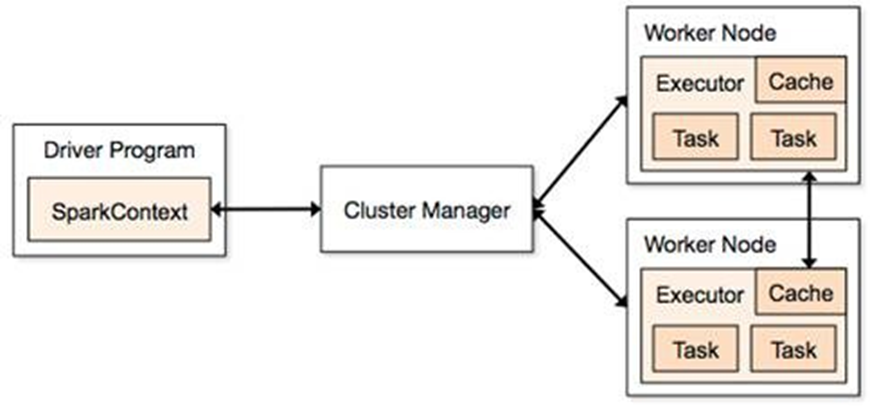


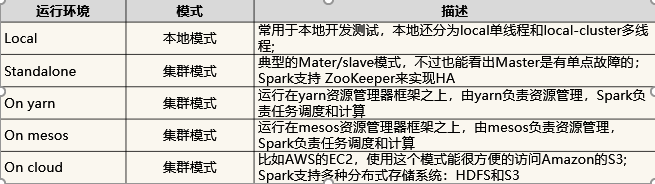

### 4.RDD

#### 定义

RDD是spark最基本的抽象，是对分布式内存的抽象使用。实现了以操作本地集合的方式来操作分布式数据集的抽象实现。RDD表示了已被分区，不可变的能够并行操作的数据集合，不同数据格式对应不同的RDD实现。RDD必须可序列化，可以cache到内存中，每次RDD的结果都放在内存中，下次可以直接从内存中输入，省去MapReduce的大量磁盘IO操作。对于迭代常见的机器学习和交互式数据挖掘效率提升很大。

#### 特点

+ 来源：从持久存储获取或者从其他RDD生成
+ 只读：状态不可变，不能修改
+ 分区：支持元素根据key分区，保存到多个节点上
+ 路径：RDD中叫世族或者血统，即RDD有充足的信息关于如何从其他RDD产生
+ 持久化：控制存储级别来进行持久化
+ 操作：丰富的动作：Count,Reduce,Collect,Save等

#### 创建

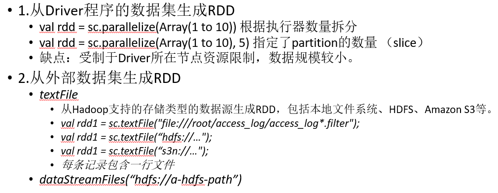

#### 例子：控制台日志挖掘

假设网站中的一个 WebService 出现错误，我们想要从数以 TB 的 HDFS 日志文件中找到问题的原因，此时我们就可以用 Spark 加载日志文件到一组结点组成集群的 RAM 中，并交互式地进行查询。

```scala
lines = spark.textFile("hdfs://...")
```

这行从HDFS文件中创建出一个RDD

```scala
errors = line.fliter(_.startWith("Error"))
```

这行衍生出一个经过某种条件过滤的RDD（挑选出头为`Error`的值）

```scala
errors.persisit()
```

这行将上一行出来的RDD errors缓存到内存中，但不会将第一个lines放到缓存中，因为文件可能比较大，缓存放不下，但是Error的集合比较小，缓存足以装进全部内存

```scala
//Count errors mentioning MySQL
errors.filter(._contains("MySQL")).count
```

这行统计errors中包含MySQL 字样的总行数

```scala
//Return time fields of errors mentioning
//HDFS as an array (assuming time is field number 3 in a tab-separated format):
errors.filter(._contains("HDFS"))
	.map(._split('\t')(3))
	.collect()
```

取出包含HDFS字样的行的第三列时间，并保存成一个集合

#### RDD操作

RDD是Spark的核心抽象，所有计算都是围绕这RDD进行的

+ 转换：一个RDD经过计算后生成新的RDD，比如wordcount中的flatmap,map和ReduceByKey
+ 动作：返回结果到Driver程序中，意味着RDD的计算结果，比如wordcount的collect操作

转换是lazy模式，要等到有action操作时运行启动计算过程计算

action会返回结果或把RDD写到存储系统中，是触发Spark运算的动因

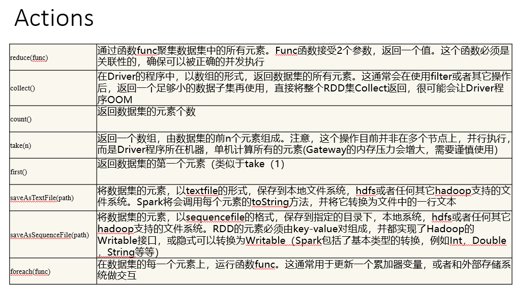

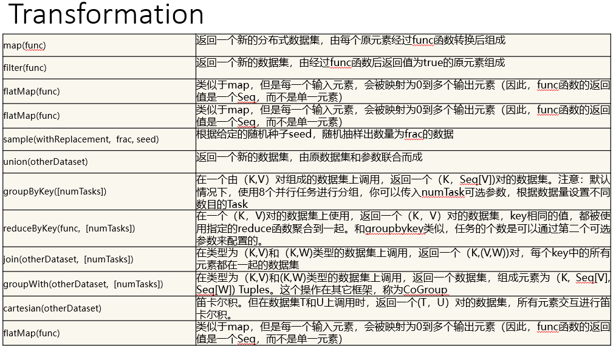

#### 传递函数参数

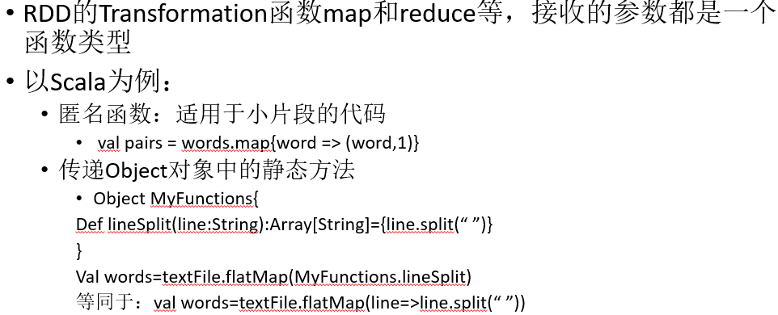

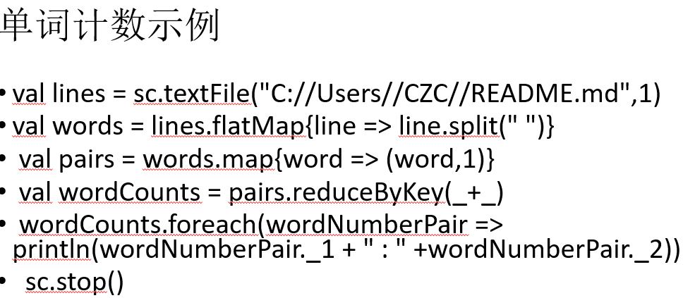

```scala
import org.apache.spark.{SparkConf, SparkContext}
object WordCount {
 def main(args: Array[String]): Unit = {
  val conf = new SparkConf().setMaster("local").setAppName("WordCount")
  val sc = new SparkContext(conf)
  //设置数据路径
  val text = sc.textFile("./GoneWithTheWind")
  //将文本数据按行处理，每行按空格拆成一个数组
  // flatMap会将各个数组中元素合成一个大的集合
  val textSplit = text.flatMap(line =>line.split(" "))
  //处理合并后的集合中的元素，每个元素的值为1，返回一个元组（key,value）
  //其中key为单词，value这里是1，即该单词出现一次
  val textSplitFlag = textSplit.map(word => (word,1))
  //reduceByKey会将textSplitFlag中的key相同的放在一起处理
  //传入的（x,y）中，x是上一次统计后的value，y是本次单词中的value，即每一次是x+1
  val countWord = textSplitFlag.reduceByKey((x,y)=>x+y)
  //将计算后的结果存在项目目录下的result目录中
  countWord.saveAsTextFile("./result")
 }
}
```


#### 宽依赖和窄依赖

+ 窄依赖
  + 子RDD的每个分区依赖于常数个父分区（即与数据规模无关）
  + 输入输出一对一的算子，且结果RDD的分区结构不变，主要是map,flatmap
  + 输入输出一对一，但结果RDD的分区结构发生变化，如union,coalesce
  + 从输入中选择部分元素的算子，如flater,distinct,subract,sample

+ 宽依赖
  + 子RDD的每个分区依赖于所有父分区
  + 对单个RDD基于Key进行重组和reduce，如groupByKey,reduceByKey
  + 对两个RDD基于Key进行join和重组，如join

### 5.Shuffle

**当一个RDD的一个分区依赖前一个RDD的所有分区**时，例如，对于单词Spark出现次数汇总时，该单词可能出现在所有分区中，需要将所有分区中Spark出现的键值汇总到某一数据节点进行汇总，这个过程叫做shuffle

### 6.Spark内存管理

Spark 对堆内内存的管理是一种逻辑上的"规划式"的管理，因为对象实例占用内存的申请和释放都由 JVM 完成，Spark 只能在申请后和释放前**记录**这些内存，我们来看其具体流程：

**申请内存**：

Spark 在代码中 new 一个对象实例

JVM 从堆内内存分配空间，创建对象并返回对象引用

Spark 保存该对象的引用，记录该对象占用的内存

**释放内存**：

Spark 记录该对象释放的内存，删除该对象的引用

等待 JVM 的垃圾回收机制释放该对象占用的堆内内存

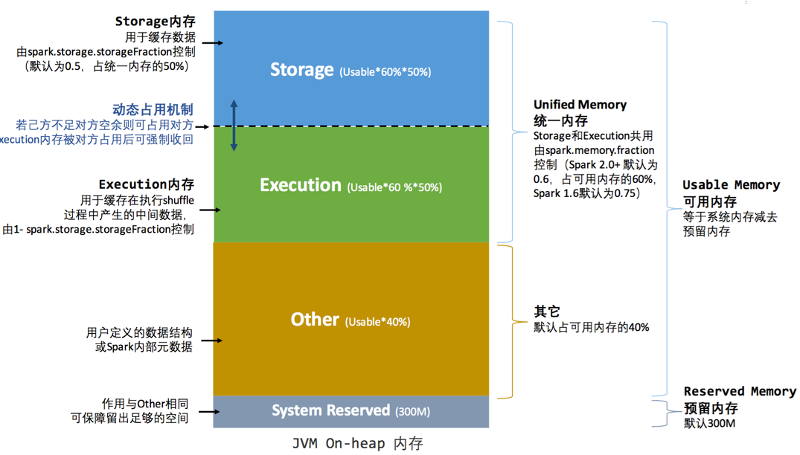

为了进一步优化内存的使用以及提高 Shuffle 时排序的效率，Spark 引入了堆外（Off-heap）内存，使之可以直接在工作节点的系统内存中开辟空间，存储经过序列化的二进制数据。利用 JDK Unsafe API（从 Spark 2.0 开始，在管理堆外的存储内存时不再基于 Tachyon，而是与堆外的执行内存一样，基于 JDK Unsafe API 实现[3]），Spark 可以直接操作系统堆外内存，减少了不必要的内存开销，以及频繁的 GC 扫描和回收，提升了处理性能。堆外内存可以被精确地申请和释放，而且序列化的数据占用的空间可以被精确计算，所以相比堆内内存来说降低了管理的难度，也降低了误差。

在默认情况下堆外内存并不启用，可通过配置 spark.memory.offHeap.enabled 参数启用，并由 spark.memory.offHeap.size 参数设定堆外空间的大小。除了没有 other 空间，堆外内存与堆内内存的划分方式相同，所有运行中的并发任务共享存储内存和执行内存。

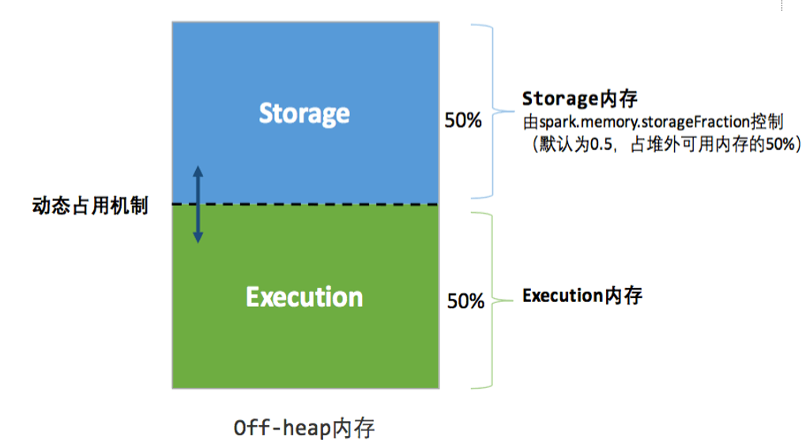

#### 动态内存管理

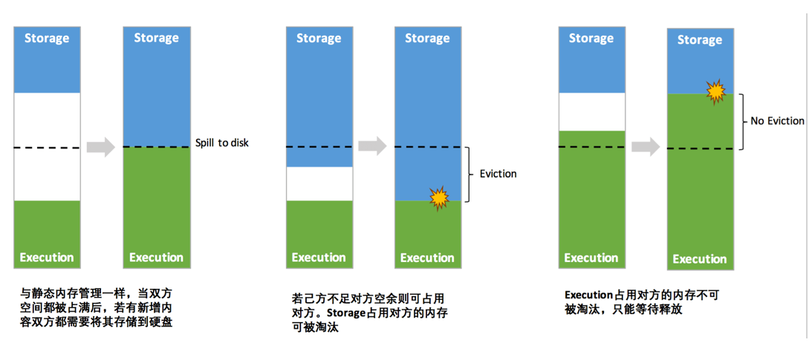

#### 存储内存管理

##### RDD的持久化机制：

弹性分布式数据集（RDD）作为 Spark 最根本的数据抽象，是只读的分区记录（Partition）的集合，只能基于在稳定物理存储中的数据集上创建，或者在其他已有的 RDD 上执行转换（Transformation）操作产生一个新的 RDD。转换后的 RDD 与原始的 RDD 之间产生的依赖关系，构成了血统（Lineage）。凭借血统，Spark 保证了每一个 RDD 都可以被重新恢复。但 RDD 的所有转换都是惰性的，即只有当一个返回结果给 Driver 的行动（Action）发生时，Spark 才会创建任务读取 RDD，然后真正触发转换的执行。
 Task 在启动之初读取一个分区时，会先判断这个分区是否已经被持久化，如果没有则需要检查 Checkpoint 或按照血统重新计算。所以如果一个 RDD 上要执行多次行动，可以在第一次行动中使用 persist 或 cache 方法，在内存或磁盘中持久化或缓存这个 RDD，从而在后面的行动时提升计算速度。事实上，cache 方法是使用默认的 MEMORY_ONLY 的存储级别将 RDD 持久化到内存，故缓存是一种特殊的持久化。 **堆内和堆外存储内存的设计，便可以对缓存** **RDD** **时使用的内存做统一的规划和管 理** （存储内存的其他应用场景，如缓存 broadcast 数据，暂时不在本文的讨论范围之内）。

RDD 的持久化由 Spark 的 Storage 模块 [7] 负责，实现了 RDD 与物理存储的解耦合。Storage 模块负责管理 Spark 在计算过程中产生的数据，将那些在内存或磁盘、在本地或远程存取数据的功能封装了起来。在具体实现时 Driver 端和 Executor 端的 Storage 模块构成了主从式的架构，即 Driver 端的 BlockManager 为 Master，Executor 端的 BlockManager 为 Slave。Storage 模块在逻辑上以 Block 为基本存储单位，RDD 的每个 Partition 经过处理后唯一对应一个 Block（BlockId 的格式为 rdd_RDD-ID_PARTITION-ID ）。Master 负责整个 Spark 应用程序的 Block 的元数据信息的管理和维护，而 Slave 需要将 Block 的更新等状态上报到 Master，同时接收 Master 的命令，例如新增或删除一个 RDD。

#### RDD缓存过程

在缓存到存储内存之前，partition中数据用Iterator访问。可以获取分区中每一条序列化或者非序列化的数据项，他们逻辑上占用JVM堆内的other部分空间，同一partition的不同Record空间并不连续

RDD 在缓存到存储内存之后，Partition 被转换成 Block，所有Record 在堆内或堆外存储内存中占用一块连续的空间。将Partition由不连续的存储空间转换为连续存储空间的过程，Spark称之为"展开"（Unroll）

因为不能保证存储空间可以一次容纳 Iterator 中的所有数据，当前的计算任务在 Unroll 时要向 MemoryManager 申请足够的 Unroll 空间来临时占位，空间不足则 Unroll 失败，空间足够时可以继续进行。对于序列化的 Partition，其所需的 Unroll 空间可以直接累加计算，一次申请。而非序列化的 Partition 则要在遍历 Record 的过程中依次申请，即每读取一条 Record，采样估算其所需的 Unroll 空间并进行申请，空间不足时可以中断，释放已占用的 Unroll 空间。如果最终 Unroll 成功，当前 Partition 所占用的 Unroll 空间被转换为正常的缓存 RDD 的存储空间

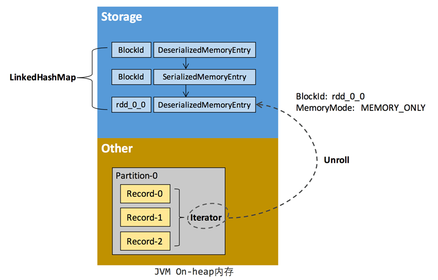

#### 淘汰和落盘

存储内存的淘汰规则为：

被淘汰的旧 Block 要与新 Block 的 MemoryMode 相同，即同属于堆外或堆内内存

新旧 Block 不能属于同一个 RDD，避免循环淘汰

旧 Block 所属 RDD 不能处于被读状态，避免引发一致性问题

遍历 LinkedHashMap 中 Block，按照最近最少使用（LRU）的顺序淘汰，直到满足新 Block 所需的空间。其中 LRU 是 LinkedHashMap 的特性。

落盘的流程则比较简单，如果其存储级别符合_useDisk 为 true 的条件，再根据其_deserialized 判断是否是非序列化的形式，若是则对其进行序列化，最后将数据存储到磁盘，在 Storage 模块中更新其信息。

+ 由于同一个 Executor 的所有的计算任务共享有限的存储内存空间，当有新的 Block 需要缓存但是剩余空间不足且无法动态占用时，就要对 LinkedHashMap 中的旧 Block 进行淘汰（Eviction），而被淘汰的 Block 如果其存储级别中同时包含存储到磁盘的要求，则要对其进行落盘（Drop），否则直接删除该 Block。

#### 执行内存管理

Executor 内运行的任务同样共享执行内存，Spark 用一个 HashMap 结构保存了任务到内存耗费的映射。每个任务可占用的执行内存大小的范围为 1/2N ~ 1/N，其中 N 为当前 Executor 内正在运行的任务的个数。每个任务在启动之时，要向 MemoryManager 请求申请最少为 1/2N 的执行内存，如果不能被满足要求则该任务被阻塞，直到有其他任务释放了足够的执行内存，该任务才可以被唤醒

#### shuffle内存占用

·在 ExternalSorter 和 Aggregator 中，Spark 会使用一种叫 AppendOnlyMap 的哈希表在堆内执行内存中存储数据，但在 Shuffle 过程中所有数据并不能都保存到该哈希表中，当这个哈希表占用的内存会进行周期性地采样估算，当其大到一定程度，无法再从 MemoryManager 申请到新的执行内存时，Spark 就会将其全部内容存储到磁盘文件中，这个过程被称为溢存(Spill)，溢存到磁盘的文件最后会被归并(Merge)。

Shuffle Write 阶段中用到的 Tungsten 是 Databricks 公司提出的对 Spark 优化内存和 CPU 使用的计划[9]，解决了一些 JVM 在性能上的限制和弊端。Spark 会根据 Shuffle 的情况来自动选择是否采用 Tungsten 排序。Tungsten 采用的页式内存管理机制建立在 MemoryManager 之上，即 Tungsten 对执行内存的使用进行了一步的抽象，这样在 Shuffle 过程中无需关心数据具体存储在堆内还是堆外。每个内存页用一个 MemoryBlock 来定义，并用 Object obj 和 long offset 这两个变量统一标识一个内存页在系统内存中的地址。堆内的 MemoryBlock 是以 long 型数组的形式分配的内存，其 obj 的值为是这个数组的对象引用，offset 是 long 型数组的在 JVM 中的初始偏移地址，两者配合使用可以定位这个数组在堆内的绝对地址；堆外的 MemoryBlock 是直接申请到的内存块，其 obj 为 null，offset 是这个内存块在系统内存中的 64 位绝对地址。Spark 用 MemoryBlock 巧妙地将堆内和堆外内存页统一抽象封装，并用页表(pageTable)管理每个 Task 申请到的内存页。

•执行内存主要用来存储任务在执行 Shuffle 时占用的内存，Shuffle 是按照一定规则对 RDD 数据重新分区的过程，我们来看 Shuffle 的 Write 和 Read 两阶段对执行内存的使用

•Shuffle Write：若在 map 端选择普通的排序方式，会采用 ExternalSorter 进行外排，在内存中存储数据时主要占用堆内执行空间。若在 map 端选择 Tungsten 的排序方式，则采用 ShuffleExternalSorter 直接对以序列化形式存储的数据排序，在内存中存储数据时可以占用堆外或堆内执行空间，取决于用户是否开启了堆外内存以及堆外执行内存是否足够。

•Shuffle Read：在对 reduce 端的数据进行聚合时，要将数据交给 Aggregator 处理，在内存中存储数据时占用堆内执行空间。如果需要进行最终结果排序，则要将再次将数据交给 ExternalSorter 处理，占用堆内执行空间。

#### BlackManager在spark中扮演的角色

shuffle过程用到了BlackManager作为数据中转站

spark board cast调度task到多个executor的时候，broadcast底层使用的时数据存储层

如果我们对一个rdd进行cache，cacheManager也是把数据放在blockmanager中，截断了对计算链依赖，后续task运行的时候可以直接从cachemanager中获取到cacherdd，不用从头计算

#### block和partition的关系

+ RDD的运算基于partition每个task代表一个分区上的一个stage内的运算闭包，task被分别调度到多个executor上去运行，

+ 如果 Block 在 BlockManager 中存在， 就会从 BlockManager 中获取，如果不存在， 就进行计算这个Block, 然后在 BlockManager 中进行存储持久化， 方便下次使用。

+ 首先根据RDD id和partition index构造出block id (rdd_xx_xx)，接着从BlockManager中取出相应的block。
  + 如果该block存在，表示此RDD在之前已经被计算过和存储在BlockManager中，因此取出即可，无需再重新计算。
  + 如果该block不存在则需要调用RDD的computeOrReadCheckpoint()函数计算出新的block，并将其存储到BlockManager中。

+ 需要注意的是block的计算和存储是阻塞的，若另一线程也需要用到此block则需等到该线程block的loading结束。

+ 获取的时候是先从本地的 BlockManager 中获取， 如果本地没有， 然后再 从 remote 获取， 先从 driver 上获取到元数据 Block的位置， 然后去到真正的节点上fetch。

+ 如果没有，就进行计算，然后根据存储级别，存储到计算节点本地的BlockManager 的内存或磁盘中，这样RDD的transformation、action就和block数据建立了联系，虽然抽象上我们的操作是在partition层面上进行的，但是partition最终还是被映射成为block，因此实际上我们的所有操作都是对block的处理和存取。

#### SparkCache过程总结

存在则取出即可，不存在则计算下次使用同一个rdd时从分布式直接取出

rdd 计算的时候， 首先根据RDD id和partition index构造出block id (rdd_xx_xx)， 接着从BlockManager中取出相应的block， 如果该block存在，表示此RDD在之前已经被计算过和存储在BlockManager中，因此取出即可，无需再重新计算。 如果 block 不存在我们可以 计算出来， 然后吧 block 通过 doPutIterator 函数存储在 节点上的 BlockManager上面， 汇报block信息到 driver, 下次如果使用同一个 rdd, 就可以直接从分布式存储中 直接取出相应的 block。

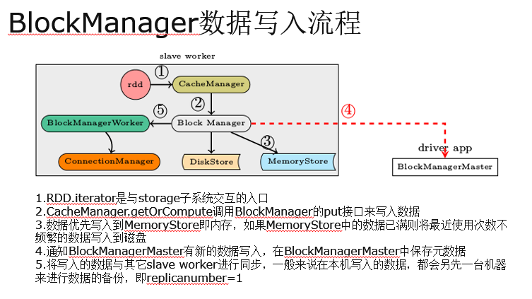

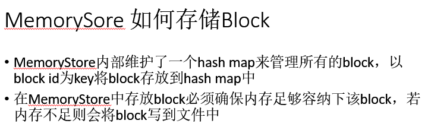

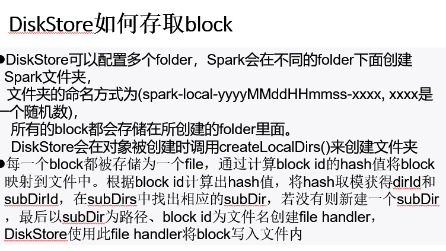